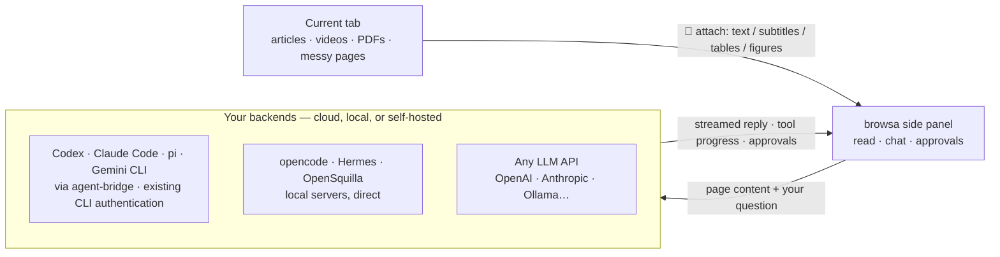

<p align="center"><a href="./README.md">English</a> · <a href="./README.zh-CN.md">简体中文</a> · <a href="./README.ja.md">日本語</a> · <a href="./README.ko.md">한국어</a> · <strong>Español</strong> · <a href="./README.pt-BR.md">Português</a> · <a href="./README.ru.md">Русский</a></p>

<p align="center">
  <a href="https://chromewebstore.google.com/detail/browsa/kghjmmajnpbkljankbbjbmnhfdocaeho"></a>&nbsp;
  <a href="LICENSE"></a>&nbsp;
  <a href="#instalación"></a>&nbsp;
  <a href="https://github.com/xiaohuzai/browsa/pulls"></a>
</p>

<p align="center">
  <a href="https://xiaohuzai.github.io/browsa/en/"><strong>Sitio web</strong></a> · <a href="https://xiaohuzai.github.io/browsa/en/guide/quickstart.html"><strong>Inicio rápido</strong></a> · <a href="#instalación"><strong>Instalación</strong></a> · <a href="https://github.com/xiaohuzai/browsa/issues"><strong>Issues</strong></a>
</p>

---

# browsa

**Quédate en la página. Pregunta a su lado.**

browsa es una extensión de panel lateral para Chrome / Edge. Trae un artículo, un vídeo o un PDF a una conversación con **tu propia IA** — sin copiar texto ni salir de la página. Conecta **Codex / Claude Code / pi / Gemini CLI** mediante Agent Bridge, usa **opencode / Hermes / OpenSquilla** o configura una API de modelos como OpenAI, Anthropic u Ollama.

**Extensión gratuita, con licencia MIT.** Trae tu propio modelo o agente. Las claves de API se guardan localmente y se usan para autenticarte con los servicios que configures.

<p align="center">
  
</p>
<p align="center">
  <a href="https://www.youtube.com/watch?v=Q3ySghDuKog"><strong>▶ Vídeo completo · 68 segundos</strong></a> · <a href="https://xiaohuzai.github.io/browsa/es/#demo"><strong>▶ Quédate en la página. Pregunta a su lado.</strong></a> · <a href="docs/assets/promo/browsa-promo-v7-es.mp4">Descargar MP4</a> — Demostración de la interfaz real: abre browsa, elige o cambia tu propia IA y agentes, adjunta un artículo, profundiza en una frase y visualiza fórmulas, diagramas y gráficos. Comprueba el contenido en la línea de tiempo del vídeo, gestiona varias sesiones y continúa en tu agente con el ID de sesión. Las respuestas, los resultados guardados y la ilustración de continuidad en CLI usan datos de demostración; la reproducción está editada. Guardar archivos depende del agente conectado.</p>

## Lo más destacado

### 1. Conecta el agente que ya usas

Conecta tu agente CLI existente a través de Agent Bridge, usando su inicio de sesión y sus herramientas ya configurados. browsa le entrega contenido web, transmite el progreso de las herramientas y muestra las solicitudes de aprobación que envía. Las herramientas y los permisos disponibles dependen de la configuración del agente.

| Agente | Cómo conectarlo | Inicio de sesión |
|---|---|---|
| **Codex** (OpenAI) | demonio local [agent-bridge](https://github.com/xiaohuzai/agent-bridge) | Autenticación CLI existente |
| **Claude Code** (Anthropic) | demonio local agent-bridge | Autenticación CLI existente |
| **pi** (earendil-works) | demonio local agent-bridge | El modelo que le configures a pi |
| **Gemini CLI** (Google) | demonio local agent-bridge | Autenticación CLI existente |
| opencode | servidor headless oficial, conexión directa | el modelo que le configures |
| Hermes | autoalojado, protocolo `/v1/runs` | autoalojado |
| OpenSquilla | gateway autoalojado, WebSocket (`/ws`) | los modelos que el gateway enrute |

Una sola tarjeta de browsa se conecta a varios agentes a la vez; el desplegable de la barra lateral cambia entre ellos.

### 2. Lee toda la web — vídeos incluidos

- **Vídeos**: subtítulos o transcripción automática (ASR) → notas con **marcas de tiempo `[mm:ss]` clicables**; haz clic en una para volver justo al momento. Los vídeos sin subtítulos también se pueden leer visualmente
- **PDF / artículos científicos**: se analizan por completo en el navegador — tablas, diseño de varias columnas y encabezados reconstruidos; las regiones de las figuras se recortan y se envían a los modelos de visión
- **Documentos de Office**: los enlaces directos a `.docx` / `.pptx` / `.xlsx` / `.epub` / `.odt` / `.rtf`… se convierten a Markdown íntegramente en tu dispositivo (docling compilado a WASM) — las tablas, los encabezados y las listas se conservan
- **Artículos y páginas desordenadas**: texto de artículo limpio; las páginas tipo feed leen directamente los datos de la propia página (YouTube, Bilibili, 小红书…)

La lista completa está en «Qué lee browsa» más abajo.

## Arquitectura



Un recorrido a nivel de desarrollador por el código — flujo de mensajes, pipeline de renderizado, modelo de almacenamiento, proveedores y agentes, ASR y el modelo de seguridad — vive en la [wiki del proyecto](https://github.com/xiaohuzai/browsa/wiki) (7 idiomas).

## Instalación

Elige un método de instalación:

**Chrome Web Store — recomendado, actualizaciones automáticas.** [Añade browsa a Chrome](https://chromewebstore.google.com/detail/browsa/kghjmmajnpbkljankbbjbmnhfdocaeho). La revisión de la tienda puede ir por detrás de las versiones publicadas en GitHub.

**GitHub — instalación y actualizaciones manuales.**

1. Descarga y descomprime el ZIP de la extensión desde [Releases](https://github.com/xiaohuzai/browsa/releases). Para trabajar con el código, clona o descarga este repositorio.
2. Abre `chrome://extensions` (o `edge://extensions`) y activa el **Modo de desarrollador**.
3. Haz clic en **Cargar descomprimida** → selecciona la carpeta descomprimida que contiene `manifest.json`, no el ZIP ni su carpeta contenedora. Su nombre depende de cómo lo hayas descargado.

**Después, en cualquier caso:**

1. Abre un artículo y haz clic en el icono de la extensión en la barra de herramientas, o pulsa `Ctrl+Shift+H` (`Command+Shift+H` en macOS).
2. Abre **⚙ Ajustes**, configura un proveedor de LLM o de agente y haz clic en **Ping** para verificar la conexión.
3. Selecciona el modelo o agente en el desplegable del panel lateral, haz clic en **📎** para adjuntar la página y haz tu primera pregunta.

Consulta la [guía de inicio rápido](https://xiaohuzai.github.io/browsa/en/guide/quickstart.html) para el recorrido completo. Los ajustes avanzados pueden quedarse con sus valores predeterminados mientras estableces la conexión.

<details>
<summary><b>Compilar y empaquetar</b></summary>

```bash
npm install          # first time only
npm test             # run the test suite
npm run package      # → browsa-v<version>.zip
```

`npm version patch|minor` aumenta la versión tanto en `package.json` como en `manifest.json` automáticamente.

En máquinas con memoria limitada, ejecuta las pruebas en serie: `node --test --test-concurrency=1 test/*.test.mjs`.

</details>

## Conecta un proveedor

Abre ⚙ Ajustes, rellena la dirección y pulsa **Ping** — se verifica la conectividad y las capacidades se detectan automáticamente; el primer proveedor que verifiques queda activo. Dos tipos de backends:

- **Proveedores de agentes** — backends de agente completos, con ejecución de herramientas del lado del servidor (bash, operaciones con archivos, búsqueda web…). La IA realmente puede *hacer* cosas.
- **Proveedores de LLM** — endpoints de chat sencillos para conversar. Se requiere el ID del modelo.

Las conversaciones con agentes viven del lado del agente: browsa nombra la sesión automáticamente ("browsa:" + tu primer mensaje) para que puedas retomarla en la propia interfaz del agente. El ID de sesión se muestra — y se puede copiar — en la parte superior del cajón de sesiones. Las conversaciones guardadas de browsa conservan y restauran los ID de sesión de cada Agent y dirección de conexión. Las conversaciones antiguas sin ID registrado crean una sesión de Agent nueva al enviar el primer mensaje y trasladan su historial de texto.

<details>
<summary><b>🔧 Agent Bridge</b> — puente para agentes CLI locales (<b>Codex</b>, <b>Claude Code</b>, <b>pi</b>, <b>Gemini CLI</b>…)</summary>

[agent-bridge](https://github.com/xiaohuzai/agent-bridge) es un demonio local independiente que adapta agentes CLI (codex, claude, pi, gemini) a un único protocolo HTTP local. Usa la autenticación ya configurada del CLI:

```bash
npm i -g @xiaohuzai/agent-bridge                  # published on npm (Node 18+)
cp "$(npm root -g)/@xiaohuzai/agent-bridge/agents.example.json" agents.json
agent-bridge serve                                # one bridge per entry; ports live in agents.json
```

Abre ⚙ Ajustes, selecciona la tarjeta **Agent Bridge**, haz clic en **＋ Añadir agente** y rellena las direcciones de bridge, una por fila — un agente por dirección, con un alias opcional (déjalo vacío y Ping descubrirá el nombre del agente automáticamente) y la clave de API propia de ese bridge (las claves pueden diferir entre bridges). El desplegable de la barra lateral los muestra como "Agent Bridge · codex", cada uno con su propio hilo de sesión independiente y su propio estado de ping (⟳ en la fila hace ping solo a ese agente). Las tarjetas de aprobación para acciones peligrosas aparecen directamente en el panel; las capturas de pantalla, las imágenes pegadas y las figuras de PDF viajan junto con tu mensaje (≤8 por turno). El contexto multi-turno vive en el propio agente.


</details>

<details>
<summary><b>🔧 OpenCode Agent</b> — conecta el agente CLI <code>opencode</code></summary>

[opencode](https://opencode.ai) incluye un servidor headless de primera parte — browsa se conecta a él directamente (sesiones, streaming, progreso de herramientas y solicitudes de aprobación para acciones peligrosas como comandos de shell). Browsa puede conectarse a **cualquier** dirección de `opencode serve` — pero un `opencode serve` sin más elige un puerto aleatorio que cambia en cada reinicio, así que la opción de configurar y olvidarse es fijar uno:

```bash
opencode serve --port 4096
```

Abre ⚙ Ajustes, selecciona el proveedor **OpenCode Agent**, rellena la Base URL con `http://127.0.0.1:4096` (el placeholder ya lo sugiere), **Ping**, y listo. El contexto multi-turno vive en la sesión de opencode; browsa solo envía tus turnos. Cuando opencode pide ejecutar un comando peligroso, la tarjeta de aprobación aparece directamente en el panel. Funciona desde cualquier directorio — inicia el servidor en el proyecto sobre el que quieras que trabaje.

</details>

<details>
<summary><b>🤖 Hermes Agent</b> — agente autoalojado con herramientas integradas</summary>

Hermes es un agente de IA autoalojado con herramientas integradas (búsqueda web, terminal, operaciones con archivos, memoria, skills). browsa usa su API `/v1/runs` — más rica que las chat completions sencillas (progreso de herramientas, solicitudes de aprobación/aclaración para acciones peligrosas) — con un `X-Hermes-Session-Id` estable por conversación, para que Hermes pueda mantener la continuidad de la sesión del lado del servidor. Recurre automáticamente a `/v1/chat/completions` sencillo si un despliegue de Hermes no anuncia compatibilidad con `/v1/runs`.

**1. Instala Hermes**

```bash
pip install hermes-agent   # or follow the official install guide
```

**2. Activa el servidor de API** — añade a `~/.hermes/.env`:

```bash
API_SERVER_ENABLED=true
API_SERVER_KEY=your-secret-key
```

**3. Inicia Hermes**

```bash
hermes gateway
# → [API Server] API server listening on http://127.0.0.1:8642
```

**4. Configura browsa** — abre ⚙ Ajustes y selecciona el proveedor **Hermes Agent**. Solo necesita una Base URL y una clave de API — su propio protocolo `/v1/runs` se usa automáticamente (sin desplegable de tipo de API).

| Campo | Valor |
|---|---|
| Base URL | `http://<server-ip>:8642` |
| API Key | el valor de `API_SERVER_KEY` |

**5. Ping** para verificar. La compatibilidad con `/v1/runs` se detecta y se activa automáticamente.

</details>

<details>
<summary><b>🦑 OpenSquilla Agent</b> — agente local vía WebSocket del gateway (app de escritorio o CLI)</summary>

[OpenSquilla](https://github.com/opensquilla/opensquilla) es un agente local (gateway + interfaz web + app de escritorio) con un diseño de microkernel eficiente en tokens, enrutamiento de modelos y skills. browsa habla con su **WebSocket de gateway** (`/ws`) — el mismo canal que usa su propia interfaz web — así que obtienes la experiencia completa del agente: memoria de sesión del lado del servidor, deltas en streaming, salida de razonamiento y cancelación del lado del servidor.

Ejecuta el gateway **o bien** como app de escritorio **o bien** desde la línea de comandos — browsa se conecta a ambos de la misma manera. Los dos caminos se diferencian en exactamente una cosa: qué archivo de configuración lee el gateway (el paso 2 de cada camino). Editar el archivo equivocado es la causa más habitual de que la conexión falle en silencio.

**Camino A — App de escritorio (sin terminal)**

1. **Instala y abre** la app de escritorio de OpenSquilla, v0.5.5 o más reciente (las versiones antiguas incluyen un gateway cuyo filtro de origen no acepta extensiones). La app inicia su propio gateway automáticamente — abre los ajustes de la app y anota la **URL del gateway** que muestra (normalmente `http://127.0.0.1:18791`; toma el primer puerto libre del rango 18791–18830).
2. **Deja entrar a la extensión** — la app de escritorio **no** lee `~/.opensquilla/config.toml`; lee una configuración en su propio directorio de datos de la app. La fuente más fiable es la propia app: **Settings → Advanced → Config file** muestra la ruta exacta (con botón de copiar). Valores predeterminados habituales: paquete oficial de macOS `~/Library/Application Support/OpenSquilla/opensquilla/config.toml`; paquete compilado por ti `~/Library/Application Support/@opensquilla/desktop-electron/opensquilla/config.toml` (los dos directorios de datos están totalmente separados). La ruta contiene espacios — escápalos en la terminal (rodea toda la ruta con comillas, o escapa cada espacio con una barra invertida), o la shell la partirá en el espacio y editarás el archivo equivocado:

```bash
open -e "<paste the path copied from Settings → Advanced → Config file>"   # opens in macOS TextEdit
```

Añade:

```toml
[cors]
# The value below covers the Chrome Web Store build. A sideloaded build
# (zip / repo folder) has a DIFFERENT extension ID — see the fine print below.
allowed_origins = ["chrome-extension://kghjmmajnpbkljankbbjbmnhfdocaeho"]
```

3. **Cierra por completo la app y vuélvela a abrir** (cerrar la ventana no basta) — el gateway lee esta configuración una sola vez al arrancar. Los modelos / claves de API de la app de escritorio se configuran dentro de la app (en su ventana de configuración), no mediante variables de entorno de la shell. Avanzado: la app también puede conectarse a un gateway CLI ejecutado externamente vía `OPENSQUILLA_DESKTOP_GATEWAY_URL`.
4. Salta a **Configura browsa** más abajo.

**Camino B — Línea de comandos**

1. **Instala y arranca** el gateway (uv proporciona Python 3.12):

```bash
uv tool install --python 3.12 "opensquilla[recommended] @ https://github.com/opensquilla/opensquilla/releases/download/v0.5.5/opensquilla-0.5.5-py3-none-any.whl"
opensquilla gateway start
# → running: http://127.0.0.1:18791
```

2. **Deja entrar a la extensión** — el gateway de la CLI lee `~/.opensquilla/config.toml`. Añade el mismo bloque `[cors]` que en el Camino A. El enrutamiento de modelos del gateway también se configura aquí (consulta la documentación de la propia OpenSquilla; las claves de LLM normalmente vienen del entorno con el que se arranca el gateway).
3. **Reinicia el gateway** (`Ctrl+C`, y luego `opensquilla gateway start` de nuevo) — la configuración se lee una sola vez al arrancar.
4. Salta a **Configura browsa** más abajo.

**Configura browsa (igual para ambos)** — abre ⚙ Ajustes y selecciona la pestaña **OpenSquilla**:

| Campo | Valor |
|---|---|
| Base URL | `ws://127.0.0.1:18791/ws` — usa la URL que tu gateway muestre realmente (escritorio: sus ajustes; CLI: la línea `running:`) |
| API Key | solo si tu gateway exige un token (opcional) |

**Ping** para verificar — realiza el handshake real de WebSocket, así que un ping en verde demuestra tanto la conectividad como la lista de orígenes permitidos.

Letra pequeña del filtro de origen (ambos caminos): la lista es una coincidencia exacta de cadena (`*` no hace nada). El valor del fragmento cubre la **compilación de la Chrome Web Store**; una **compilación instalada manualmente tiene otro ID** — cargar directamente la carpeta del repositorio muestra siempre `chrome-extension://apoodheofdhglelbnmggeokbhampbmgn` (fijado por la clave del manifest del repositorio), mientras que una compilación descomprimida del zip de releases obtiene un ID derivado de la ruta de su carpeta en tu máquina. En cualquier caso, lee el valor real en `chrome://extensions` → browsa → **ID** y añade ese origen a la lista (varias entradas son válidas). Desde la v0.5.5 el filtro acepta orígenes no http(s) listados exactamente, en loopback (el esquema `ws://` se mapea a `http`; `wss` se rechaza — usa `ws://` para un gateway local).

Notas: cada conversación de browsa se corresponde con una sesión del gateway (clave asignada por el gateway, que se restablece al borrar el historial de browsa). El historial de chat vive del lado del gateway — browsa reenvía tu texto más cualquier página que hayas adjuntado justo antes de preguntar (el contexto 📎 viaja con el siguiente mensaje y luego vive en el transcript del propio gateway); una página enorme (más de 60k caracteres) se sube como un documento `page-context.md` que el agente lee con sus propias herramientas. Las figuras de la página viajan como adjuntos de imagen (un modelo router de solo texto degrada a texto automáticamente). Las capturas pegadas se quedan en el historial del propio browsa y aún no se reenvían. La preferencia de idioma de respuesta se antepone al mensaje, ya que este protocolo no tiene campo de prompt del sistema.

</details>

<details>
<summary><b>💬 Proveedores de LLM</b> — OpenAI · Anthropic · Ollama · Groq · LiteLLM · cualquier endpoint compatible</summary>

Cualquier endpoint que hable OpenAI **Chat Completions** (`/v1/chat/completions`), OpenAI **Responses** (`/v1/responses`) o **Anthropic Messages** (`/v1/messages`).

Abre ⚙ Ajustes → **Proveedores de LLM**. Hay una casilla vacía **LLM 1** reservada para ti — rellénala y pulsa **Guardar**. Los proveedores viven como pestañas en una sola tarjeta; añade más cuando quieras con la pestaña **＋** al final de la barra de pestañas:

| Campo | Valor |
|---|---|
| Alias | un nombre que tú elijas (p. ej. "Mi OpenAI", "本地模型") — se muestra en el desplegable de la barra lateral para que varios proveedores se distingan entre sí |
| Base URL | p. ej. `https://api.openai.com` |
| API Key | tu clave de API |
| Model ID | Obligatorio. Escribe un ID de modelo y pulsa **Enter** o **＋** para añadirlo; **✕** elimina un modelo. Una entrada separada por comas añade varios a la vez. Cada uno aparece como "Alias · modelo" en el desplegable de la barra lateral |
| API | el protocolo que habla este endpoint: Chat Completions / Responses / Anthropic |

Añade tantos proveedores de LLM como quieras; cada uno elige su propio protocolo y lleva su propio alias. Una sola tarjeta también puede llevar varios Model ID — una tarjeta cubre todo un gateway que aloje decenas de modelos. Usa el **✕** de una tarjeta para eliminarla (las tarjetas de agentes integrados — Hermes, OpenSquilla, OpenCode, Agent Bridge — son fijas y no se pueden eliminar).

</details>

## Qué lee browsa

Haz clic en 📎 para adjuntar la pestaña actual — modo **Automático** (texto de artículo limpio, con reserva en el árbol DOM y luego en el texto completo de la página) o modo **📷 Captura de pantalla** (la pestaña visible, para modelos multimodales). Adjuntar un PDF o un documento de Office — o una página que resulta serlo — es automático; no hay modo que elegir.

| Estás leyendo | Qué envía browsa |
|---|---|
| Artículos y documentación | texto de artículo limpio; las instrucciones `llms.txt` del sitio se integran en el contexto |
| PDF y artículos científicos | diseño completo — tablas, encabezados, columnas — analizado en el navegador; las regiones de las figuras se recortan y se envían como imágenes a los modelos de visión (se compactan a placeholders etiquetados en el historial tras responder) |
| Documentos de Office (`.docx` `.pptx` `.xlsx` `.epub` `.odt` `.rtf`…) | convertidos a Markdown en tu dispositivo vía docling-wasm — los encabezados, las listas y las tablas conservan su estructura |
| Vídeos | transcripción con marcas de tiempo `[mm:ss]` clicables; los vídeos sin subtítulos se transcriben automáticamente (ASR, opcional — clave de Volcengine Ark en Ajustes) o se analizan visualmente junto con la voz |
| Páginas de archivos de GitHub | código fuente en crudo desde `raw.githubusercontent.com` — el markdown y el código conservan su estructura |
| Documentos de Feishu / Lark | la estructura de bloques del editor de la página se analiza directamente — los encabezados, las listas y las **filas y columnas de las tablas** se conservan |
| Cualquier página desordenada | las propias peticiones de red de la página se observan y se leen directamente — subtítulos, comentarios, fuente del artículo (YouTube, Bilibili, 小红书 y más) |

Resalta texto en una página y aparece la **barra flotante de selección**: **Explicar** y **Traducir** responden en línea — una tarjeta en streaming justo al lado de la selección, sin necesidad del panel — mientras que **Preguntar** y **Resumir** (y el menú del clic derecho) entran al panel. No hace falta pulsar 📎.

## Funciones

La referencia completa está aquí:

<details>
<summary><b>Chat</b> — streaming, bloques de razonamiento, diagramas, follow-up…</summary>

Cambiar de sesión a mitad de una respuesta nunca la mata: sigue ejecutándose en segundo plano y se guarda en la sesión donde empezó (marcada con un punto pulsante en el cajón hasta que termina). Detener tú mismo una respuesta conserva lo que ya se había transmitido, marcado como interrumpido — un razonamiento largo nunca se evapora.

| Función | Qué obtienes |
|---|---|
| **Respuestas en streaming** | los tokens aparecen a medida que llegan; haz clic en **■** en el cuadro de mensaje o pulsa `Esc` para detener |
| **Bloques de razonamiento** | el contenido `<think>` / `<thinking>` en un bloque plegable, auto-colapsado tras el streaming |
| **Markdown y resaltado** | GFM completo (tablas, bloques de código, listas); más de 40 lenguajes vía highlight.js; los bloques `diff` colorean `+` en verde / `-` en rojo |
| **Tu código también se renderiza** | pega un bloque cercado ```` ``` ```` en el cuadro de mensaje y tu propia burbuja lo muestra como un bloque de código resaltado con botón de copiar; no hace falta etiqueta de lenguaje (se detecta automáticamente). Todo lo demás de tu mensaje se queda byte a byte como lo escribiste — ninguna reinterpretación markdown de tus palabras |
| **LaTeX** | `$...$` en línea y `$$...$$` en bloque vía KaTeX — los mensajes con muchas fórmulas se descargan a un Web Worker para que el panel no sufra tirones |
| **Mermaid · ECharts · Markmap** | los bloques de código ` ```mermaid ` / ` ```echarts ` / ` ```markmap ` se renderizan en línea, cada uno con una barra de zoom / copiar / exportar PNG; solo pide una gráfica o un mapa mental — el modelo conoce el formato. Si un bloque Mermaid no se puede analizar, un clic lo devuelve a tu modelo para corregirlo — el diagrama reparado se valida localmente antes de reemplazar al que falló |
| **Moléculas · Proteínas · Grafos** | los bloques ```smiles / ```pdb / ```dot también se renderizan en vivo — diagramas de estructura y de reacción en 2D dibujados por RDKit con una línea de propiedades moleculares (MW, logP, TPSA, dadores/aceptores de puentes de hidrógeno; los SMILES químicamente inválidos se rechazan conservando el código fuente), proteína 3D interactiva a partir de un ID de PDB o un ID de AlphaFold (visor Mol*: pasa el cursor sobre cualquier residuo para ver su identidad, tira de secuencia incluida, modelos de AlphaFold coloreados por confianza pLDDT), y figuras Graphviz DOT (arquitecturas de redes neuronales, flujo de datos, grafos de dependencias); cada uno con controles de copiar / exportar |
| **Follow-up («追问»)** | selecciona cualquier texto dentro de una respuesta para abrir una conversación lateral acotada sobre solo ese fragmento, sin tocar el historial principal; totalmente redimensionable; pega imágenes en la tarjeta, igual que en el cuadro de mensaje principal; el ↑/↓ del campo de entrada recupera solo preguntas de seguimiento; las fórmulas citadas se renderizan como matemáticas |
| **Barra de esquema** | a partir de 4 turnos, una discreta barra de marcas sigue la conversación — clic para saltar, hover para previsualizar |
| **Editar y reenviar · Regenerar** | ✏ edita y reenvía cualquier mensaje de usuario; ⟳ vuelve a ejecutar cualquier respuesta del asistente |
| **Seguimientos en cola** | si escribes mientras se transmite una respuesta, tu mensaje se pone en cola; se envía automáticamente cuando el streaming termina |
| **Tarjetas de error** | los errores del proveedor se clasifican en lenguaje claro (auth / límite de tasa / timeout / red / 5xx), el error en crudo es expandible y copiable |
| **Copiar y marcas de tiempo** | ⎘ copia el Markdown completo en crudo; pasa el cursor sobre cualquier mensaje para ver su hora de envío |
| **Etiquetas de origen de la respuesta** | cada respuesta lleva el sello del proveedor / agente que la produjo (el mismo nombre que en el desplegable de la barra lateral); cambiar a un agente pregunta si traspasar la conversación como su primer mensaje o iniciar una sesión nueva (enviar sin elegir continúa sin contexto) |

</details>

<details>
<summary><b>Historial y sesiones</b> — cajones, búsqueda, exportación…</summary>

| Función | Qué obtienes |
|---|---|
| **Sesiones** | guarda la conversación como una sesión con nombre; explora y restaura desde el cajón 🕐; fija las favoritas encima de la lista |
| **Búsqueda en todas partes** | `Ctrl+F` en todos los mensajes de una conversación; el cajón filtra sesiones por título **y** por contenido de los mensajes (las coincidencias solo de contenido van marcadas) |
| **Exportación** | cualquier sesión como archivo Markdown |
| **Borrado seguro** | borrado en dos pasos para sesiones; multiselección de mensajes para el borrado por lotes; borrar todos los mensajes requiere confirmación |

</details>

<details>
<summary><b>Entrada</b> — imágenes, borradores, acciones rápidas…</summary>

| Función | Qué obtienes |
|---|---|
| **Adjuntos de imagen** | arrastra y suelta o pega imágenes en el cuadro de mensaje (para modelos multimodales) |
| **Historial de entrada y borradores** | ↑/↓ recupera mensajes enviados anteriormente para editarlos; ↓ después del más reciente restaura el borrador original; un borrador sin enviar sobrevive al cierre del panel |
| **Comandos de barra diagonal** | escribe `/` para ver las sugerencias — mira la tabla de abajo |
| **Acciones rápidas** | Resumir / Puntos clave / Explicar / → 中文 / Esquema con un clic, encima del cuadro de mensaje |
| **Barra de selección y menú contextual** | resalta texto en cualquier página: Preguntar · Explicar · → 中文 · Resumir — Explicar / Traducir responden en línea (en streaming, en su lugar); Preguntar / Resumir y el menú del clic derecho van al panel |

</details>

<details>
<summary><b>Ajustes</b> — prompt del sistema, idiomas, llms.txt, autorresumen…</summary>

Los ajustes del día a día se muestran directamente: idioma de la interfaz, proveedores, prompt del sistema / idioma de respuesta y preferencias de chat. **Avanzado** guarda las opciones de la barra de selección, `llms.txt`, la extracción profunda y el ASR; déjalo plegado si no las necesitas. Los grupos de proveedores de LLM y de Agent también se pliegan de forma independiente — cambiar de agente mantiene cerrado un grupo de LLM ya plegado.

| Ajuste | Qué hace |
|---|---|
| **Prompt del sistema** | se antepone a cada conversación como `role: system` — define aquí el idioma de respuesta, el tono y las reglas de formato |
| **Idioma de respuesta** | fuerza las respuestas en un idioma específico sin importar el idioma de la página |
| **Idioma de la interfaz** | English, 中文, 日本語, 한국어, Español, Português, Русский o Auto (sigue al navegador) — se aplica al instante, sin recargar |
| **Barra de selección y llms.txt** | activa o desactiva la barra flotante al seleccionar texto; al pulsar 📎, las instrucciones LLM del sitio se obtienen una vez y se integran en el contexto de la página adjunta — se mantienen fuera del prompt del sistema para que el prefijo del prompt sea estable byte a byte entre turnos (amable con la caché de prompts) |
| **Nivel de razonamiento** | profundidad de razonamiento por modelo (`auto` no envía nada; luego, la escala propia del modelo — la clase GLM/Qwen es un interruptor sí/no, la clase GPT/Claude es un esfuerzo bajo→máximo). Las opciones siguen el ID de modelo que hayas rellenado, y los campos de la petición se adaptan automáticamente a cada dialecto de API (`reasoning.effort` / `thinking`+`output_config` / `enable_thinking`…) |
| **Preferencias de lectura** | tamaño de fuente de los mensajes, atajo de envío (Enter / Shift+Enter), autoplegado de los bloques de razonamiento |
| **ASR** | el proveedor de voz a texto para vídeos sin subtítulos (Volcengine Ark por defecto): clave de API, idioma, fuente de subtítulos |
| **Autorresumen de adjuntos largos** | automático — las páginas o transcripciones que superen el umbral (100 000 caracteres por defecto) se dividen en trozos, se resumen en paralelo y se fusionan en segundo plano; las marcas `[mm:ss]` se conservan para que los enlaces de salto sigan funcionando; cualquier error resuelve al texto original |
| **Extracción profunda** | activada por defecto — antes de adjuntar, browsa despliega las secciones plegadas y avanza por el contenido paginado para que mucho más de la página llegue al modelo; todo ocurre en silencio en pestañas en segundo plano, sin desplazar ni hacer clic en la página que estás viendo |

</details>

### Comandos de barra diagonal

Escribe `/` en el cuadro de mensaje para ver el autocompletado. Todos los comandos aceptan instrucciones extra — `/summarize focus on the methodology`:

| Comando | Prompt enviado al modelo |
|---|---|
| `/summarize` | resumen de 3 a 5 puntos |
| `/translate` | traducir al chino |
| `/rewrite` | reescritura más concisa, conservando todos los hechos |
| `/explain` | explicación para principiantes, en lenguaje sencillo |
| `/outline` | esquema anidado de solo los encabezados |
| `/keypoints` | las 5 ideas principales |
| `/prompt` | muestra el prompt del sistema activo actual (no se envía al modelo) |

## Atajos de teclado

| Atajo | Acción |
|---|---|
| `Ctrl+Shift+H` | Abrir / cerrar el panel lateral |
| `Enter` | Enviar mensaje (configurable en Ajustes) |
| `Shift+Enter` | Nueva línea |
| `Ctrl+K` | Borrar mensajes (con confirmación) |
| `Ctrl+/` | Alternar el modo de contexto (Automático ↔ Captura de pantalla) |
| `Ctrl+F` | Abrir la búsqueda en la conversación |
| `Esc` | Cancelar el streaming / cerrar la búsqueda / cerrar el cajón |

## Cómo funciona

<details>
<summary><b>Mapa del código</b></summary>

- **`background.js`** — service worker MV3, enrutador único de mensajes; streaming vía puertos por turno, autorresumen para adjuntos de gran tamaño.
- **`sidepanel.js`** — orquestador de la UI de chat; el renderizado (Markdown/Mermaid/Markmap/KaTeX/ECharts), las sesiones, la búsqueda y el follow-up viven cada uno en `lib/sidepanel/`.
- **`lib/`** — extracción de páginas (cascada Readability + intercepción de XHR), clientes de streaming SSE (`/v1/chat/completions`, Hermes `/v1/runs`, los clientes de agente opencode / agent-bridge), envoltorio de `chrome.storage.local`, content scripts.

La [wiki](https://github.com/xiaohuzai/browsa/wiki) desarrolla cada uno de estos puntos en un capítulo completo — Arquitectura, Pipeline de renderizado, Modelo de almacenamiento, Proveedores y agentes, ASR, Modelo de seguridad, Decisiones de diseño, Contribuir.

</details>

## Compatibilidad con navegadores

Chrome / Edge 116+ (objetivo principal); Brave 1.56+ debería funcionar (misma base Chromium). Firefox no está soportado (sin API `side_panel`).

## Seguridad

- Las claves de API se guardan localmente en `chrome.storage.local` y se usan para autenticarte con los servicios que configures. Almacenamiento local no significa que las claves nunca se transmitan.
- El contenido de la página adjunta, las preguntas y el contexto de la conversación se envían al modelo o agente que hayas seleccionado. La transcripción / el análisis audiovisual opcionales también envían los medios al servicio de análisis configurado.
- Antes de enviar el contexto de la página, browsa enmascara las credenciales reconocidas en las URLs (como los parámetros de token, contraseña, firma y sesión). No es un limpiador de propósito general para el texto sensible de la página. Las URLs que el propio browsa obtiene (medios, imágenes) no se tocan.
- Los PDF se analizan localmente (WASM + pdf.js); el texto extraído y las imágenes de las figuras pueden enviarse a tu proveedor configurado. El análisis local no significa que todo el contenido extraído se quede en el dispositivo.
- Las respuestas de los LLM se depuran con DOMPurify antes de renderizarse (bloquea las fuentes `data:image/svg+xml`; el SVG que produce Mermaid se limpia de atributos `<script>` / controladores de eventos).
- Los content scripts solo observan las peticiones de red; nunca las modifican ni las bloquean.

## Licencia

[MIT](LICENSE) — libre para usar, modificar y distribuir.

---

<p align="center">
  <sub><b>browsa</b> — lee en cualquier parte, pregunta en cualquier parte.</sub>
</p>
