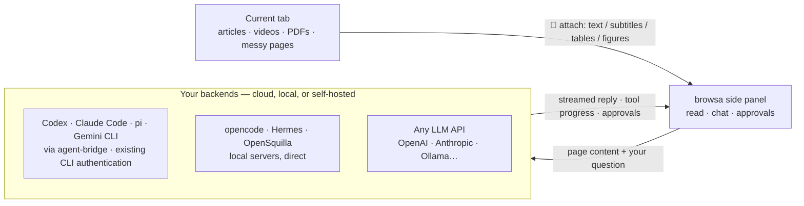

<p align="center"><a href="./README.md">English</a> · <a href="./README.zh-CN.md">简体中文</a> · <strong>日本語</strong> · <a href="./README.ko.md">한국어</a> · <a href="./README.es.md">Español</a> · <a href="./README.pt-BR.md">Português</a> · <a href="./README.ru.md">Русский</a></p>

<p align="center">
  <a href="https://chromewebstore.google.com/detail/browsa/kghjmmajnpbkljankbbjbmnhfdocaeho"></a>&nbsp;
  <a href="LICENSE"></a>&nbsp;
  <a href="#インストール"></a>&nbsp;
  <a href="https://github.com/xiaohuzai/browsa/pulls"></a>
</p>

<p align="center">
  <a href="https://xiaohuzai.github.io/browsa/en/"><strong>ウェブサイト</strong></a> · <a href="https://xiaohuzai.github.io/browsa/en/guide/quickstart.html"><strong>クイックスタート</strong></a> · <a href="#インストール"><strong>インストール</strong></a> · <a href="https://github.com/xiaohuzai/browsa/issues"><strong>Issues</strong></a>
</p>

---

# browsa

**ページから離れず、その隣で尋ねる。**

browsa は Chrome / Edge のサイドパネル拡張機能です。テキストをコピーしたりページを離れたりすることなく、記事・動画・PDF を**自分の AI** との会話に取り込みます。Agent Bridge 経由で **Codex / Claude Code / pi / Gemini CLI** をつなぎ、**opencode / Hermes / OpenSquilla** を利用するか、OpenAI・Anthropic・Ollama などのモデル API を設定できます。

**無料・MIT ライセンスの拡張機能です。** モデルやエージェントはご自身で用意します。API キーはローカルに保存され、設定したサービスへの認証に使用されます。

<p align="center">
  
</p>
<p align="center">
  <a href="docs/assets/promo/browsa-promo-v7-ja.mp4"><strong>▶ 紹介動画 · 68秒</strong></a> · <a href="https://xiaohuzai.github.io/browsa/ja/#demo"><strong>▶ ページから離れず、その隣で尋ねる。</strong></a> · <a href="https://www.youtube.com/watch?v=c3lt2dG4T_I">YouTube（旧版デモ）</a> — 実際のUIデモ：browsaで自分のAIやエージェントを選択・切り替え、記事を添付し、一文を掘り下げ、数式・フローチャート・グラフを表示します。動画のタイムラインで内容を確認し、複数のセッションを管理して、セッションIDでエージェント側の作業を続けます。回答・保存結果・CLI継続画面はデモデータで、再生は編集されています。ファイル保存は接続先エージェントの機能に依存します。</p>

## ハイライト

### 1. いつも使っているエージェントに接続

Agent Bridge 経由で、お使いの CLI エージェントに、設定済みのサインインとツールのままで接続します。browsa はウェブコンテンツをエージェントに渡し、ツールの進行状況をストリーミング表示し、エージェントが送ってくる承認リクエストを表示します。利用できるツールと権限はエージェント側の設定によります。

| エージェント | 接続方法 | サインイン |
|---|---|---|
| **Codex** (OpenAI) | [agent-bridge](https://github.com/xiaohuzai/agent-bridge) ローカルデーモン | 既存の CLI 認証 |
| **Claude Code** (Anthropic) | agent-bridge ローカルデーモン | 既存の CLI 認証 |
| **pi** (earendil-works) | agent-bridge ローカルデーモン | pi に設定したモデル |
| **Gemini CLI** (Google) | agent-bridge ローカルデーモン | 既存の CLI 認証 |
| opencode | 公式ヘッドレスサーバーに直接接続 | 設定したモデル |
| Hermes | セルフホスト、`/v1/runs` プロトコル | セルフホスト |
| OpenSquilla | セルフホストゲートウェイ、WebSocket（`/ws`） | ゲートウェイが振り分けるモデル |

1 枚の browsa カードで複数のエージェントに同時接続でき、サイドバーのドロップダウンで切り替えられます。

### 2. ウェブ全体を読み取る — 動画も含めて

- **動画**: 字幕または自動文字起こし（ASR）→ **クリックできる `[mm:ss]` タイムスタンプ付き**のノート。クリックすればその瞬間へジャンプ。字幕のない動画は映像からも読み取れます
- **PDF / 論文**: すべてブラウザ内で解析 — 表・段組みレイアウト・見出しを再構築し、図の領域は切り出してビジョンモデルへ送信
- **Office ドキュメント**: `.docx` / `.pptx` / `.xlsx` / `.epub` / `.odt` / `.rtf`… への直接リンクを完全にオンデバイスで Markdown に変換（WASM にコンパイルした docling）— 表・見出し・リストの構造が保たれます
- **記事や雑多なページ**: 記事本文をきれいに抽出。フィード型のページはページ自身のデータを直接読み取ります（YouTube、Bilibili、小红书…）

完全な一覧は下の「browsa が読み取るもの」をご覧ください。

## アーキテクチャ



コードベースを開発者レベルで解説するツアー — メッセージフロー、レンダリングパイプライン、ストレージモデル、プロバイダーとエージェント、ASR、セキュリティモデル — は[プロジェクト Wiki](https://github.com/xiaohuzai/browsa/wiki)（7 言語）にあります。

## インストール

インストール方法はいずれか 1 つを選びます:

**Chrome Web Store — 推奨、自動更新。** [Chrome に browsa を追加](https://chromewebstore.google.com/detail/browsa/kghjmmajnpbkljankbbjbmnhfdocaeho)。ストアの審査は GitHub のリリースより遅れることがあります。

**GitHub — 手動でのインストールと更新。**

1. [Releases](https://github.com/xiaohuzai/browsa/releases) から拡張機能の ZIP をダウンロードして展開します。コードを触りたい場合は、代わりにこのリポジトリをクローンまたはダウンロードしてください。
2. `chrome://extensions`（または `edge://extensions`）を開き、**デベロッパー モード**を有効にします。
3. **パッケージ化されていない拡張機能を読み込む** をクリック → `manifest.json` を含む展開後のフォルダを選択します（ZIP やその親フォルダではありません）。フォルダ名はダウンロードの仕方によって異なります。

**どちらの方法でも、続いて:**

1. 記事を開いて拡張機能のツールバーアイコンをクリックするか、`Ctrl+Shift+H`（macOS は `Command+Shift+H`）を押します。
2. **⚙ 設定**を開いて LLM またはエージェントプロバイダーを設定し、**Ping** を押して接続を確認します。
3. サイドパネルのドロップダウンでモデルやエージェントを選び、**📎** でページを添付して、最初の質問をどうぞ。

詳しい手順は[クイックスタートガイド](https://xiaohuzai.github.io/browsa/en/guide/quickstart.html)をご覧ください。接続を済ませるまでの間、詳細設定はデフォルトのままで構いません。

<details>
<summary><b>ビルドとパッケージ</b></summary>

```bash
npm install          # first time only
npm test             # run the test suite
npm run package      # → browsa-v<version>.zip
```

`npm version patch|minor` は `package.json` と `manifest.json` の両方のバージョンを自動的に上げます。

メモリの少ないマシンでは、テストを直列に実行してください: `node --test --test-concurrency=1 test/*.test.mjs`。

</details>

## プロバイダーを接続

⚙ 設定を開き、アドレスを入力して **Ping** を押します — 接続が検証され、対応機能が自動検出されます。最初に検証したプロバイダーがアクティブになります。バックエンドには 2 種類あります:

- **エージェントプロバイダー** — サーバー側でツールを実行する本格的なエージェントバックエンド（bash、ファイル操作、ウェブ検索…）。AI が実際に*何かをし*ます。
- **LLM プロバイダー** — 会話のためのプレーンなチャットエンドポイント。モデル ID が必要です。

エージェントとの会話はエージェント側に置かれます: browsa はセッションに自動で名前を付け（「browsa:」 + 最初のメッセージ）、エージェント自身のインターフェースから続きを行えます。セッション ID はセッションドロワーの上部に表示され、コピーもできます。 保存した browsa の会話には、各 Agent・各接続先のセッション ID も保存され、復元時に一緒に切り替わります。ID が記録されていない古い会話は、最初の送信時に新しい Agent セッションを作成し、既存のテキスト履歴を引き継ぎます。

<details>
<summary><b>🔧 Agent Bridge</b> — ローカル CLI エージェント（<b>Codex</b>、<b>Claude Code</b>、<b>pi</b>、<b>Gemini CLI</b>…）をブリッジ</summary>

[agent-bridge](https://github.com/xiaohuzai/agent-bridge) は、CLI エージェント（codex、claude、pi、gemini）を 1 つのローカル HTTP プロトコルに適合させるスタンドアロンのローカルデーモンです。CLI に設定済みの認証を使います:

```bash
npm i -g @xiaohuzai/agent-bridge                  # published on npm (Node 18+)
cp "$(npm root -g)/@xiaohuzai/agent-bridge/agents.example.json" agents.json
agent-bridge serve                                # one bridge per entry; ports live in agents.json
```

⚙ 設定を開いて **Agent Bridge** カードを選び、**＋ Add agent** をクリックして、ブリッジのアドレスを 1 行に 1 つずつ入力します — 1 アドレスに 1 エージェントで、必要ならエイリアス（空のままにすれば Ping がエージェント名を自動検出します）と、そのブリッジ専用の API キー（ブリッジごとに異なるキーも可）を設定します。サイドバーのドロップダウンには「Agent Bridge · codex」のように並び、それぞれが独立したセッションスレッドと固有の ping 状態（行の ⟳ はそのエージェントだけを ping します）を持ちます。危険な操作の承認カードはパネル内に表示されます。スクリーンショット・貼り付けた画像・PDF の図はメッセージに同乗します（1 ターンにつき ≤8 枚）。マルチターンの文脈はエージェント自身が保持します。


</details>

<details>
<summary><b>🔧 OpenCode Agent</b> — <code>opencode</code> CLI エージェントに接続</summary>

[opencode](https://opencode.ai) は公式のヘッドレスサーバーを同梱しており、browsa はそれに直接接続します（セッション、ストリーミング、ツールの進行状況、シェルコマンドなどの危険な操作の承認プロンプト）。browsa は **どの** `opencode serve` アドレスにも接続できます — ただし素の `opencode serve` は再起動のたびに変わるランダムポートを選ぶため、設定して放置するならポートを 1 つに固定しましょう:

```bash
opencode serve --port 4096
```

⚙ 設定を開き、**OpenCode Agent** プロバイダーを選んで、Base URL に `http://127.0.0.1:4096` を入力（プレースホルダーに表示される値です）、**Ping**、これで完了です。マルチターンの文脈は opencode のセッション側にあり、browsa はあなたのターンを送るだけです。opencode が危険なコマンドの実行を求めてくると、承認カードがパネル内に表示されます。どのディレクトリからでも使えます — 扱ってほしいプロジェクトの中でサーバーを起動してください。

</details>

<details>
<summary><b>🤖 Hermes Agent</b> — ツール内蔵のセルフホストエージェント</summary>

Hermes は、ツール（ウェブ検索、ターミナル、ファイル操作、メモリ、スキル）を内蔵したセルフホスト型 AI エージェントです。browsa は会話ごとに安定した `X-Hermes-Session-Id` を付けて `/v1/runs` API を使います — 素のチャット completions より豊富です（ツールの進行状況、危険な操作に対する承認/確認プロンプト）。Hermes のデプロイが `/v1/runs` 対応を告示していない場合は、素の `/v1/chat/completions` へ自動的にフォールバックします。

**1. Hermes をインストール**

```bash
pip install hermes-agent   # or follow the official install guide
```

**2. API サーバーを有効化** — `~/.hermes/.env` に追記します:

```bash
API_SERVER_ENABLED=true
API_SERVER_KEY=your-secret-key
```

**3. Hermes を起動**

```bash
hermes gateway
# → [API Server] API server listening on http://127.0.0.1:8642
```

**4. browsa を設定** — ⚙ 設定を開き、**Hermes Agent** プロバイダーを選択します。必要なのは Base URL と API キーだけ — 固有の `/v1/runs` プロトコルが自動的に使われます（API 種別のドロップダウンはありません）。

| 項目 | 値 |
|---|---|
| Base URL | `http://<server-ip>:8642` |
| API Key | `API_SERVER_KEY` の値 |

**5. Ping** で確認します。`/v1/runs` 対応は自動検出され、自動的に有効になります。

</details>

<details>
<summary><b>🦑 OpenSquilla Agent</b> — ゲートウェイ WebSocket 経由のローカルエージェント（デスクトップアプリまたは CLI）</summary>

[OpenSquilla](https://github.com/opensquilla/opensquilla) は、トークン効率の良いマイクロカーネル設計・モデルルーティング・スキルを備えたローカルエージェント（ゲートウェイ + Web UI + デスクトップアプリ）です。browsa はその**ゲートウェイ WebSocket**（`/ws`）— 自前の Web UI が使うのと同じチャネル — と通信するため、完全なエージェント体験が得られます: サーバー側のセッションメモリ、ストリーミング差分、思考出力、サーバー側のキャンセル。

ゲートウェイはデスクトップアプリ**または**コマンドラインのどちらでも実行でき、browsa はどちらにも同じ方法で接続します。2 つの方法が違う点は 1 つだけ: ゲートウェイが読み込む設定ファイルです（それぞれの方法のステップ 2）。間違ったファイルを編集することが、接続が静かに失敗する最も多い原因です。

**方法 A — デスクトップアプリ（ターミナル不要）**

1. OpenSquilla デスクトップアプリ（v0.5.5 以降）を**インストールして起動**します（それより古いビルドに同梱のゲートウェイは、オリジンガードが拡張機能を受け付けません）。アプリは自分のゲートウェイを自動的に起動します — アプリの設定を開き、表示される**ゲートウェイ URL** を控えてください（通常は `http://127.0.0.1:18791`。18791–18830 の中で最初の空きポートを使います）。
2. **拡張機能を通す** — デスクトップアプリは `~/.opensquilla/config.toml` を読み**ません**。独自のアプリデータディレクトリにある設定を読みます。最も確実な情報源はアプリ自身です: **Settings → Advanced → Config file** に正確なパスが表示されます（コピーボタン付き）。よくあるデフォルト: macOS 公式パッケージは `~/Library/Application Support/OpenSquilla/opensquilla/config.toml`、自前ビルドのパッケージは `~/Library/Application Support/@opensquilla/desktop-electron/opensquilla/config.toml`（2 つのデータディレクトリは完全に別物です）。パスには空白が含まれるため、ターミナルではエスケープしてください（パス全体を引用符で囲むか、各空白をバックスラッシュでエスケープ）。そうしないとシェルが空白で分割し、別のファイルを編集することになります:

```bash
open -e "<paste the path copied from Settings → Advanced → Config file>"   # opens in macOS TextEdit
```

以下を追記します:

```toml
[cors]
# The value below covers the Chrome Web Store build. A sideloaded build
# (zip / repo folder) has a DIFFERENT extension ID — see the fine print below.
allowed_origins = ["chrome-extension://kghjmmajnpbkljankbbjbmnhfdocaeho"]
```

3. **アプリを完全に終了して開き直します**（ウィンドウを閉じるだけでは不十分）— ゲートウェイはこの設定を起動時に一度だけ読みます。デスクトップアプリ用のモデル / API キーは、シェルの環境変数ではなくアプリ内（セットアップウィンドウ）で設定します。上級者向け: アプリは `OPENSQUILLA_DESKTOP_GATEWAY_URL` で外部起動した CLI ゲートウェイに接続することもできます。
4. 下の **browsa を設定** へ進みます。

**方法 B — コマンドライン**

1. ゲートウェイを**インストールして起動**します（uv が Python 3.12 を用意します）:

```bash
uv tool install --python 3.12 "opensquilla[recommended] @ https://github.com/opensquilla/opensquilla/releases/download/v0.5.5/opensquilla-0.5.5-py3-none-any.whl"
opensquilla gateway start
# → running: http://127.0.0.1:18791
```

2. **拡張機能を通す** — CLI ゲートウェイは `~/.opensquilla/config.toml` を読みます。方法 A と同じ `[cors]` ブロックを追記してください。ゲートウェイのモデルルーティングもここで設定します（OpenSquilla 自身のドキュメントを参照。LLM のキーは通常、ゲートウェイを起動した環境から渡します）。
3. **ゲートウェイを再起動します**（`Ctrl+C`、そのうえで `opensquilla gateway start` をもう一度）— 設定は起動時に一度だけ読まれます。
4. 下の **browsa を設定** へ進みます。

**browsa を設定（両方法共通）** — ⚙ 設定を開き、**OpenSquilla** タブを選択します:

| 項目 | 値 |
|---|---|
| Base URL | `ws://127.0.0.1:18791/ws` — ゲートウェイが実際に表示する URL を使ってください（デスクトップ: アプリの設定。CLI: `running:` の行） |
| API Key | ゲートウェイがトークンを要求する場合のみ（任意） |

**Ping** で確認します — 実際の WebSocket ハンドシェイクを行うため、ping が緑になれば接続性とオリジン許可リストの両方が証明されます。

オリジンガードの細かい注意（両方法共通）: 許可リストは完全一致の文字列照合です（`*` は何もしません）。上のスニペットの値は **Chrome Web Store 版ビルド**を対象にしています。**サイドロードしたビルドの ID は異なります** — リポジトリのフォルダを直接読み込む場合は常に `chrome-extension://apoodheofdhglelbnmggeokbhampbmgn`（リポジトリの manifest の key で固定）と表示され、リリース zip から展開したビルドはマシン上のフォルダパスから導出された ID を得ます。いずれの場合も、`chrome://extensions` → browsa → **ID** で実際の値を確認し、そのオリジンをリストに追記してください（複数エントリで構いません）。v0.5.5 から、このガードはループバック上の明示的に列挙された非 http(s) オリジンを受け付けます（`ws://` スキームは `http` に対応付けられます。`wss` は拒否されます — ローカルゲートウェイには `ws://` を使ってください）。

注: browsa の各会話は 1 つのゲートウェイセッションに対応します（キーはゲートウェイが割り当て、browsa の履歴を消すとリセットされます）。チャット履歴はゲートウェイ側にあります — browsa はあなたのテキストと、質問の直前に添付したページを転送します（📎 のコンテキストは次のメッセージに同乗し、その後はゲートウェイ自身のトランスクリプトの中に置かれます）。巨大なページ（6 万字超）は `page-context.md` ドキュメントとしてアップロードされ、エージェントが自分のツールで読みます。ページの図は画像添付として同乗します（テキスト専用のルーターモデルでは自動的にテキストのみに退行します）。貼り付けたスクリーンショットは browsa 自身の履歴にとどまり、現時点では転送されません。このプロトコルにはシステムプロンプト用のフィールドがないため、返信言語の設定はメッセージの先頭に付加されます。

</details>

<details>
<summary><b>💬 LLM プロバイダー</b> — OpenAI · Anthropic · Ollama · Groq · LiteLLM · 互換エンドポイント全般</summary>

OpenAI **Chat Completions**（`/v1/chat/completions`）、OpenAI **Responses**（`/v1/responses`）、**Anthropic Messages**（`/v1/messages`）のいずれかを話すエンドポイントであれば何でも使えます。

⚙ 設定 → **LLM Providers** を開きます。空の **LLM 1** スロットが用意されています — 埋めて **Save** を押してください。プロバイダーは 1 枚のカード上のタブとして存在し、タブバー末尾の **＋** タブからいつでも追加できます:

| 項目 | 値 |
|---|---|
| Alias | 自分で決める名前（例: 「自分の OpenAI」「ローカルモデル」）— サイドバーのドロップダウンに表示され、複数のプロバイダーを区別できます |
| Base URL | 例: `https://api.openai.com` |
| API Key | あなたの API キー |
| Model ID | 必須。モデル ID を入力して **Enter** または **＋** で追加。**✕** で削除します。カンマ区切りで入力すれば複数を一度に追加できます。それぞれ「Alias · model」の形でサイドバーのドロップダウンに表示されます |
| API | このエンドポイントが話すプロトコル: Chat Completions / Responses / Anthropic |

LLM プロバイダーはいくつでも追加でき、それぞれが独自のプロトコルとエイリアスを持ちます。1 枚のカードに複数のモデル ID を持たせることもできます — 数十のモデルをホストするゲートウェイ全体を 1 枚のカードでカバーできます。削除するにはカードの **✕** を使います（組み込みのエージェントカード — Hermes、OpenSquilla、OpenCode、Agent Bridge — は固定で削除できません）。

</details>

## browsa が読み取るもの

📎 をクリックすると現在のタブを添付できます — **自動**モード（記事本文をきれいに抽出し、だめなら DOM ツリー、さらにページ全文テキストへフォールバック）か、**📷 スクリーンショット** モード（表示中のタブそのもの。マルチモーダルモデル向け）。PDF や Office ドキュメント（および添付してみたらそうだと分かったページ）の処理は自動で、モードを選ぶ必要はありません。

| 読んでいるもの | browsa が送るもの |
|---|---|
| 記事・ドキュメント | 記事本文のきれいなテキスト。サイトの `llms.txt` の指示をコンテキストに織り込みます |
| PDF・論文 | 表・見出し・段組みを含む完全なレイアウトをブラウザ内で解析。図の領域は切り出して画像としてビジョンモデルへ送信（回答後は履歴内でラベル付きプレースホルダーに圧縮されます） |
| Office ドキュメント（`.docx` `.pptx` `.xlsx` `.epub` `.odt` `.rtf`…） | docling-wasm でオンデバイス変換 — 見出し・リスト・表の構造が保たれます |
| 動画 | クリックできる `[mm:ss]` タイムスタンプ付きの文字起こし。字幕のない動画は自動文字起こし（ASR、オプション — 設定で Volcengine Ark キー）または音声と併せた映像解析 |
| GitHub のファイルページ | `raw.githubusercontent.com` からの生ソース — markdown とコードの構造が保たれます |
| Feishu / Lark ドキュメント | ページのエディタブロック構造を直接解析 — 見出し・リストに加え **表の行と列** まで保たれます |
| その他雑多なページ | ページ自身のネットワークリクエストを観測して直接読み取り — 字幕、コメント、記事ソース（YouTube、Bilibili、小红书 など） |

ページ上でテキストを選択すると**フローティングツールバー**が現れます: **解説**と**翻訳**はその場でインライン回答 — 選択範囲のすぐ横にストリーミングカードが開き、パネルは不要 — 一方、**質問**と**要約**（および右クリックメニュー）はパネルに入ります。📎 をクリックする必要はありません。

## 機能

全機能のリファレンスは以下のとおりです:

<details>
<summary><b>チャット</b> — ストリーミング、思考ブロック、図表、フォローアップ…</summary>

返信の途中でセッションを切り替えても、返信は止まりません: バックグラウンドで実行が続けられ、開始したセッションに保存されます（収まるまで、ドロワーでは脈動するドットで示されます）。自分で返信を止めた場合も、すでにストリーミングされた部分は「中断」として残ります — 長い思考が消えてしまうことはありません。

| 機能 | 内容 |
|---|---|
| **ストリーミング回答** | トークンは届き次第表示。入力欄の **■** をクリックするか `Esc` で停止 |
| **思考ブロック** | `<think>` / `<thinking>` の内容を折りたたみブロックで表示。ストリーミング後に自動で折りたたみ |
| **Markdown とハイライト** | 完全な GFM（表・コードブロック・リスト）。highlight.js で 40 以上の言語に対応。`diff` ブロックは `+` を緑 / `-` を赤で色分け |
| **あなたのコードもレンダリング** | 入力欄に ```` ``` ```` のフェンスブロックを貼ると、自分のバブルにもコピー ボタン付きのハイライト済みコードブロックとして表示されます。言語タグは不要（自動検出）。メッセージのその他の部分は入力したとおり 1 バイトも変わりません — あなたの言葉が markdown として再解釈されることはありません |
| **LaTeX** | KaTeX によるインライン `$...$` とディスプレイ `$$...$$` — 数式の多いメッセージは Web Worker にオフロードされるため、パネルがもたつきません |
| **Mermaid · ECharts · Markmap** | ` ```mermaid ` / ` ```echarts ` / ` ```markmap ` のコードブロックをインラインで描画。それぞれズーム / コピー / PNG エクスポートのツールバー付き。チャートやマインドマップを頼めば、モデルが形式を知っています。Mermaid ブロックの解析に失敗したら、ワンクリックでモデルに修正を依頼 — 修復された図はローカルで検証してから壊れたものと置き換わります |
| **分子 · タンパク質 · グラフ** | ```smiles / ```pdb / ```dot のコードブロックもライブ描画 — RDKit による 2D 構造式と反応式の描画（分子物性行付き: MW、logP、TPSA、水素結合ドナー/アクセプター。化学的に無効な SMILES はソースを残したまま拒否）、PDB ID または AlphaFold ID からの対話型タンパク質 3D（Mol* ビューア: 残基にホバーすると情報を表示、配列ストリップ付き、AlphaFold モデルは pLDDT 信頼度で色分け）、Graphviz DOT 図（ニューラルネットワークのアーキテクチャ、データフロー、依存グラフ）。それぞれコピー / エクスポート操作付き |
| **フォローアップ（「追问」）** | 返信内の任意のテキストを選択すると、その部分だけを対象にしたスコープ付きのサイド会話を開けます。メインの履歴には触れません。カードは自由にリサイズ可能。メインの入力欄と同じようにカードへ画像を貼り付けられます。入力の ↑/↓ で呼び出せるのはフォローアップの質問のみ。引用した数式は数式として表示されます |
| **アウトラインレール** | 4 ターン目から、目立たない目盛りレールが会話を追跡 — クリックでジャンプ、ホバーでプレビュー |
| **編集して再送信 · 再生成** | ✏ でユーザーメッセージを編集して再送信。⟳ でアシスタントの返信をやり直し |
| **フォローアップのキューイング** | 返信のストリーミング中に入力するとメッセージはキューに入り、ストリームの終了後に自動送信されます |
| **エラーカード** | プロバイダーのエラーを平易な言葉へ分類（認証 / レート制限 / タイムアウト / ネットワーク / 5xx）。生のエラーは展開・コピー可能 |
| **コピーとタイムスタンプ** | ⎘ で生の Markdown 全文をコピー。どのメッセージもホバーすると送信時刻を表示 |
| **返信元ラベル** | すべての返信に、生成したプロバイダー / エージェント（サイドバーのドロップダウンと同じ名前）が刻印されます。エージェントへ切り替える際は、会話を最初のメッセージとして引き継ぐか新しいセッションを始めるか尋ねられます（選ばずに送信すると文脈なしで続きます） |

</details>

<details>
<summary><b>履歴とセッション</b> — ドロワー、検索、エクスポート…</summary>

| 機能 | 内容 |
|---|---|
| **セッション** | 会話に名前を付けて保存。🕐 ドロワーから閲覧・復元。お気に入りはリストの上にピン留め |
| **全体検索** | `Ctrl+F` で会話内の全メッセージを検索。ドロワーはタイトル **と** メッセージ内容の両方でセッションを絞り込みます（内容だけのヒットは印付き） |
| **エクスポート** | 任意のセッションを Markdown ファイルとして書き出し |
| **安全な削除** | セッションは 2 段階確認の削除。メッセージは複数選択で一括削除。履歴の全消去は 5 秒なら取り消し可能 |

</details>

<details>
<summary><b>入力</b> — 画像、下書き、クイックアクション…</summary>

| 機能 | 内容 |
|---|---|
| **画像の添付** | 入力欄へのドラッグ＆ドロップや貼り付け（マルチモーダルモデル向け） |
| **入力履歴と下書き** | ↑/↓ で以前送ったメッセージを呼び出し。未送信の下書きはパネルを閉じても残ります |
| **スラッシュコマンド** | `/` で入力候補を表示 — 下の表を参照 |
| **クイックアクション** | 入力欄の上で 要約 / 要点 / 解説 / 翻訳 / アウトライン をワンクリック |
| **選択ツールバーと右クリックメニュー** | どのページでもテキストを選択: 質問 · 解説 · 翻訳 · 要約 — 解説 / 翻訳 はインライン回答（ストリーミング、その場で）。質問 / 要約 と右クリックメニューはパネルへ |

</details>

<details>
<summary><b>設定</b> — システムプロンプト、言語、llms.txt、自動要約…</summary>

日々の設定はそのまま表示されます: インターフェースの言語、プロバイダー、システムプロンプト / 返信の言語、チャットの設定。**詳細**には選択ツールバー、`llms.txt`、深い抽出、ASR のオプションがあります。必要がなければ折りたたんだままで構いません。LLM とエージェントのプロバイダーグループもそれぞれ独立して折りたためます — エージェントへ切り替えても、閉じたままの LLM グループは閉じたままです。

| 設定 | 内容 |
|---|---|
| **システムプロンプト** | すべての会話の先頭に `role: system` として付加 — 返信の言語、口調、フォーマットのルールはここで指定 |
| **返信の言語** | ページの言語に関係なく、特定の言語での返信を強制します |
| **UI の言語** | English、中文、日本語、한국어、Español、Português、Русский、または Auto（ブラウザに追従）— すぐに反映、再読み込み不要 |
| **選択ツールバーと llms.txt** | テキスト選択時のフローティングツールバーのオン/オフ。📎 の際、サイトの LLM 向け指示を一度だけ取得して添付ページのコンテキストに織り込みます — システムプロンプトには入れないため、プロンプトの先頭部分がターン間でバイト単位で安定します（プロンプトキャッシュに有利） |
| **思考レベル** | モデルごとの推論の深さ（`auto` は何も送りません。次いでモデル固有の段階 — GLM/Qwen 系はオン/オフのトグル、GPT/Claude 系は low→max の effort）。選択肢は入力したモデル ID に従い、リクエストのフィールドは各 API の方言（`reasoning.effort` / `thinking`+`output_config` / `enable_thinking`…）に自動で適合します |
| **閲覧の設定** | メッセージのフォントサイズ、送信ショートカット（Enter / Shift+Enter）、思考ブロックの自動折りたたみ |
| **ASR** | 字幕のない動画のための音声認識プロバイダー（デフォルトは Volcengine Ark）: API キー、言語、字幕ソース |
| **長い添付の自動要約** | 自動 — しきい値（デフォルト 10 万字）を超えるページや文字起こしはチャンクに分割され、並列に要約されてバックグラウンドで統合されます。`[mm:ss]` マーカーは保持されるためシークリンクは機能し続け、エラー時は元のテキストに安全にフォールバックします |
| **深い抽出** | デフォルトで有効 — 添付の前に、折りたたまれたセクションを展開し、ページ送りのあるコンテンツを読み進めることで、はるかに多くのページ内容をモデルへ届けます。すべてバックグラウンドタブで静かに実行され、表示中のページをスクロールしたりクリックしたりすることはありません |

</details>

### スラッシュコマンド

入力欄で `/` と入力すると入力候補が出ます。すべてのコマンドは追加の指示を受け付けます — `/summarize focus on the methodology` のように:

| コマンド | モデルに送るプロンプト |
|---|---|
| `/summarize` | 3〜5 項目の箇条書き要約 |
| `/translate` | 中国語へ翻訳 |
| `/rewrite` | 事実はすべて保ったまま、より簡潔に書き直し |
| `/explain` | 初心者に向けて平易な言葉で説明 |
| `/outline` | 見出しだけの階層付きアウトライン |
| `/keypoints` | 重要なポイント 5 つ |
| `/prompt` | 現在有効なシステムプロンプトを表示（モデルには送られません） |

## キーボードショートカット

| ショートカット | 操作 |
|---|---|
| `Ctrl+Shift+H` | サイドパネルを開く / 閉じる |
| `Enter` | メッセージを送信（設定で変更可能） |
| `Shift+Enter` | 改行 |
| `Ctrl+K` | 履歴を消去（取り消し可） |
| `Ctrl+/` | コンテキストモードを順送り（自動 ↔ スクリーンショット） |
| `Ctrl+F` | 会話内検索を開く |
| `Esc` | ストリームを中止 / 検索を閉じる / ドロワーを閉じる |

## 仕組み

<details>
<summary><b>コードマップ</b></summary>

- **`background.js`** — MV3 サービスワーカー、単一のメッセージルーター。ターンごとのポートによるストリーミング、巨大な添付の自動要約。
- **`sidepanel.js`** — チャット UI のオーケストレーター。レンダリング（Markdown/Mermaid/Markmap/KaTeX/ECharts）、セッション、検索、フォローアップはそれぞれ `lib/sidepanel/` にあります。
- **`lib/`** — ページ抽出（Readability カスケード + XHR インターセプト）、SSE ストリーミングクライアント（`/v1/chat/completions`、Hermes `/v1/runs`、opencode / agent-bridge のエージェントクライアント）、`chrome.storage.local` ラッパー、コンテンツスクリプト。

[Wiki](https://github.com/xiaohuzai/browsa/wiki) では、これらの各項目を完全な章に膨らませて解説しています — Architecture、Rendering Pipeline、Storage Model、Providers and Agents、ASR、Security Model、Design Decisions、Contributing。

</details>

## ブラウザ互換性

Chrome / Edge 116+（メインターゲット）。Brave 1.56+ も動作するはずです（同じ Chromium の土台）。Firefox は非対応です（`side_panel` API がないため）。

## セキュリティ

- API キーは `chrome.storage.local` にローカル保存され、設定したサービスへの認証に使われます。ローカル保存は、キーが一切送信されないことを意味するわけではありません。
- 添付したページの内容・質問・会話のコンテキストは、選択したモデルまたはエージェントに送信されます。オプションの文字起こし / 視聴覚解析でも、メディアは設定した解析サービスへ送られます。
- ページコンテキストを送る前に、browsa は URL 内の認識できた認証情報（token、password、signature、session などのパラメータ）をマスクします。これはページテキスト全体のための汎用スクラバーではありません。browsa 自身が取得する URL（メディア、画像）には手を付けません。
- PDF はローカルで解析します（WASM + pdf.js）。抽出されたテキストや図の画像は、設定したプロバイダーに送信されることがあります。ローカル解析が、抽出内容のすべてがデバイス内にとどまることを意味するわけではありません。
- LLM の返信はレンダリング前に DOMPurify でサニタイズされます（`data:image/svg+xml` のソースをブロック。Mermaid の SVG 出力からは `<script>` / イベントハンドラ属性を除去）。
- コンテンツスクリプトはネットワークリクエストを観察するだけで、変更もブロックもしません。

## ライセンス

[MIT](LICENSE) — 自由に利用・改変・配布できます。

---

<p align="center">
  <sub><b>browsa</b> — どこででも読み、どこででも尋ねる。</sub>
</p>
