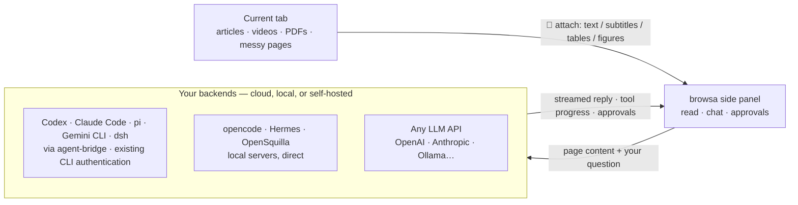

<p align="center"><a href="./README.md">English</a> · <a href="./README.zh-CN.md">简体中文</a> · <a href="./README.ja.md">日本語</a> · <strong>한국어</strong> · <a href="./README.es.md">Español</a> · <a href="./README.pt-BR.md">Português</a> · <a href="./README.ru.md">Русский</a></p>

<p align="center">
  <a href="https://chromewebstore.google.com/detail/browsa/kghjmmajnpbkljankbbjbmnhfdocaeho"></a>&nbsp;
  <a href="LICENSE"></a>&nbsp;
  <a href="#설치"></a>&nbsp;
  <a href="https://github.com/xiaohuzai/browsa/pulls"></a>
</p>

<p align="center">
  <a href="https://xiaohuzai.github.io/browsa/en/"><strong>웹사이트</strong></a> · <a href="https://xiaohuzai.github.io/browsa/en/guide/quickstart.html"><strong>빠른 시작</strong></a> · <a href="#설치"><strong>설치</strong></a> · <a href="https://github.com/xiaohuzai/browsa/issues"><strong>이슈</strong></a>
</p>

---

# browsa

**페이지에 머무르고, 곁에서 물어보세요.**

browsa는 Chrome / Edge 사이드 패널 확장 프로그램입니다. 텍스트를 복사하거나 페이지를 떠나지 않고도 기사, 동영상, PDF를 **나만의 AI**와의 대화로 가져오세요. Agent Bridge를 통해 **Codex / Claude Code / pi / Gemini CLI / dsh (DeepSeek Harness)**를 연결하거나, **opencode / Hermes / OpenSquilla**를 사용하거나, OpenAI, Anthropic, Ollama 같은 모델 API를 구성할 수 있습니다.

**무료, MIT 라이선스 확장 프로그램입니다.** 모델이나 에이전트는 직접 준비해서 연결하세요. API 키는 로컬에 저장되며, 구성한 서비스를 인증할 때 사용됩니다.

<p align="center">
  
</p>
<p align="center">
  <a href="https://www.youtube.com/watch?v=km0joAMt0Ow"><strong>▶ 전체 영상 · 68초</strong></a> · <a href="https://xiaohuzai.github.io/browsa/ko/#demo"><strong>▶ 페이지에 머무르고, 곁에서 물어보세요.</strong></a> · <a href="docs/assets/promo/browsa-promo-v7-ko.mp4">MP4 다운로드</a> — 실제 UI 데모: browsa에서 내 AI와 에이전트를 선택하거나 전환하고, 글을 첨부해 한 문장을 더 질문하며 수식·흐름도·차트를 확인합니다. 영상 타임라인으로 내용을 검증하고 여러 세션을 관리하며, 세션 ID로 에이전트 쪽에서 작업을 이어갑니다. 답변·저장 결과·CLI 연결 화면은 데모 데이터이며 재생은 편집되었습니다. 파일 저장은 연결된 에이전트의 기능에 따라 달라집니다.</p>

## 주요 기능

### 1. 이미 사용 중인 에이전트 연결하기

Agent Bridge를 통해 기존 CLI 에이전트를 연결하면, 에이전트가 구성해 둔 로그인과 도구를 그대로 사용합니다. browsa는 웹 콘텐츠를 에이전트에 전달하고, 도구 진행 상황을 스트리밍으로 보여 주며, 에이전트가 보내는 승인 요청을 표시합니다. 사용 가능한 도구와 권한은 에이전트의 설정에 따라 달라집니다.

| 에이전트 | 연결 방법 | 로그인 |
|---|---|---|
| **Codex** (OpenAI) | [agent-bridge](https://github.com/xiaohuzai/agent-bridge) 로컬 데몬 | 기존 CLI 인증 사용 |
| **Claude Code** (Anthropic) | agent-bridge 로컬 데몬 | 기존 CLI 인증 사용 |
| **pi** (earendil-works) | agent-bridge 로컬 데몬 | pi에 구성한 모델 |
| **Gemini CLI** (Google) | agent-bridge 로컬 데몬 | 기존 CLI 인증 사용 |
| **dsh** (DeepSeek Harness) | agent-bridge 로컬 데몬 | DeepSeek 계정 또는 API 키 |
| opencode | 공식 헤드리스 서버, 직접 연결 | 구성해 둔 모델 |
| Hermes | 셀프호스팅, `/v1/runs` 프로토콜 | 셀프호스팅 |
| OpenSquilla | 셀프호스팅 게이트웨이, WebSocket (`/ws`) | 게이트웨이가 라우팅하는 모델 |

하나의 browsa 카드로 여러 에이전트에 동시에 연결할 수 있고, 사이드바 드롭다운에서 전환합니다.

### 2. 웹 전체를 읽어 들입니다 — 동영상 포함

- **동영상**: 자막 또는 자동 전사(ASR) → **클릭 가능한 `[mm:ss]` 타임스탬프**가 달린 노트. 클릭하면 해당 순간으로 바로 이동합니다. 자막 없는 동영상도 화면으로 읽을 수 있습니다
- **PDF / 논문**: 전부 브라우저 안에서 파싱 — 표, 다단 레이아웃, 제목이 재구성되고, 그림 영역은 잘라 내어 비전 모델로 전송됩니다
- **Office 문서**: `.docx` / `.pptx` / `.xlsx` / `.epub` / `.odt` / `.rtf`… 직접 링크는 기기 안에서 전부 Markdown으로 변환됩니다(docling이 WASM으로 컴파일됨) — 표, 제목, 목록이 그대로 살아 남습니다
- **기사 & 복잡한 페이지**: 깨끗한 본문 텍스트. 피드형 페이지는 페이지 자체 데이터를 직접 읽습니다(YouTube, Bilibili, 小红书…)

전체 목록은 아래 "browsa가 읽는 것들" 섹션에 있습니다.

## 아키텍처



코드베이스의 개발자 수준 투어 — 메시지 흐름, 렌더링 파이프라인, 스토리지 모델, 공급자와 에이전트, ASR, 보안 모델 — 은 [프로젝트 위키](https://github.com/xiaohuzai/browsa/wiki)(7개 언어)에 있습니다.

## 설치

설치 방법을 하나 선택하세요:

**Chrome 웹 스토어 — 권장, 자동 업데이트.** [Chrome에 browsa 추가](https://chromewebstore.google.com/detail/browsa/kghjmmajnpbkljankbbjbmnhfdocaeho). 스토어 심사는 GitHub 릴리스보다 늦을 수 있습니다.

**GitHub — 수동 설치 및 업데이트.**

1. [Releases](https://github.com/xiaohuzai/browsa/releases)에서 확장 프로그램 ZIP을 내려받아 압축을 풉니다. 코드를 다루어 보려면 대신 이 저장소를 클론하거나 내려받으세요.
2. `chrome://extensions`(또는 `edge://extensions`)를 열고 **개발자 모드**를 켭니다.
3. **압축해제된 확장 프로그램 로드**를 클릭 → `manifest.json`이 들어 있는 압축을 푼 폴더를 선택합니다(ZIP 파일이나 상위 폴더가 아님). 폴더 이름은 내려받은 방식에 따라 다릅니다.

**어느 쪽이든, 이어서:**

1. 기사를 열고 확장 프로그램 툴바 아이콘을 클릭하거나 `Ctrl+Shift+H`(macOS는 `Command+Shift+H`)를 누릅니다.
2. **⚙ 설정**을 열어 LLM 또는 에이전트 공급자를 구성하고 **Ping**을 클릭해 연결을 확인합니다.
3. 사이드 패널 드롭다운에서 모델이나 에이전트를 선택하고, **📎**를 클릭해 페이지를 첨부한 뒤 첫 질문을 해 보세요.

전체 과정은 [빠른 시작 가이드](https://xiaohuzai.github.io/browsa/en/guide/quickstart.html)를 참고하세요. 연결만 먼저 잡으면 되므로 고급 설정은 기본값으로 두어도 됩니다.

<details>
<summary><b>빌드 & 패키징</b></summary>

```bash
npm install          # first time only
npm test             # run the test suite
npm run package      # → browsa-v<version>.zip
```

`npm version patch|minor`는 `package.json`과 `manifest.json` 양쪽의 버전을 자동으로 올립니다.

메모리가 부족한 머신에서는 테스트를 직렬로 실행하세요: `node --test --test-concurrency=1 test/*.test.mjs`.

</details>

## 공급자 연결하기

⚙ 설정을 열고 주소를 채운 뒤 **Ping**을 누르세요 — 연결이 검증되고 지원 기능이 자동 감지되며, 첫 번째로 검증된 공급자가 활성화됩니다. 백엔드는 두 종류입니다:

- **에이전트 공급자** — 서버 측 도구 실행(bash, 파일 작업, 웹 검색…)을 갖춘 완전한 에이전트 백엔드. AI가 실제로 *무언가를 수행*합니다.
- **LLM 공급자** — 대화 전용 순수 채팅 엔드포인트. 모델 ID가 필요합니다.

에이전트와의 대화는 에이전트 측에 저장됩니다. browsa는 세션 이름을 자동으로 붙입니다("browsa:" + 첫 메시지) — 에이전트 고유의 인터페이스에서 그 이름으로 찾아 이어서 작업할 수 있습니다. 세션 ID는 세션 드로어 상단에 표시되며 복사할 수 있습니다. 저장한 browsa 대화는 각 Agent와 연결 주소별 세션 ID를 함께 보관하고 복원합니다. ID가 기록되지 않은 이전 대화는 첫 메시지를 보낼 때 새 Agent 세션을 만들고 기존 텍스트 기록을 전달합니다.

<details>
<summary><b>🔧 Agent Bridge</b> — 로컬 CLI 에이전트 브리지(<b>Codex</b>, <b>Claude Code</b>, <b>pi</b>, <b>Gemini CLI</b>, <b>dsh</b>…)</summary>

[agent-bridge](https://github.com/xiaohuzai/agent-bridge)는 CLI 에이전트(codex, claude, pi, gemini, dsh)를 하나의 로컬 HTTP 프로토콜로 변환해 주는 독립 실행형 로컬 데몬입니다. CLI에 구성된 인증을 그대로 사용합니다:

```bash
npm i -g @xiaohuzai/agent-bridge                  # published on npm (Node 18+)
cp "$(npm root -g)/@xiaohuzai/agent-bridge/agents.example.json" agents.json
agent-bridge serve                                # one bridge per entry; ports live in agents.json
```

⚙ 설정을 열어 **Agent Bridge** 카드를 선택하고, **＋ 에이전트 추가**를 클릭한 뒤 브리지 주소를 한 줄에 하나씩 채우세요 — 주소 하나당 에이전트 하나이며, 별칭(비워 두면 Ping이 에이전트 이름을 자동으로 찾습니다)과 그 브리지 자체의 API 키(브리지마다 달라도 됩니다)를 넣을 수 있습니다. 사이드바 드롭다운에는 "Agent Bridge · codex" 형태로 표시되며, 각 에이전트는 자신만의 독립적인 세션 스레드와 ping 상태(행의 ⟳는 해당 에이전트만 ping합니다)를 갖습니다. 위험한 작업의 승인 카드는 패널에 바로 나타납니다. 스크린샷, 붙여넣은 이미지, PDF 그림도 메시지와 함께 전송됩니다(턴당 ≤8개). 다중 턴 컨텍스트는 에이전트 자체에 저장됩니다.


</details>

<details>
<summary><b>🔧 OpenCode Agent</b> — <code>opencode</code> CLI 에이전트 연결</summary>

[opencode](https://opencode.ai)는 퍼스트파티 헤드리스 서버를 기본 제공합니다 — browsa는 여기에 직접 연결됩니다(세션, 스트리밍, 도구 진행 상황, 그리고 셸 명령 같은 위험 작업에 대한 승인 프롬프트까지). browsa는 **어떤** `opencode serve` 주소에도 연결할 수 있습니다 — 하지만 옵션 없는 `opencode serve`는 재시작할 때마다 바뀌는 임의 포트를 고르므로, 한 번 설정으로 끝내려면 포트를 고정하는 것이 상책입니다:

```bash
opencode serve --port 4096
```

⚙ 설정을 열고 **OpenCode Agent** 공급자를 선택한 뒤 Base URL에 `http://127.0.0.1:4096`을 채우고(플레이스홀더가 이 값을 제안합니다), **Ping**, 완료입니다. 다중 턴 컨텍스트는 opencode 세션이 관리하고 browsa는 당신의 턴만 보냅니다. opencode가 위험한 명령의 실행을 요청하면 승인 카드가 패널에 바로 나타납니다. 어떤 디렉터리에서든 작동합니다 — 작업을 맡길 프로젝트에서 서버를 시작하세요.

</details>

<details>
<summary><b>🤖 Hermes Agent</b> — 도구가 내장된 셀프호스팅 에이전트</summary>

Hermes는 도구(웹 검색, 터미널, 파일 작업, 메모리, 스킬)가 내장된 셀프호스팅 AI 에이전트입니다. browsa는 Hermes의 `/v1/runs` API를 사용합니다 — 순수 chat completions보다 풍부하고(도구 진행 상황, 위험 작업에 대한 승인/확인 프롬프트), 대화마다 안정적인 `X-Hermes-Session-Id`를 사용해 Hermes가 서버 측에서 세션 연속성을 유지할 수 있게 합니다. Hermes 배포가 `/v1/runs` 지원을 알리지 않으면 자동으로 일반 `/v1/chat/completions`로 폴백합니다.

**1. Hermes 설치**

```bash
pip install hermes-agent   # or follow the official install guide
```

**2. API 서버 활성화** — `~/.hermes/.env`에 추가:

```bash
API_SERVER_ENABLED=true
API_SERVER_KEY=your-secret-key
```

**3. Hermes 시작**

```bash
hermes gateway
# → [API Server] API server listening on http://127.0.0.1:8642
```

**4. browsa 구성** — ⚙ 설정을 열고 **Hermes Agent** 공급자를 선택합니다. Base URL과 API 키만 필요합니다 — 자체 `/v1/runs` 프로토콜이 자동으로 사용됩니다(API 유형 드롭다운 없음).

| 필드 | 값 |
|---|---|
| Base URL | `http://<server-ip>:8642` |
| API Key | `API_SERVER_KEY`의 값 |

**5. Ping**으로 검증하세요. `/v1/runs` 지원은 자동 감지되어 자동으로 활성화됩니다.

</details>

<details>
<summary><b>🦑 OpenSquilla Agent</b> — 게이트웨이 WebSocket을 통한 로컬 에이전트(데스크톱 앱 또는 CLI)</summary>

[OpenSquilla](https://github.com/opensquilla/opensquilla)는 토큰 효율적인 마이크로커널 설계, 모델 라우팅, 스킬을 갖춘 로컬 에이전트입니다(게이트웨이 + 웹 UI + 데스크톱 앱). browsa는 OpenSquilla의 **게이트웨이 WebSocket**(`/ws`) — 자체 웹 UI가 쓰는 것과 같은 채널 — 으로 통신하므로 완전한 에이전트 경험을 얻습니다: 서버 측 세션 메모리, 스트리밍 델타, 사고 과정 출력, 서버 측 취소.

게이트웨이는 **데스크톱 앱** 또는 명령줄 **어느 쪽으로든** 실행하면 됩니다 — browsa는 둘을 똑같은 방식으로 연결합니다. 두 경로가 다른 지점은 딱 하나입니다: 게이트웨이가 읽는 설정 파일(각 경로의 2단계)입니다. 잘못된 파일을 고치는 것이 연결이 조용히 실패하는 가장 흔한 원인입니다.

**방법 A — 데스크톱 앱(터미널 없음)**

1. **설치 & 실행** — OpenSquilla 데스크톱 앱 v0.5.5 이상(그보다 오래된 빌드는 확장을 받아들이지 않는 origin 가드를 가진 게이트웨이를 묶고 있습니다). 앱은 자체 게이트웨이를 자동으로 시작합니다 — 앱 설정을 열어 표시되는 **게이트웨이 URL**을 적어 두세요(보통 `http://127.0.0.1:18791`; 18791–18830 중 첫 번째 free port를 가져갑니다).
2. **확장 프로그램 허용** — 데스크톱 앱은 `~/.opensquilla/config.toml`을 읽지 **않습니다**. 자체 앱 데이터 디렉터리에 있는 설정을 읽습니다. 가장 정확한 출처는 앱 자신입니다: **Settings → Advanced → Config file**에 정확한 경로가 표시됩니다(복사 버튼 포함). 흔한 기본값: macOS 공식 패키지 `~/Library/Application Support/OpenSquilla/opensquilla/config.toml`; 직접 빌드한 패키지 `~/Library/Application Support/@opensquilla/desktop-electron/opensquilla/config.toml`(두 데이터 디렉터리는 완전히 분리되어 있습니다). 경로에 공백이 들어 있으므로 터미널에서 이스케이프해야 합니다(전체 경로를 따옴표로 감싸거나 공백마다 백슬래시를 붙이세요). 그렇지 않으면 셸이 공백에서 경로를 잘라 엉뚱한 파일을 고치게 됩니다:

```bash
open -e "<paste the path copied from Settings → Advanced → Config file>"   # opens in macOS TextEdit
```

추가할 내용:

```toml
[cors]
# The value below covers the Chrome Web Store build. A sideloaded build
# (zip / repo folder) has a DIFFERENT extension ID — see the fine print below.
allowed_origins = ["chrome-extension://kghjmmajnpbkljankbbjbmnhfdocaeho"]
```

3. **앱을 완전히 종료한 뒤 다시 엽니다**(창을 닫는 것만으로는 부족합니다) — 게이트웨이는 이 설정을 시작할 때 한 번만 읽습니다. 데스크톱 앱의 모델 / API 키는 앱 안에서(설정 창) 구성하며 셸 환경 변수로는 넣지 않습니다. 고급: 앱은 `OPENSQUILLA_DESKTOP_GATEWAY_URL`로 외부에서 실행한 CLI 게이트웨이에 붙을 수도 있습니다.
4. 아래 **browsa 구성**으로 이동합니다.

**방법 B — 명령줄**

1. **설치 & 시작** — 게이트웨이(uv가 Python 3.12를 제공합니다):

```bash
uv tool install --python 3.12 "opensquilla[recommended] @ https://github.com/opensquilla/opensquilla/releases/download/v0.5.5/opensquilla-0.5.5-py3-none-any.whl"
opensquilla gateway start
# → running: http://127.0.0.1:18791
```

2. **확장 프로그램 허용** — CLI 게이트웨이는 `~/.opensquilla/config.toml`을 읽습니다. 방법 A와 같은 `[cors]` 블록을 추가하세요. 게이트웨이의 모델 라우팅도 이 설정에서 구성합니다(OpenSquilla 자체 문서 참고; LLM 키는 보통 게이트웨이가 시작된 환경에서 옵니다).
3. **게이트웨이 재시작**(`Ctrl+C`, 이후 `opensquilla gateway start`를 다시) — 설정은 시작할 때 한 번만 읽힙니다.
4. 아래 **browsa 구성**으로 이동합니다.

**browsa 구성(양쪽 동일)** — ⚙ 설정을 열고 **OpenSquilla** 탭을 선택하세요:

| 필드 | 값 |
|---|---|
| Base URL | `ws://127.0.0.1:18791/ws` — 게이트웨이가 실제로 표시하는 URL을 사용하세요(데스크톱: 앱 설정; CLI: `running:` 줄) |
| API Key | 게이트웨이가 토큰을 요구할 때만 입력(선택) |

**Ping**으로 검증하세요 — 실제 WebSocket 핸드셰이크를 수행하므로 초록 ping은 연결과 origin 허용 목록이 모두 준비되었음을 증명합니다.

Origin 가드 세부 사항(양쪽 공통): 허용 목록은 정확한 문자열 일치입니다(`*`는 아무 효과가 없습니다). 위 스니펫의 값은 **Chrome 웹 스토어 빌드**를 커버합니다. **사이드로드 빌드는 ID가 다릅니다** — 저장소 폴더를 직접 로드하면 항상 `chrome-extension://apoodheofdhglelbnmggeokbhampbmgn`이 표시되고(저장소 manifest의 키로 고정), 릴리스 zip에서 푼 빌드는 머신의 폴더 경로에서 파생된 ID를 받습니다. 어느 쪽이든 `chrome://extensions` → browsa → **ID**에 표시된 실제 값을 읽어 그 origin을 목록에 추가하세요(여러 항목을 나열해도 됩니다). v0.5.5부터 가드는 루프백에 대해 정확히 나열된 non-http(s) origin을 받아들입니다(`ws://` 스킴은 `http`로 매핑; `wss`는 거부됨 — 로컬 게이트웨이에는 `ws://`를 사용하세요).

참고: 각 browsa 대화는 하나의 게이트웨이 세션에 매핑됩니다(게이트웨이가 할당한 키, browsa 히스토리를 지우면 재설정). 채팅 히스토리는 게이트웨이 측에 저장됩니다 — browsa는 당신의 텍스트와, 묻기 직전에 첨부한 페이지를 전달합니다(📎 컨텍스트는 다음 메시지에 함께 실려 가고, 이후에는 게이트웨이 자체 대화 기록에 남습니다); 거대한 페이지(6만 자 초과)는 에이전트가 자체 도구로 읽는 `page-context.md` 문서로 업로드됩니다. 페이지 그림은 이미지 첨부로 함께 전송됩니다(텍스트 전용 라우터 모델이 배정되면 자동으로 텍스트로 강등됩니다). 붙여넣은 스크린샷은 browsa 자체 히스토리에만 남으며 아직 전달되지 않습니다. 이 프로토콜에는 시스템 프롬프트 필드가 없으므로 답변 언어 선호는 메시지 앞에 붙여서 전송됩니다.

</details>

<details>
<summary><b>💬 LLM 공급자</b> — OpenAI · Anthropic · Ollama · Groq · LiteLLM · 호환 엔드포인트</summary>

OpenAI **Chat Completions**(`/v1/chat/completions`), OpenAI **Responses**(`/v1/responses`), 또는 **Anthropic Messages**(`/v1/messages`)를 말하는 어떤 엔드포인트든 연결됩니다.

⚙ 설정 → **LLM 공급자**를 엽니다. 빈 **LLM 1** 슬롯이 예약되어 있습니다 — 채워 넣고 **Save**를 누르세요. 공급자는 하나의 카드에 탭으로 모여 있으며, 탭 바 끝의 **＋** 탭으로 언제든 추가할 수 있습니다:

| 필드 | 값 |
|---|---|
| Alias | 직접 정한 이름(예: "My OpenAI", "로컬 모델") — 사이드바 드롭다운에 표시되어 여러 공급자를 구별할 수 있게 해 줍니다 |
| Base URL | 예: `https://api.openai.com` |
| API Key | 당신의 API 키 |
| Model ID | 필수. 모델 ID를 입력하고 **Enter** 또는 **＋**를 눌러 추가하고, **✕**로 제거합니다. 쉼표로 구분해 입력하면 여러 개를 한 번에 추가합니다. 각 모델은 사이드바 드롭다운에 "Alias · 모델" 형태로 표시됩니다 |
| API | 이 엔드포인트가 말하는 프로토콜: Chat Completions / Responses / Anthropic |

LLM 공급자는 원하는 만큼 추가하세요. 각각 자신의 프로토콜을 고르고 자신의 별칭을 가집니다. 한 카드가 여러 모델 ID를 가질 수도 있습니다 — 수십 개의 모델을 호스팅하는 게이트웨이 전체를 한 카드가 커버합니다. 카드의 **✕**로 제거합니다(내장 에이전트 카드 — Hermes, OpenSquilla, OpenCode, Agent Bridge — 는 고정되어 있으며 제거할 수 없습니다).

</details>

## browsa가 읽는 것들

📎를 클릭해 현재 탭을 첨부하세요 — **자동** 모드(깨끗한 기사 본문, 실패 시 DOM 트리, 그다음 전체 페이지 텍스트) 또는 **📷 스크린샷** 모드(보이는 탭 그대로, 멀티모달 모델용). PDF나 Office 문서 — 또는 사실 그런 파일인 페이지 — 의 첨부는 자동입니다. 고를 모드가 없습니다.

| 보고 있는 것 | browsa가 보내는 것 |
|---|---|
| 기사 & 문서 | 깨끗한 기사 본문. 사이트의 `llms.txt` 지침이 컨텍스트에 통합됩니다 |
| PDF & 논문 | 전체 레이아웃 — 표, 제목, 다단 — 을 브라우저에서 파싱. 그림 영역은 잘라 이미지로 비전 모델에 전송(답변 후에는 히스토리에서 라벨 달린 자리표시자로 압축됩니다) |
| Office 문서(`.docx` `.pptx` `.xlsx` `.epub` `.odt` `.rtf`…) | docling-wasm으로 기기 안에서 Markdown으로 변환 — 제목, 목록, 표의 구조가 유지됩니다 |
| 동영상 | 클릭 가능한 `[mm:ss]` 타임스탬프가 달린 전사 텍스트. 자막 없는 동영상은 자동 전사(ASR, 선택 — 설정에서 Volcengine Ark 키)되거나 음성과 함께 화면으로 분석됩니다 |
| GitHub 파일 페이지 | `raw.githubusercontent.com`의 원본 소스 — markdown과 코드가 구조를 유지합니다 |
| Feishu / Lark 문서 | 페이지의 에디터 블록 구조를 직접 파싱 — 제목, 목록, **표의 행 & 열**까지 살아 남습니다 |
| 복잡한 모든 페이지 | 페이지 자체 네트워크 요청을 관찰해 직접 읽습니다 — 자막, 댓글, 기사 소스(YouTube, Bilibili, 小红书 등) |

페이지에서 텍스트를 선택하면 **플로팅 툴바**가 나타납니다: **설명**과 **번역**은 그 자리에서 답합니다 — 선택 영역 바로 옆에 스트리밍 카드가 펼쳐지고 패널도 필요 없습니다. 반면 **질문**과 **요약**(그리고 우클릭 메뉴)은 패널로 들어갑니다. 📎를 누를 필요가 없습니다.

## 기능

전체 레퍼런스는 여기에 있습니다:

<details>
<summary><b>채팅</b> — 스트리밍, 생각 블록, 다이어그램, 후속 질문…</summary>

답변이 진행되는 중에 세션을 전환해도 답변은 죽지 않습니다: 백그라운드에서 계속 실행되며 시작된 세션에 저장됩니다(완료될 때까지 드로어에서 맥동하는 점으로 표시). 직접 답변을 멈추면 이미 스트리밍된 내용이 그대로 유지되고 중단됨으로 표시됩니다 — 긴 사고가 증발하지 않습니다.

| 기능 | 제공되는 것 |
|---|---|
| **스트리밍 답변** | 토큰이 도착하는 대로 표시됩니다. 입력창의 **■**을 클릭하거나 `Esc`를 눌러 중지 |
| **생각 블록** | `<think>` / `<thinking>` 내용이 접을 수 있는 블록으로 표시되고 스트리밍 후 자동으로 접힙니다 |
| **Markdown & 하이라이팅** | 완전한 GFM(표, 코드 블록, 목록). highlight.js로 40+ 언어. `diff` 블록은 `+`를 초록 / `-`를 빨강으로 칠합니다 |
| **당신의 코드도 렌더링됩니다** | 입력창에 ```` ``` ```` 펜스 블록을 붙여넣으면 당신의 버블에 복사 버튼이 달린 하이라이트된 코드 블록으로 표시됩니다. 언어 태그도 필요 없습니다(자동 감지). 메시지의 다른 모든 내용은 입력한 그대로 유지됩니다 — 당신의 말이 markdown으로 재해석되지 않습니다 |
| **LaTeX** | 인라인 `$...$`와 디스플레이 `$$...$$`(KaTeX) — 수식이 많은 메시지는 Web Worker로 오프로드되어 패널이 버벅이지 않습니다 |
| **Mermaid · ECharts · Markmap** | ` ```mermaid ` / ` ```echarts ` / ` ```markmap ` 코드 블록이 인라인으로 렌더링되고 각각 줌 / 복사 / PNG 내보내기 툴바가 붙습니다. 차트나 마인드맵을 그냥 요청하세요 — 모델이 형식을 압니다. Mermaid 블록의 파싱이 실패하면 한 번의 클릭으로 모델에게 수정을 맡깁니다 — 수리된 다이어그램은 깨진 것을 교체하기 전에 로컬에서 검증됩니다 |
| **분자 · 단백질 · 그래프** | ```smiles / ```pdb / ```dot 코드 블록도 라이브 렌더링됩니다 — 2D 구조식과 반응 다이어그램은 RDKit이 분자 특성 줄과 함께 그립니다(MW, logP, TPSA, 수소 결합 공여체/수용체; 화학적으로 성립하지 않는 SMILES는 원본을 남긴 채 거부됩니다). PDB ID나 AlphaFold ID로 대화형 단백질 3D를 볼 수 있습니다(Mol* 뷰어: 잔기에 호버하면 신원이 표시되고, 서열 스트립이 포함되며, AlphaFold 모델은 pLDDT 신뢰도로 색칠됩니다). Graphviz DOT 그림(신경망 아키텍처, 데이터 흐름, 의존성 그래프)도 됩니다. 각각 복사 / 내보내기 컨트롤이 붙습니다 |
| **후속 질문("追问")** | 답변 안의 텍스트를 선택하면 그 발췌만을 위한 별도의 사이드 대화가 열립니다. 메인 히스토리는 건드리지 않습니다. 크기는 자유롭게 조절할 수 있고, 메인 입력창과 마찬가지로 카드에 이미지를 붙여넣을 수 있습니다. 입력창의 ↑/↓는 후속 질문만 기억합니다. 인용된 수식은 수식으로 렌더링됩니다 |
| **아웃라인 레일** | 4턴부터 조용한 눈금 레일이 대화를 추적합니다 — 클릭해 이동하고, 호버로 미리 봅니다 |
| **편집 & 재전송 · 재생성** | ✏로 사용자 메시지를 편집해 다시 보냅니다. ⟳로 어느 답변이든 다시 실행합니다 |
| **대기열 후속 질문** | 답변이 스트리밍되는 동안 입력하면 메시지가 대기열에 들어가고, 스트림이 끝나면 자동으로 전송됩니다 |
| **오류 카드** | 공급자 오류를 평이한 언어로 분류합니다(인증 / 레이트 리밋 / 타임아웃 / 네트워크 / 5xx). 원본 오류는 펼쳐 보고 복사할 수 있습니다 |
| **복사 & 타임스탬프** | ⎘로 전체 원본 Markdown을 복사합니다. 메시지에 호버하면 전송 시간이 표시됩니다 |
| **답변 출처 라벨** | 모든 답변에는 그것을 만들어 낸 공급자 / 에이전트가 도장으로 찍힙니다(사이드바 드롭다운과 같은 이름). 에이전트로 전환하면 대화를 첫 메시지로 가져갈지 새 세션을 시작할지 묻습니다(선택 없이 보내면 컨텍스트 없이 계속됩니다) |

</details>

<details>
<summary><b>히스토리 & 세션</b> — 드로어, 검색, 내보내기…</summary>

| 기능 | 제공되는 것 |
|---|---|
| **세션** | 대화를 이름 있는 세션으로 저장합니다. 🕐 드로어에서 탐색하고 복원합니다. 즐겨찾기는 목록 위에 고정됩니다 |
| **모든 곳에서 검색** | `Ctrl+F`로 대화의 모든 메시지를 검색합니다. 드로어는 제목**과** 메시지 내용으로 세션을 필터링합니다(내용 전용 히트는 표시됩니다) |
| **내보내기** | 어느 세션이든 Markdown 파일로 내보냅니다 |
| **안전한 삭제** | 세션은 2단계 확인 삭제입니다. 메시지는 다중 선택해 일괄 삭제합니다. 모든 메시지를 지우기 전에 확인이 필요합니다 |

</details>

<details>
<summary><b>입력</b> — 이미지, 초안, 빠른 작업…</summary>

| 기능 | 제공되는 것 |
|---|---|
| **이미지 첨부** | 이미지를 입력창으로 드래그하거나 붙여넣습니다(멀티모달 모델용) |
| **입력 히스토리 & 초안** | ↑/↓로 이전에 보낸 메시지를 불러와 편집합니다. 최신 항목에서 ↓를 한 번 더 누르면 원래 초안이 복원됩니다. 보내지 않은 초안은 패널을 닫아도 남습니다 |
| **슬래시 명령어** | `/`를 입력하면 자동완성이 나타납니다 — 아래 표 참고 |
| **빠른 작업** | 입력창 위의 요약 / 핵심 포인트 / 설명 / → 中文 / 개요 원클릭 버튼 |
| **선택 툴바 & 컨텍스트 메뉴** | 어느 페이지에서든 텍스트를 선택하세요: 질문 · 설명 · → 中文 · 요약 — 설명 / 번역은 그 자리에서 답변합니다(스트리밍, 인플레이스). 질문 / 요약과 우클릭 메뉴는 패널로 갑니다 |

</details>

<details>
<summary><b>설정</b> — 시스템 프롬프트, 언어, llms.txt, 자동 요약…</summary>

일상적인 설정은 바로 표시됩니다: 인터페이스 언어, 공급자, 시스템 프롬프트 / 답변 언어, 채팅 환경설정. **고급**에는 선택 툴바, `llms.txt`, 딥 추출, ASR 옵션이 있습니다. 필요 없다면 접어 두세요. LLM과 에이전트 공급자 그룹도 독립적으로 접힙니다 — 에이전트로 전환해도 접힌 LLM 그룹은 접힌 채로 있습니다.

| 설정 | 하는 일 |
|---|---|
| **시스템 프롬프트** | 모든 대화 앞에 `role: system`으로 추가됩니다 — 답변 언어, 어조, 형식 규칙을 여기에 정합니다 |
| **답변 언어** | 페이지 언어와 무관하게 특정 언어로 답변하도록 강제합니다 |
| **UI 언어** | English, 中文, 日本語, 한국어, Español, Português, Русский, 또는 Auto(브라우저를 따름) — 즉시 적용되며 새로고침이 필요 없습니다 |
| **선택 툴바 & llms.txt** | 텍스트 선택 시 나타나는 플로팅 툴바를 켜고 끕니다. 📎를 누르면 사이트의 LLM 지침을 한 번 가져와 첨부되는 페이지 컨텍스트에 넣습니다 — 시스템 프롬프트 밖에 유지되므로 프롬프트 접두사가 턴 사이에서 바이트 단위로 안정적입니다(프롬프트 캐시에 유리) |
| **추론 수준** | 모델별 추론 깊이(`auto`는 아무것도 보내지 않고, 이후에는 모델 자체의 사다리를 따릅니다 — GLM/Qwen류는 켜기/끄기 토글, GPT/Claude류는 low→max 노력). 선택지는 입력한 모델 id를 따라가며, 요청 필드는 각 API 방언에 맞춰 자동으로 조정됩니다(`reasoning.effort` / `thinking`+`output_config` / `enable_thinking`…) |
| **읽기 환경설정** | 메시지 글꼴 크기, 전송 단축키(Enter / Shift+Enter), 생각 블록 자동 접기 |
| **ASR** | 자막 없는 동영상을 위한 음성 인식 공급자(기본값 Volcengine Ark): API 키, 언어, 자막 소스 |
| **긴 첨부 자동 요약** | 자동입니다 — 임계값(기본 100,000자)을 넘는 페이지나 전사는 청크로 나뉘어 병렬 요약되고 백그라운드에서 병합됩니다. `[mm:ss]` 표식은 보존되므로 시크 링크가 계속 작동하고, 오류가 나면 원본 텍스트로 안전하게 폴백합니다 |
| **딥 추출** | 기본적으로 켜짐 — 첨부하기 전에 browsa가 접힌 섹션을 펼치고 페이지 매기기된 콘텐츠를 넘겨 읽어 훨씬 많은 페이지 내용이 모델에 도달합니다. 전부 백그라운드 탭에서 조용히 실행되며, 보고 있는 페이지를 스크롤하거나 클릭하지 않습니다 |

</details>

### 슬래시 명령어

입력창에서 `/`를 입력하면 자동완성이 보입니다. 모든 명령은 추가 지시를 받습니다 — `/summarize focus on the methodology`:

| 명령어 | 모델에 보내는 프롬프트 |
|---|---|
| `/summarize` | 3–5개 불릿 요약 |
| `/translate` | 중국어로 번역 |
| `/rewrite` | 모든 사실을 유지하며 더 간결하게 재작성 |
| `/explain` | 초보자에게 쉬운 언어로 설명 |
| `/outline` | 제목만으로 구성된 중첩 개요 |
| `/keypoints` | 상위 5개 핵심 요점 |
| `/prompt` | 현재 활성 시스템 프롬프트 표시(모델에는 전송되지 않음) |

## 키보드 단축키

| 단축키 | 동작 |
|---|---|
| `Ctrl+Shift+H` | 사이드 패널 열기 / 닫기 |
| `Enter` | 메시지 전송(설정에서 변경 가능) |
| `Shift+Enter` | 새 줄 |
| `Ctrl+K` | 메시지 지우기(확인 필요) |
| `Ctrl+/` | 컨텍스트 모드 순환(자동 ↔ 스크린샷) |
| `Ctrl+F` | 대화 내 검색 열기 |
| `Esc` | 스트림 취소 / 검색 닫기 / 드로어 닫기 |

## 작동 방식

<details>
<summary><b>코드 맵</b></summary>

- **`background.js`** — MV3 서비스 워커, 단일 메시지 라우터. 턴별 포트로 스트리밍하고, 과대 첨부는 자동 요약합니다.
- **`sidepanel.js`** — 채팅 UI 오케스트레이터. 렌더링(Markdown/Mermaid/Markmap/KaTeX/ECharts), 세션, 검색, 후속 질문은 각각 `lib/sidepanel/`에 있습니다.
- **`lib/`** — 페이지 추출(Readability 캐스케이드 + XHR 인터셉션), SSE 스트리밍 클라이언트(`/v1/chat/completions`, Hermes `/v1/runs`, opencode / agent-bridge 에이전트 클라이언트), `chrome.storage.local` 래퍼, 콘텐츠 스크립트.

[위키](https://github.com/xiaohuzai/browsa/wiki)는 이 각각을 하나의 완전한 장으로 확장합니다 — 아키텍처, 렌더링 파이프라인, 스토리지 모델, 공급자와 에이전트, ASR, 보안 모델, 설계 결정, 기여하기.

</details>

## 브라우저 호환성

Chrome / Edge 116+(주요 타깃). Brave 1.56+에서도 작동해야 합니다(같은 Chromium 기반). Firefox는 지원되지 않습니다(`side_panel` API가 없습니다).

## 보안

- API 키는 로컬의 `chrome.storage.local`에 저장되며, 구성한 서비스를 인증할 때 사용됩니다. 로컬 저장이 키가 절대 전송되지 않는다는 뜻은 아닙니다.
- 첨부된 페이지 콘텐츠, 질문, 대화 컨텍스트는 선택한 모델이나 에이전트로 전송됩니다. 선택적인 전사 / 시청각 분석도 구성된 분석 서비스로 미디어를 보냅니다.
- 페이지 컨텍스트가 전송되기 전에 browsa는 URL에서 인식되는 자격 증명(토큰, 비밀번호, 서명, 세션 파라미터 등)을 마스킹합니다. 이는 민감한 페이지 텍스트를 위한 범용 스크러버가 아닙니다. browsa 자신이 가져오는 URL(미디어, 이미지)은 건드리지 않습니다.
- PDF는 로컬에서 파싱됩니다(WASM + pdf.js). 추출된 텍스트와 그림 이미지는 구성한 공급자로 전송될 수 있습니다. 로컬 파싱이 모든 추출 내용이 기기에 남는다는 뜻은 아닙니다.
- LLM 답변은 렌더링 전에 DOMPurify로 정화됩니다(`data:image/svg+xml` 소스를 차단하고, Mermaid의 SVG 출력에서는 `<script>` / 이벤트 핸들러 속성을 제거합니다).
- 콘텐츠 스크립트는 네트워크 요청을 관찰만 할 뿐, 수정하거나 차단하지 않습니다.

## 라이선스

[MIT](LICENSE) — 자유롭게 사용, 수정, 배포할 수 있습니다.

---

<p align="center">
  <sub><b>browsa</b> — 어디서든 읽고, 어디서든 물어보세요.</sub>
</p>
