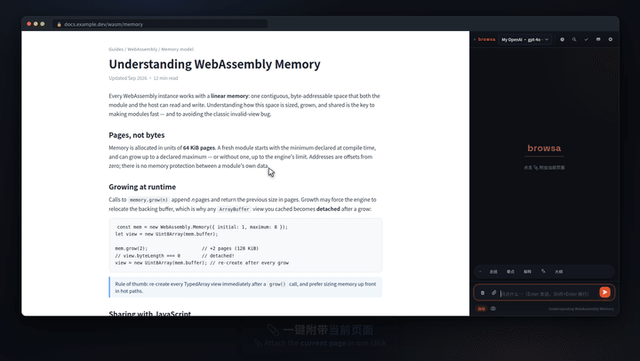
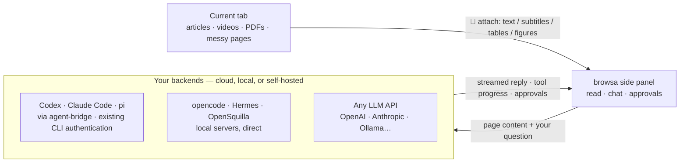

<p align="center">
  <strong>English</strong> · <a href="./README.zh-CN.md">简体中文</a>
</p>

<p align="center">
  <a href="https://chromewebstore.google.com/detail/browsa/kghjmmajnpbkljankbbjbmnhfdocaeho"></a>&nbsp;
  <a href="LICENSE"></a>&nbsp;
  <a href="#install"></a>&nbsp;
  <a href="https://github.com/xiaohuzai/browsa/pulls"></a>
</p>

<p align="center">
  <a href="https://xiaohuzai.github.io/browsa/en/"><strong>Website</strong></a> · <a href="https://xiaohuzai.github.io/browsa/en/guide/quickstart.html"><strong>Quick start</strong></a> · <a href="#install"><strong>Install</strong></a> · <a href="https://github.com/xiaohuzai/browsa/issues"><strong>Issues</strong></a>
</p>

---

# browsa

**Stay on the page. Ask beside it.**

browsa is a Chrome / Edge side-panel extension. Bring an article, video, or PDF into a conversation with **your own AI** — without copying text or leaving the page. Connect **Codex / Claude Code / pi** through Agent Bridge, use **opencode / Hermes / OpenSquilla**, or configure a model API such as OpenAI, Anthropic, or Ollama.

**Free, MIT-licensed extension.** Bring your own model or agent. API keys are stored locally and used to authenticate with the services you configure.

<p align="center">
  
</p>
<p align="center">
  <a href="https://xiaohuzai.github.io/browsa/en/#demo"><strong>▶ Watch the full 60-second tour</strong></a> · <a href="https://www.youtube.com/watch?v=rDBK2Xxvf2I">YouTube</a> — attach &amp; ask · follow-up threads · selection toolbar · video timeline · live diagrams &amp; 3D · agent approvals
</p>

## Highlights

### 1. Connect the agent you already use

Connect your existing CLI agent through Agent Bridge, using its configured sign-in and tools. browsa feeds it web content, streams tool progress, and displays the approval requests it sends. Available tools and permissions depend on the agent's configuration.

| Agent | How to connect | Sign-in |
|---|---|---|
| **Codex** (OpenAI) | [agent-bridge](https://github.com/xiaohuzai/agent-bridge) local daemon | Existing CLI authentication |
| **Claude Code** (Anthropic) | agent-bridge local daemon | Existing CLI authentication |
| **pi** (earendil-works) | agent-bridge local daemon | Whatever model you configure pi with |
| opencode | official headless server, direct | whatever model you configure it with |
| Hermes | self-hosted, `/v1/runs` protocol | self-hosted |
| OpenSquilla | self-hosted gateway, WebSocket (`/ws`) | whatever models the gateway routes to |

One browsa card connects to several agents at once; the sidebar dropdown switches between them.

### 2. Reads the whole web — videos included

- **Videos**: subtitles or auto-transcription (ASR) → notes with **clickable `[mm:ss]` timestamps**; click one to jump straight back to the moment. Subtitle-less videos can be read visually too
- **PDFs / papers**: parsed entirely in-browser — tables, multi-column layout, and headings reconstructed; figure regions cropped out and sent to vision models
- **Office documents**: direct links to `.docx` / `.pptx` / `.xlsx` / `.epub` / `.odt` / `.rtf`… are converted to Markdown fully on-device (docling compiled to WASM) — tables, headings and lists survive
- **Articles & messy pages**: clean article text; feed-style pages read the page's own data directly (YouTube, Bilibili, 小红书…)

Full list under "What browsa reads" below.

## Architecture



## Install

Choose one installation method:

**Chrome Web Store — recommended, automatic updates.** [Add browsa to Chrome](https://chromewebstore.google.com/detail/browsa/kghjmmajnpbkljankbbjbmnhfdocaeho). Store review may lag behind GitHub releases.

**GitHub — manual installation and updates.**

1. Download and extract the extension ZIP from [Releases](https://github.com/xiaohuzai/browsa/releases). To work on the code, clone or download this repository instead.
2. Open `chrome://extensions` (or `edge://extensions`) and enable **Developer mode**.
3. Click **Load unpacked** → select the extracted folder containing `manifest.json`, not the ZIP or its parent folder. Its name depends on how you downloaded it.

**Then, either way:**

1. Open an article and click the extension toolbar icon, or press `Ctrl+Shift+H` (`Command+Shift+H` on macOS).
2. Open **⚙ Settings**, configure an LLM or Agent provider, and click **Ping** to verify the connection.
3. Select the model or agent in the side-panel dropdown, click **📎** to attach the page, and ask your first question.

See the [quick-start guide](https://xiaohuzai.github.io/browsa/en/guide/quickstart.html) for the full walkthrough. Advanced settings can keep their defaults while you get connected.

<details>
<summary><b>Build & package</b></summary>

```bash
npm install          # first time only
npm test             # run the test suite
npm run package      # → browsa-v<version>.zip
```

`npm version patch|minor` bumps the version in both `package.json` and `manifest.json` automatically.

On memory-constrained machines, run tests serially: `node --test --test-concurrency=1 test/*.test.mjs`.

</details>

## Connect a provider

Open ⚙ Settings, fill in the address, hit **Ping** — connectivity is verified and capabilities auto-detected; the first provider you verify becomes active. Two kinds of backends:

- **Agent providers** — full agent backends with server-side tool execution (bash, file ops, web search…). The AI can actually *do* things.
- **LLM providers** — plain chat endpoints for conversation. Model ID required.

<details>
<summary><b>🔧 Agent Bridge</b> — bridge local CLI agents (<b>Codex</b>, <b>Claude Code</b>, <b>pi</b>…)</summary>

[agent-bridge](https://github.com/xiaohuzai/agent-bridge) is a standalone local daemon that adapts CLI agents (codex, claude, pi) to one local HTTP protocol. It uses the CLI's configured authentication:

```bash
npm i -g @xiaohuzai/agent-bridge                  # published on npm (Node 18+)
cp "$(npm root -g)/@xiaohuzai/agent-bridge/agents.example.json" agents.json
agent-bridge serve                                # one bridge per entry; ports live in agents.json
```

Open ⚙ Settings, select the **Agent Bridge** card, click **＋ Add agent** and fill in bridge addresses one per row — one agent per address, with an optional alias (leave it empty and Ping discovers the agent's name automatically) and that bridge's own API key (keys can differ per bridge). The sidebar dropdown lists them as "Agent Bridge · codex", each with its own independent session thread. Approval cards for dangerous actions appear right in the panel; screenshots, pasted images, and PDF figures ride along with your message (≤8 per turn). Multi-turn context lives in the agent itself.

Don't want to run those three commands yourself? Click "**Copy setup prompt**" on the Agent Bridge card in settings and paste the whole block to your CLI agent — it performs the install, config, and launch for you (full text in the [setup guide](https://xiaohuzai.github.io/browsa/en/guide/providers.html#agent-bridge)).

</details>

<details>
<summary><b>🔧 OpenCode Agent</b> — connect the <code>opencode</code> CLI agent</summary>

[opencode](https://opencode.ai) ships a first-party headless server — browsa connects to it directly (sessions, streaming, tool progress, and approval prompts for dangerous actions like shell commands). Browsa can connect to **any** `opencode serve` address — but bare `opencode serve` picks a random port that changes on every restart, so the set-and-forget move is to pin one:

```bash
opencode serve --port 4096
```

Open ⚙ Settings, select the **OpenCode Agent** provider, fill Base URL `http://127.0.0.1:4096` (the placeholder suggests it), **Ping**, done. Multi-turn context lives in the opencode session; browsa just sends your turns. When opencode asks to run a dangerous command, the approval card appears right in the panel. Works from any directory — start the server in the project you want it to work on.

</details>

<details>
<summary><b>🤖 Hermes Agent</b> — self-hosted agent with built-in tools</summary>

Hermes is a self-hosted AI agent with built-in tools (web search, terminal, file ops, memory, skills). browsa uses its `/v1/runs` API — richer than plain chat completions (tool progress, approval/clarification prompts for dangerous actions) — with a stable `X-Hermes-Session-Id` per conversation so Hermes can maintain session continuity server-side. Falls back to plain `/v1/chat/completions` automatically if a Hermes deployment doesn't advertise `/v1/runs` support.

**1. Install Hermes**

```bash
pip install hermes-agent   # or follow the official install guide
```

**2. Enable the API server** — add to `~/.hermes/.env`:

```bash
API_SERVER_ENABLED=true
API_SERVER_KEY=your-secret-key
```

**3. Start Hermes**

```bash
hermes gateway
# → [API Server] API server listening on http://127.0.0.1:8642
```

**4. Configure browsa** — open ⚙ Settings, select the **Hermes Agent** provider. It only needs a Base URL and API key — its own `/v1/runs` protocol is used automatically (no API-type dropdown).

| Field | Value |
|---|---|
| Base URL | `http://<server-ip>:8642` |
| API Key | value of `API_SERVER_KEY` |

**5. Ping** to verify. `/v1/runs` support is auto-detected and enabled automatically.

</details>

<details>
<summary><b>🦑 OpenSquilla Agent</b> — local agent over gateway WebSocket (desktop app or CLI)</summary>

[OpenSquilla](https://github.com/opensquilla/opensquilla) is a local agent (gateway + Web UI + desktop app) with a token-efficient microkernel design, model routing, and skills. browsa talks to its **gateway WebSocket** (`/ws`) — the same channel its own Web UI uses — so you get the full agent experience: server-side session memory, streaming deltas, thinking output, and server-side cancellation.

Run the gateway **either** as the desktop app **or** from the command line — browsa connects to both the same way. The tracks differ in exactly one thing: which config file the gateway reads (step 2 in each track). Editing the wrong file is the most common reason the connection silently fails.

**Way A — Desktop app (no terminal)**

1. **Install & launch** the OpenSquilla desktop app, v0.5.5 or newer (older builds bundle a gateway whose origin guard doesn't accept extensions). The app starts its own gateway automatically — open the app's settings and note the **gateway URL** it shows (typically `http://127.0.0.1:18791`; it takes the first free port in 18791–18830).
2. **Let the extension in** — the desktop app does **not** read `~/.opensquilla/config.toml`; it reads a config in its own app-data directory. macOS official package: `~/Library/Application Support/OpenSquilla/opensquilla/config.toml` (a self-built package uses `~/Library/Application Support/@opensquilla/desktop-electron/opensquilla/config.toml` instead — the two data directories are fully separate). The path contains spaces, so quote it in a terminal, e.g. `vim "$HOME/Library/Application Support/OpenSquilla/opensquilla/config.toml"` — an unquoted path quietly edits a different file. Add:

```toml
[cors]
allowed_origins = ["chrome-extension://kghjmmajnpbkljankbbjbmnhfdocaeho"]
```

3. **Fully quit and reopen the app** (closing the window is not enough) — the gateway reads this config once at startup. Models / API keys for the desktop app are configured inside the app (its setup window), not via shell env vars. Advanced: the app can also attach to an externally-run CLI gateway via `OPENSQUILLA_DESKTOP_GATEWAY_URL`.
4. Jump to **Configure browsa** below.

**Way B — Command line**

1. **Install & start** the gateway (uv provides Python 3.12):

```bash
uv tool install --python 3.12 "opensquilla[recommended] @ https://github.com/opensquilla/opensquilla/releases/download/v0.5.5/opensquilla-0.5.5-py3-none-any.whl"
opensquilla gateway start
# → running: http://127.0.0.1:18791
```

2. **Let the extension in** — the CLI gateway reads `~/.opensquilla/config.toml`. Add the same `[cors]` block as in Way A. The gateway's model routing is configured here too (see OpenSquilla's own docs; LLM keys typically come from the environment the gateway is started with).
3. **Restart the gateway** (`Ctrl+C`, then `opensquilla gateway start` again) — the config is read once at startup.
4. Jump to **Configure browsa** below.

**Configure browsa (same for both)** — open ⚙ Settings, select the **OpenSquilla** tab:

| Field | Value |
|---|---|
| Base URL | `ws://127.0.0.1:18791/ws` — use the URL your gateway actually shows (desktop: its settings; CLI: the `running:` line) |
| API Key | only if your gateway requires a token (optional) |

**Ping** to verify — it performs the real WebSocket handshake, so a green ping proves both connectivity and the origin allowlist.

Origin-guard fine print (both ways): the listing is an exact string match (`*` does nothing); verify the ID at `chrome://extensions` → browsa → **ID** and use whatever value is shown there if you run an unpacked build. Since v0.5.5 the guard accepts exactly-listed non-http(s) origins on loopback (the `ws://` scheme maps to `http`; `wss` is rejected — use `ws://` for a local gateway).

Notes: each browsa conversation maps to one gateway session (gateway-assigned key, reset when you clear browsa's history). Chat history lives on the gateway side — browsa forwards your text plus any page you attached right before asking (the 📎 context rides along on the next message, then lives in the gateway's own transcript); a huge page (over 60k chars) is uploaded as a `page-context.md` document the agent reads with its own tools. Page figures ride along as image attachments (a text-only router model degrades to text automatically). Pasted screenshots stay in browsa's own history and are not forwarded yet. The reply-language preference is prepended to the message since this protocol has no system-prompt field.

</details>

<details>
<summary><b>💬 LLM providers</b> — OpenAI · Anthropic · Ollama · Groq · LiteLLM · any compatible endpoint</summary>

Any endpoint that speaks OpenAI **Chat Completions** (`/v1/chat/completions`), OpenAI **Responses** (`/v1/responses`), or **Anthropic Messages** (`/v1/messages`).

Open ⚙ Settings → **LLM Providers**. An empty **LLM 1** slot is reserved for you — fill it in and hit **Save**. Providers live as tabs on one card; add more anytime with the **＋** tab at the end of the tab bar:

| Field | Value |
|---|---|
| Alias | a name you choose (e.g. "My OpenAI", "本地模型") — shown in the sidebar dropdown so multiple providers stay distinguishable |
| Base URL | e.g. `https://api.openai.com` |
| API Key | your API key |
| Model ID | Required. Enter a model ID and press **Enter** or **＋** to add it; **✕** removes a model. Comma-separated input adds several at once. Each appears as "Alias · model" in the sidebar dropdown |
| API | the protocol this endpoint speaks: Chat Completions / Responses / Anthropic |

Add as many LLM providers as you like; each picks its own protocol and carries its own alias. A single card can also carry several Model IDs — one card covers an entire gateway hosting dozens of models. Use the **✕** on a card to remove it (the built-in agent cards — Hermes, OpenSquilla, OpenCode, Agent Bridge — are fixed and not removable).

</details>

## What browsa reads

Click 📎 to attach the current tab — **Auto** mode (clean article text, falling back to DOM tree, then full page text) or **📷 Screenshot** mode (the visible tab, for multimodal models). Attaching a PDF or Office document — or a page that turns out to be one — is automatic; no mode to pick.

| You're reading | What browsa sends |
|---|---|
| Articles & docs | clean article text; the site's `llms.txt` instructions folded into the context |
| PDFs & papers | full layout — tables, headings, columns — parsed in-browser; figure regions cropped and sent as images to vision models (compacted to labeled placeholders in history after answering) |
| Office documents (`.docx` `.pptx` `.xlsx` `.epub` `.odt` `.rtf`…) | converted to Markdown on-device via docling-wasm — headings, lists and tables keep their structure |
| Videos | transcript with clickable `[mm:ss]` timestamps; subtitle-less videos auto-transcribed (ASR, optional — Volcengine Ark key in Settings) or visually analyzed together with the speech |
| GitHub file pages | raw source from `raw.githubusercontent.com` — markdown and code keep their structure |
| Feishu / Lark docs | the page's editor block structure parsed directly — headings, lists, and **table rows & columns** survive |
| Anything messy | the page's own network requests observed and read directly — subtitles, comments, article source (YouTube, Bilibili, 小红书, and more) |

Highlight text on a page and the **floating toolbar** appears: **Explain** and **Translate** answer inline — a streaming card right next to the selection, no panel needed — while **Ask** and **Summarize** (and the right-click menu) ride into the panel. No need to click 📎.

## Features

The full reference lives here:

<details>
<summary><b>Chat</b> — streaming, thinking blocks, diagrams, follow-up…</summary>

Switching sessions mid-reply never kills the reply: it keeps running in the background and is saved to the session it started in (marked with a pulsing dot in the drawer until it lands). Stopping a reply yourself keeps whatever already streamed, marked as interrupted — long thinking never evaporates.

| Feature | What you get |
|---|---|
| **Streaming replies** | tokens appear as they arrive; click **■** in the composer or press `Esc` to stop |
| **Think blocks** | `<think>` / `<thinking>` content in a collapsible block, auto-collapsed after streaming |
| **Markdown & highlighting** | full GFM (tables, code blocks, lists); 40+ languages via highlight.js; `diff` blocks color `+` green / `-` red |
| **Your code renders too** | paste a ```` ``` ```` fenced block in the composer and your own bubble shows it as a highlighted code block with a copy button; no language tag needed (auto-detected). Everything else in your message stays byte-for-byte as typed — no markdown re-interpretation of your words |
| **LaTeX** | inline `$...$` and display `$$...$$` via KaTeX — formula-heavy messages offloaded to a Web Worker so the panel doesn't jank |
| **Mermaid · ECharts · Markmap** | ` ```mermaid ` / ` ```echarts ` / ` ```markmap ` code blocks render inline, each with a zoom / copy / export-SVG toolbar; just ask for a chart or mind map — the model knows the format. If a Mermaid block fails to parse, one click sends it back to your model for a fix — the repaired diagram is validated locally before it replaces the broken one |
| **Molecules · Proteins · Neural nets** | ```smiles / ```pdb / ```nn code blocks render live too — 2D structure and reaction diagrams, interactive protein 3D from a PDB ID, and publication-style network architecture figures; each with copy / export controls |
| **Follow-up ("追问")** | select any text inside a reply to open a scoped side-conversation about just that excerpt, without touching the main history; fully resizable; paste images into the card, same as the main composer; the input's ↑/↓ recalls follow-up questions only; quoted formulas render as math |
| **Outline rail** | from 4 turns on, a quiet tick rail tracks the conversation — click to jump, hover to preview |
| **Edit & resend · Regenerate** | ✏ edits and resends any user message; ⟳ re-runs any assistant reply |
| **Queued follow-ups** | typing while a reply streams queues your message; it sends automatically once the stream ends |
| **Error cards** | provider errors classified into plain language (auth / rate-limit / timeout / network / 5xx), raw error expandable and copyable |
| **Copy & timestamps** | ⎘ copies the full raw Markdown; hover any message to see its send time |
| **Reply source labels** | every reply is stamped with the provider / agent that produced it (same name as the sidebar dropdown); switching to an agent asks whether to carry the conversation over as its first message or start a new session (sending without choosing continues without context) |

</details>

<details>
<summary><b>History & sessions</b> — drawers, search, export…</summary>

| Feature | What you get |
|---|---|
| **Sessions** | save the conversation as a named session; browse and restore from the 🕐 drawer; pin favorites above the list |
| **Search everywhere** | `Ctrl+F` across all messages in a conversation; the drawer filters sessions by title **and** message content (content-only hits flagged) |
| **Export** | any session as a Markdown file |
| **Safe deletion** | two-step armed delete for sessions; multi-select messages for batch deletion; clearing history is undoable for 5 seconds |

</details>

<details>
<summary><b>Input</b> — images, drafts, quick actions…</summary>

| Feature | What you get |
|---|---|
| **Image attachments** | drag-and-drop or paste images into the composer (for multimodal models) |
| **Input history & drafts** | ↑/↓ recalls previously sent messages; an unsent draft survives closing the panel |
| **Slash commands** | type `/` for completions — see the table below |
| **Quick actions** | one-click Summarize / Key Points / Explain / → 中文 / Outline above the composer |
| **Selection toolbar & context menu** | highlight text on any page: Ask · Explain · → 中文 · Summarize — Explain / Translate answer inline (streaming, in place); Ask / Summarize and the right-click menu go to the panel |

</details>

<details>
<summary><b>Settings</b> — system prompt, languages, llms.txt, auto-summarize…</summary>

Everyday settings are shown directly: interface language, providers, system prompt / reply language, and chat preferences. **Advanced** holds options for the selection toolbar, `llms.txt`, deep extraction, and ASR; leave it collapsed if you don't need them. LLM and Agent provider groups also collapse independently — switching agents keeps a collapsed LLM group closed.

| Setting | What it does |
|---|---|
| **System prompt** | prepended to every conversation as `role: system` — set reply language, tone, and format rules here |
| **Reply language** | force replies in a specific language regardless of page language |
| **UI language** | English, 中文, or Auto (follows the browser) — applies immediately, no reload |
| **Selection toolbar & llms.txt** | toggle the floating toolbar on text selection; on 📎, the site's LLM instructions are fetched once and baked into the attached page context — kept out of the system prompt so the prompt prefix stays byte-stable across turns (prompt-cache friendly) |
| **Thinking level** | per-model reasoning depth (`auto` sends nothing; then the model's own ladder — GLM/Qwen-class is an on/off toggle, GPT/Claude-class is low→max effort). The choices follow the model id you filled in, and the request fields adapt to each API dialect (`reasoning.effort` / `thinking`+`output_config` / `enable_thinking`…) automatically |
| **Reading preferences** | message font size, send shortcut (Enter / Shift+Enter), thinking-block auto-collapse |
| **ASR** | the speech-to-text provider for subtitle-less videos (Volcengine Ark by default): API key, language, subtitle source |
| **Auto-summarize long attachments** | automatic — pages or transcripts over the threshold (default 100,000 chars) are chunked, summarized in parallel, and merged in the background; `[mm:ss]` markers are preserved so seek links keep working; any error fails open to the original text |
| **Deep extract** | on by default — before attaching, browsa expands collapsed sections and pages through paginated content so far more of the page reaches the model; it all runs quietly in background tabs, never scrolling or clicking the page you are viewing |

</details>

### Slash commands

Type `/` in the composer to see autocomplete. All commands accept extra instructions — `/summarize focus on the methodology`:

| Command | Prompt sent to the model |
|---|---|
| `/summarize` | 3–5 bullet summary |
| `/translate` | Translate to Chinese |
| `/rewrite` | More concise rewrite, keeping all facts |
| `/explain` | Explain for a beginner in simple language |
| `/outline` | Nested outline of headings only |
| `/keypoints` | Top 5 takeaways |
| `/prompt` | Show the current active system prompt (not sent to the model) |

## Keyboard shortcuts

| Shortcut | Action |
|---|---|
| `Ctrl+Shift+H` | Open / close side panel |
| `Enter` | Send message (configurable in Settings) |
| `Shift+Enter` | New line |
| `Ctrl+K` | Clear history (with undo) |
| `Ctrl+/` | Cycle context mode (Auto ↔ Screenshot) |
| `Ctrl+F` | Open in-conversation search |
| `Esc` | Cancel stream / close search / close drawer |

## How it works

<details>
<summary><b>Code map</b></summary>

- **`background.js`** — MV3 service worker, single message router; streaming via per-turn ports, auto-summarize for oversized attachments.
- **`sidepanel.js`** — chat UI orchestrator; rendering (Markdown/Mermaid/Markmap/KaTeX/ECharts), sessions, search, follow-up each live in `lib/sidepanel/`.
- **`lib/`** — page extraction (Readability cascade + XHR interception), SSE streaming clients (`/v1/chat/completions`, Hermes `/v1/runs`, the opencode / agent-bridge agent clients), `chrome.storage.local` wrapper, content scripts.

</details>

## Browser compatibility

Chrome / Edge 116+ (primary target); Brave 1.56+ should work (same Chromium surface). Firefox is not supported (no `side_panel` API).

## Security

- API keys are stored locally in `chrome.storage.local` and used to authenticate with your configured services. Local storage does not mean the keys are never transmitted.
- Attached page content, questions, and conversation context are sent to your selected model or agent. Optional transcription / audiovisual analysis also sends media to the configured analysis service.
- Before page context is sent, browsa masks recognized credentials in URLs (such as token, password, signature, and session parameters). This is not a general-purpose scrubber for sensitive page text. URLs browsa itself fetches (media, images) are untouched.
- PDFs are parsed locally (WASM + pdf.js); extracted text and figure images can be sent to your configured provider. Local parsing does not mean all extracted content stays on the device.
- LLM replies are sanitized with DOMPurify before rendering (blocks `data:image/svg+xml` sources; Mermaid's SVG output is stripped of `<script>` / event-handler attributes).
- Content scripts only observe network requests; they never modify or block them.

## License

[MIT](LICENSE) — free to use, modify, and distribute.

---

<p align="center">
  <sub><b>browsa</b> — read anywhere, ask anywhere.</sub>
</p>
