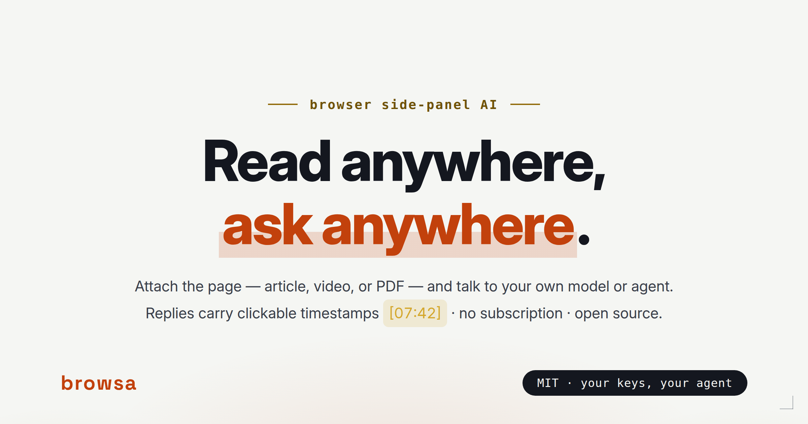
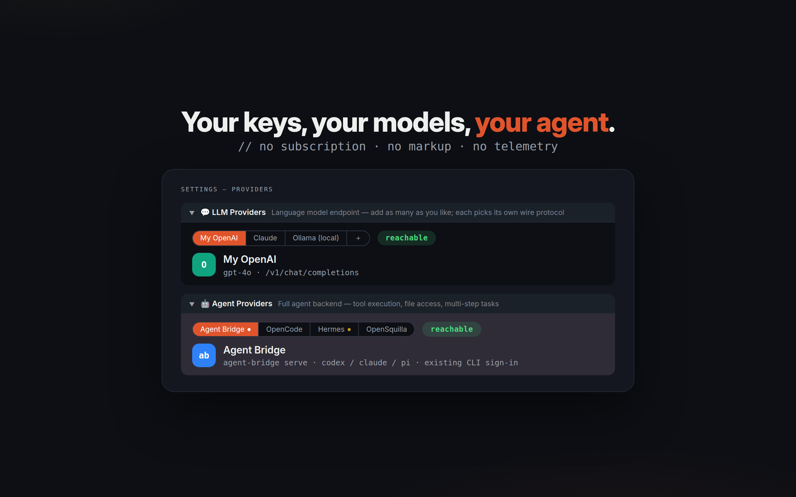

<p align="center">
  <strong>English</strong> · <a href="./README.zh-CN.md">简体中文</a>
</p>

<p align="center">
  
</p>

<p align="center">
  <a href="LICENSE"></a>&nbsp;
  <a href="#install"></a>&nbsp;
  <a href="https://github.com/xiaohuzai/browsa/pulls"></a>
</p>

<p align="center">
  <a href="https://xiaohuzai.github.io/browsa/"><strong>Website</strong></a> · <a href="#see-it-in-action"><strong>Screenshots</strong></a> · <a href="#install"><strong>Install</strong></a> · <a href="https://github.com/xiaohuzai/browsa/issues"><strong>Issues</strong></a>
</p>

---

**browsa** (**brow**ser **s**ide p**a**nel **A**I) is a Chrome / Edge extension that opens a chat panel next to whatever tab you're on, attaches the page — article, video, or PDF — and streams replies from **your own** model or agent: any OpenAI, Anthropic, or Ollama-compatible API, or a full agent backend (Hermes) with tools, memory, and approvals. No subscription, no markup — your keys stay on your machine.

## See it in action

**Video pages** — ask for a summary and the key points come back as clickable `[mm:ss]` timestamps; click one to jump straight back to the moment. No subtitles? browsa transcribes the audio (ASR) or reads the visuals.


**Papers & PDFs** — parsed entirely on your machine, nothing uploaded: tables, headings, and multi-column layout reconstructed, and actual figure regions cropped out and sent as images, so a vision model can actually *see* Figure 1.


**Feeds & messy pages** — where plain readers give up, browsa reads the page's own data directly: subtitles, comments, note content. No re-auth, no signing in.


## Install

1. Clone or download this repo.
2. Open `chrome://extensions` (or `edge://extensions`) and enable **Developer mode**.
3. Click **Load unpacked** → select the `browsa/` directory.
4. Press `Ctrl+Shift+H` (or click the toolbar icon) — the panel opens next to any page.
5. Click **⚙ Settings** and connect a provider below.

<details>
<summary><b>Build & package</b></summary>

```bash
npm install          # first time only
npm test             # run 1,000+ unit tests
npm run package      # → browsa-v<version>.zip
```

`npm version patch|minor` bumps the version in both `package.json` and `manifest.json` automatically.

</details>

## Connect a provider

browsa works with two kinds of backends:

- **Agent providers** — full agent backends with server-side tool execution (bash, file ops, web search…). The AI can actually *do* things.
- **LLM providers** — plain chat endpoints for conversation. Model ID required.

Open ⚙ Settings, fill in Base URL + API key, hit **Ping** — connectivity is verified and capabilities auto-detected; the first provider you verify becomes active.



<details>
<summary><b>🤖 Hermes Agent</b> — self-hosted agent with built-in tools</summary>

Hermes is a self-hosted AI agent with built-in tools (web search, terminal, file ops, memory, skills). browsa uses its `/v1/runs` API — richer than plain chat completions (tool progress, approval/clarification prompts for dangerous actions) — with a stable `X-Hermes-Session-Id` per conversation so Hermes can maintain session continuity server-side. Falls back to plain `/v1/chat/completions` automatically if a Hermes deployment doesn't advertise `/v1/runs` support.

**1. Install Hermes**

```bash
pip install hermes-agent   # or follow the official install guide
```

**2. Enable the API server** — add to `~/.hermes/.env`:

```bash
API_SERVER_ENABLED=true
API_SERVER_KEY=your-secret-key
```

**3. Start Hermes**

```bash
hermes gateway
# → [API Server] API server listening on http://127.0.0.1:8642
```

**4. Configure browsa** — open ⚙ Settings, select the **Hermes Agent** provider. It only needs a Base URL and API key — its own `/v1/runs` protocol is used automatically (no API-type dropdown).

| Field | Value |
|---|---|
| Base URL | `http://<server-ip>:8642` |
| API Key | value of `API_SERVER_KEY` |

**5. Ping** to verify. `/v1/runs` support is auto-detected and enabled automatically.

</details>

<details>
<summary><b>💬 LLM providers</b> — OpenAI · Anthropic · Ollama · Groq · LiteLLM · any compatible endpoint</summary>

Any endpoint that speaks OpenAI **Chat Completions** (`/v1/chat/completions`), OpenAI **Responses** (`/v1/responses`), or **Anthropic Messages** (`/v1/messages`).

Open ⚙ Settings → **LLM Providers**. An empty **LLM 1** slot is reserved for you — fill it in and hit **Save**, or use **＋ Add Provider** anytime:

| Field | Value |
|---|---|
| Alias | a name you choose (e.g. "My OpenAI", "本地模型") — shown in the sidebar dropdown so multiple providers stay distinguishable |
| Base URL | e.g. `https://api.openai.com` |
| API Key | your API key |
| Model ID | e.g. `gpt-4o`, `claude-3-5-sonnet` (required) — comma-separate multiple models and the sidebar dropdown expands to one "Alias · model" entry each |
| API | the protocol this endpoint speaks: Chat Completions / Responses / Anthropic |

Add as many LLM providers as you like; each picks its own protocol and carries its own alias. A single card can also carry several Model IDs — one card covers an entire gateway hosting dozens of models. Use the **✕** on a card to remove it (the built-in Hermes agent card is fixed and not removable).

</details>

## What browsa reads

Click 📎 to attach the current tab — **Auto** mode (clean article text, falling back to DOM tree, then full page text) or **📷 Screenshot** mode (the visible tab, for multimodal models). Attaching a PDF — or a page that turns out to be one — is automatic; no mode to pick.

| You're reading | What browsa sends |
|---|---|
| Articles & docs | clean article text; the site's `llms.txt` instructions folded into the context |
| PDFs & papers | full layout — tables, headings, columns — parsed in-browser; figure regions cropped and sent as images to vision models (compacted to labeled placeholders in history after answering) |
| Videos | transcript with clickable `[mm:ss]` timestamps; subtitle-less videos auto-transcribed (ASR, optional — Volcengine Ark key in Settings) or visually analyzed together with the speech |
| GitHub file pages | raw source from `raw.githubusercontent.com` — markdown and code keep their structure |
| Feishu / Lark docs | the page's editor block structure parsed directly — headings, lists, and **table rows & columns** survive |
| Anything messy | the page's own network requests observed and read directly — subtitles, comments, article source (YouTube, Bilibili, 小红书, and more) |

To ask about a text selection, highlight it and use the **floating toolbar** or **right-click menu** (Ask / Explain / Translate / Summarize) — no need to click 📎.

## Features

The screenshots above are the shape of it — the full reference lives here:

<details>
<summary><b>Chat</b> — streaming, thinking blocks, diagrams, detail thread…</summary>

| Feature | What you get |
|---|---|
| **Streaming replies** | tokens appear as they arrive; click ✕ or press `Esc` to stop |
| **Think blocks** | `<think>` / `<thinking>` content in a collapsible block, auto-collapsed after streaming |
| **Markdown & highlighting** | full GFM (tables, code blocks, lists); 40+ languages via highlight.js; `diff` blocks color `+` green / `-` red |
| **LaTeX** | inline `$...$` and display `$$...$$` via KaTeX — formula-heavy messages offloaded to a Web Worker so the panel doesn't jank |
| **Mermaid · ECharts · Markmap** | ` ```mermaid ` / ` ```echarts ` / ` ```markmap ` code blocks render inline, each with a zoom / copy / export-SVG toolbar; just ask for a chart or mind map — the model knows the format. If a Mermaid block fails to parse, one click sends it back to your model for a fix — the repaired diagram is validated locally before it replaces the broken one |
| **Detail thread ("细聊")** | select any text inside a reply to open a scoped side-conversation about just that excerpt, without touching the main history; fully resizable |
| **Outline rail** | from 4 turns on, a quiet tick rail tracks the conversation — click to jump, hover to preview |
| **Edit & resend · Regenerate** | ✏ edits and resends any user message; ⟳ re-runs any assistant reply |
| **Queued follow-ups** | typing while a reply streams queues your message; it sends automatically once the stream ends |
| **Error cards** | provider errors classified into plain language (auth / rate-limit / timeout / network / 5xx), raw error expandable and copyable |
| **Copy & timestamps** | ⎘ copies the full raw Markdown; hover any message to see its send time |

</details>

<details>
<summary><b>History & sessions</b> — drawers, search, export…</summary>

| Feature | What you get |
|---|---|
| **Sessions** | save the conversation as a named session; browse and restore from the 🕐 drawer; pin favorites above the list |
| **Search everywhere** | `Ctrl+F` across all messages in a conversation; the drawer filters sessions by title **and** message content (content-only hits flagged) |
| **Export** | any session as a Markdown file |
| **Safe deletion** | two-step armed delete for sessions; multi-select messages for batch deletion; clearing history is undoable for 5 seconds |

</details>

<details>
<summary><b>Input</b> — images, drafts, quick actions…</summary>

| Feature | What you get |
|---|---|
| **Image attachments** | drag-and-drop or paste images into the composer (for multimodal models) |
| **Input history & drafts** | ↑/↓ recalls previously sent messages; an unsent draft survives closing the panel |
| **Slash commands** | type `/` for completions — see the table below |
| **Quick actions** | one-click Summarize / Key Points / Explain / → 中文 / Outline above the composer |
| **Selection toolbar & context menu** | highlight text on any page: Ask · Explain · → 中文 · Summarize; or right-click → browsa › Ask / Explain / Translate / Summarize |

</details>

<details>
<summary><b>Settings</b> — system prompt, languages, llms.txt, auto-summarize…</summary>

| Setting | What it does |
|---|---|
| **System prompt** | prepended to every conversation as `role: system` — set reply language, tone, and format rules here |
| **Reply language** | force replies in a specific language regardless of page language |
| **UI language** | English, 中文, or Auto (follows the browser) — applies immediately, no reload |
| **Selection toolbar & llms.txt** | toggle the floating toolbar on text selection; on 📎, the site's LLM instructions are fetched once and baked into the attached page context — kept out of the system prompt so the prompt prefix stays byte-stable across turns (prompt-cache friendly) |
| **Reading preferences** | message font size, send shortcut (Enter / Ctrl+Enter), auto-scroll toggle |
| **ASR** | the speech-to-text provider for subtitle-less videos (Volcengine Ark by default): API key, language, subtitle source |
| **Auto-summarize long attachments** | automatic — pages or transcripts over the threshold (default 100,000 chars) are chunked, summarized in parallel, and merged in the background; `[mm:ss]` markers are preserved so seek links keep working; any error fails open to the original text |

</details>

### Slash commands

Type `/` in the composer to see autocomplete. All commands accept extra instructions — `/summarize focus on the methodology`:

| Command | Prompt sent to the model |
|---|---|
| `/summarize` | 3–5 bullet summary |
| `/translate` | Translate to Chinese |
| `/rewrite` | More concise rewrite, keeping all facts |
| `/explain` | Explain for a beginner in simple language |
| `/outline` | Nested outline of headings only |
| `/keypoints` | Top 5 takeaways |
| `/prompt` | Show the current active system prompt (not sent to the model) |

## Keyboard shortcuts

| Shortcut | Action |
|---|---|
| `Ctrl+Shift+H` | Open / close side panel |
| `Enter` | Send message (configurable in Settings) |
| `Shift+Enter` | New line |
| `Ctrl+K` | Clear history (with undo) |
| `Ctrl+/` | Cycle context mode (Auto ↔ Screenshot) |
| `Ctrl+F` | Open in-conversation search |
| `Esc` | Cancel stream / close search / close drawer |

## How it works

```
[Web page]  →  [browsa side panel]  →  [your model / agent]  →  streaming reply
```

<details>
<summary><b>Code map</b></summary>

- **`background.js`** — MV3 service worker, single message router; streaming via per-turn ports, auto-summarize for oversized attachments.
- **`sidepanel.js`** — chat UI orchestrator; rendering (Markdown/Mermaid/Markmap/KaTeX/ECharts), sessions, search, detail thread each live in `lib/sidepanel/`.
- **`lib/`** — page extraction (Readability cascade + XHR interception), SSE streaming client (`/v1/chat/completions` + Hermes `/v1/runs`), `chrome.storage.local` wrapper, content scripts.

</details>

## Browser compatibility

Chrome / Edge 114+ (primary target); Brave 1.56+ should work (same Chromium surface). Firefox is not supported (no `side_panel` API).

## Security

- API keys are stored in `chrome.storage.local` on your machine only — never sent anywhere except your configured `baseUrl`.
- Before page context is sent to your provider, every URL in it is masked locally: credentials hiding in query strings, userinfo, or fragments (tokens, passwords, signatures, session IDs) never leave your machine. URLs browsa itself fetches (media, images) are untouched.
- PDFs are parsed entirely client-side (WASM + pdf.js) — the file's bytes never leave your device; only extracted text goes to your provider.
- LLM replies are sanitized with DOMPurify before rendering (blocks `data:image/svg+xml` sources; Mermaid's SVG output is stripped of `<script>` / event-handler attributes).
- Content scripts only observe network requests; they never modify or block them.

## License

[MIT](LICENSE) — free to use, modify, and distribute.

---

<p align="center">
  <sub><b>browsa</b> — read anywhere, ask anywhere.</sub>
</p>
