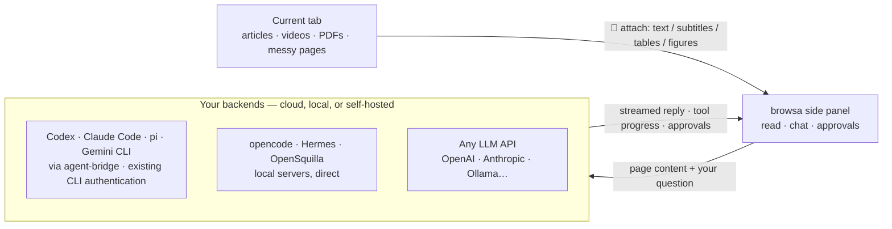

<p align="center"><a href="./README.md">English</a> · <a href="./README.zh-CN.md">简体中文</a> · <a href="./README.ja.md">日本語</a> · <a href="./README.ko.md">한국어</a> · <a href="./README.es.md">Español</a> · <strong>Português</strong> · <a href="./README.ru.md">Русский</a></p>

<p align="center">
  <a href="https://chromewebstore.google.com/detail/browsa/kghjmmajnpbkljankbbjbmnhfdocaeho"></a>&nbsp;
  <a href="LICENSE"></a>&nbsp;
  <a href="#como-instalar"></a>&nbsp;
  <a href="https://github.com/xiaohuzai/browsa/pulls"></a>
</p>

<p align="center">
  <a href="https://xiaohuzai.github.io/browsa/en/"><strong>Site</strong></a> · <a href="https://xiaohuzai.github.io/browsa/en/guide/quickstart.html"><strong>Início rápido</strong></a> · <a href="#como-instalar"><strong>Instalar</strong></a> · <a href="https://github.com/xiaohuzai/browsa/issues"><strong>Issues</strong></a>
</p>

---

# browsa

**Fique na página. Pergunte ao lado dela.**

O browsa é uma extensão de painel lateral para Chrome / Edge. Traga um artigo, um vídeo ou um PDF para uma conversa com a **sua própria IA** — sem copiar texto nem sair da página. Conecte **Codex / Claude Code / pi / Gemini CLI** pelo Agent Bridge, use **opencode / Hermes / OpenSquilla** ou configure uma API de modelo como OpenAI, Anthropic ou Ollama.

**Extensão gratuita, sob licença MIT.** Traga o seu próprio modelo ou agente. As chaves de API ficam armazenadas localmente e são usadas para autenticar nos serviços que você configurar.

<p align="center">
  
</p>
<p align="center">
  <a href="https://www.youtube.com/watch?v=AeXEyqvzcDA"><strong>▶ Vídeo completo · 68 segundos</strong></a> · <a href="https://xiaohuzai.github.io/browsa/pt-br/#demo"><strong>▶ Fique na página. Pergunte ao lado dela.</strong></a> · <a href="docs/assets/promo/browsa-promo-v7-pt-br.mp4">Baixar MP4</a> — Demonstração da interface real: abra o browsa, escolha ou alterne sua própria IA e agentes, anexe um artigo, aprofunde uma frase e veja fórmulas, fluxogramas e gráficos. Confira o conteúdo na linha do tempo do vídeo, gerencie várias sessões e continue no agente com o ID da sessão. Respostas, resultados salvos e a ilustração de continuidade na CLI usam dados de demonstração; a reprodução foi editada. Salvar arquivos depende do agente conectado.</p>

## Destaques

### 1. Conecte o agente que você já usa

Conecte o seu agente CLI atual pelo Agent Bridge, usando o login e as ferramentas já configurados nele. O browsa alimenta o agente com conteúdo da web, transmite o progresso das ferramentas e exibe as solicitações de aprovação que ele envia. As ferramentas e permissões disponíveis dependem da configuração do agente.

| Agente | Como conectar | Login |
|---|---|---|
| **Codex** (OpenAI) | daemon local [agent-bridge](https://github.com/xiaohuzai/agent-bridge) | Autenticação existente do CLI |
| **Claude Code** (Anthropic) | daemon local agent-bridge | Autenticação existente do CLI |
| **pi** (earendil-works) | daemon local agent-bridge | O modelo que você configurar no pi |
| **Gemini CLI** (Google) | daemon local agent-bridge | Autenticação existente do CLI |
| opencode | servidor headless oficial, conexão direta | o modelo que você configurar nele |
| Hermes | auto-hospedado, protocolo `/v1/runs` | auto-hospedado |
| OpenSquilla | gateway auto-hospedado, WebSocket (`/ws`) | os modelos para os quais o gateway roteia |

Um único cartão do browsa conecta a vários agentes ao mesmo tempo; o menu suspenso da barra lateral alterna entre eles.

### 2. Lê a web inteira — vídeos incluídos

- **Vídeos**: legendas ou transcrição automática (ASR) → notas com **timestamps `[mm:ss]` clicáveis**; clique em um para voltar direto ao momento. Vídeos sem legenda também podem ser lidos visualmente
- **PDFs / artigos científicos**: processados inteiramente no navegador — tabelas, layout de múltiplas colunas e títulos reconstruídos; regiões de figuras recortadas e enviadas a modelos de visão
- **Documentos Office**: links diretos para `.docx` / `.pptx` / `.xlsx` / `.epub` / `.odt` / `.rtf`… são convertidos para Markdown totalmente no dispositivo (docling compilado para WASM) — tabelas, títulos e listas se mantêm
- **Artigos & páginas bagunçadas**: texto do artigo limpo; páginas de feed leem os próprios dados da página diretamente (YouTube, Bilibili, 小红书…)

A lista completa está em "O que o browsa lê", abaixo.

## Arquitetura



Um tour a nível de desenvolvedor pelo código — fluxo de mensagens, pipeline de renderização, modelo de armazenamento, provedores e agentes, ASR e o modelo de segurança — vive na [wiki do projeto](https://github.com/xiaohuzai/browsa/wiki) (7 idiomas).

## Como instalar

Escolha um método de instalação:

**Chrome Web Store — recomendado, atualizações automáticas.** [Adicione o browsa ao Chrome](https://chromewebstore.google.com/detail/browsa/kghjmmajnpbkljankbbjbmnhfdocaeho). A revisão da loja pode ficar atrás das versões publicadas no GitHub.

**GitHub — instalação e atualizações manuais.**

1. Baixe e extraia o ZIP da extensão em [Releases](https://github.com/xiaohuzai/browsa/releases). Para trabalhar no código, clone ou baixe este repositório.
2. Abra `chrome://extensions` (ou `edge://extensions`) e ative o **Modo do desenvolvedor**.
3. Clique em **Carregar sem compactação** → selecione a pasta extraída que contém o `manifest.json`, não o ZIP nem a pasta que o contém. O nome dela depende de como você fez o download.

**Depois, em qualquer um dos casos:**

1. Abra um artigo e clique no ícone da extensão na barra de ferramentas, ou pressione `Ctrl+Shift+H` (`Command+Shift+H` no macOS).
2. Abra as **⋯ → Configurações**, configure um provedor de LLM ou de Agente e clique em **Ping** para verificar a conexão.
3. Selecione o modelo ou agente no menu suspenso do painel lateral, clique em **📎** para anexar a página e faça a sua primeira pergunta.

Veja o [guia de início rápido](https://xiaohuzai.github.io/browsa/en/guide/quickstart.html) para o passo a passo completo. As configurações avançadas podem ficar nos valores padrão enquanto você estabelece a conexão.

<details>
<summary><b>Compilar & empacotar</b></summary>

```bash
npm install          # first time only
npm test             # run the test suite
npm run package      # → browsa-v<version>.zip
```

`npm version patch|minor` incrementa a versão tanto em `package.json` quanto em `manifest.json` automaticamente.

Em máquinas com pouca memória, execute os testes em série: `node --test --test-concurrency=1 test/*.test.mjs`.

</details>

## Conecte um provedor

Abra as ⋯ → Configurações, preencha o endereço, clique em **Ping** — a conectividade é verificada e as capacidades detectadas automaticamente; o primeiro provedor que você verificar se torna o ativo. Dois tipos de backends:

- **Provedores de agente** — backends de agente completos, com execução de ferramentas no servidor (bash, operações de arquivos, busca na web…). A IA pode realmente *fazer* coisas.
- **Provedores de LLM** — endpoints de chat simples para conversar. O ID do modelo é obrigatório.

As conversas com agentes ficam do lado do agente: o browsa nomeia a sessão automaticamente ("browsa:" + a sua primeira mensagem) para que você possa retomá-la na própria interface do agente. O ID da sessão é exibido — e pode ser copiado — no topo da gaveta de sessões. As conversas salvas do browsa preservam e restauram os IDs de sessão de cada Agent e endereço de conexão. Conversas antigas sem ID registrado criam uma nova sessão de Agent na primeira mensagem e levam o histórico de texto existente.

<details>
<summary><b>🔧 Agent Bridge</b> — ponte para agentes CLI locais (<b>Codex</b>, <b>Claude Code</b>, <b>pi</b>, <b>Gemini CLI</b>…)</summary>

O [agent-bridge](https://github.com/xiaohuzai/agent-bridge) é um daemon local independente que adapta agentes CLI (codex, claude, pi, gemini) a um único protocolo HTTP local. Ele usa a autenticação já configurada no CLI:

```bash
npm i -g @xiaohuzai/agent-bridge                  # published on npm (Node 18+)
cp "$(npm root -g)/@xiaohuzai/agent-bridge/agents.example.json" agents.json
agent-bridge serve                                # one bridge per entry; ports live in agents.json
```

Abra as ⋯ → Configurações, selecione o cartão **Agent Bridge**, clique em **＋ Adicionar agente** e preencha os endereços das pontes, um por linha — um agente por endereço, com um apelido opcional (deixe vazio e o Ping descobre o nome do agente automaticamente) e a chave de API da própria ponte (as chaves podem diferir de ponte para ponte). O menu suspenso da barra lateral os lista como "Agent Bridge · codex", cada um com a sua própria thread de sessão independente e o seu próprio status de ping (o ⟳ na linha faz o ping apenas daquele agente). Os cartões de aprovação para ações perigosas aparecem direto no painel; capturas de tela, imagens coladas e figuras de PDF vão junto com a sua mensagem (≤8 por turno). O contexto de múltiplos turnos fica no próprio agente.


</details>

<details>
<summary><b>🔧 Agente OpenCode</b> — conecte o agente CLI <code>opencode</code></summary>

O [opencode](https://opencode.ai) traz um servidor headless de primeira parte — o browsa conecta a ele diretamente (sessões, streaming, progresso de ferramentas e pedidos de aprovação para ações perigosas como comandos de shell). O browsa pode conectar a **qualquer** endereço `opencode serve` — mas um `opencode serve` simples escolhe uma porta aleatória que muda a cada reinício, então a jogada de configurar e esquecer é fixar uma:

```bash
opencode serve --port 4096
```

Abra as ⋯ → Configurações, selecione o provedor **OpenCode Agent**, preencha a URL base `http://127.0.0.1:4096` (o placeholder já sugere), **Ping**, pronto. O contexto de múltiplos turnos fica na sessão do opencode; o browsa apenas envia os seus turnos. Quando o opencode pedir para executar um comando perigoso, o cartão de aprovação aparece direto no painel. Funciona a partir de qualquer diretório — inicie o servidor no projeto em que você quer que ele trabalhe.

</details>

<details>
<summary><b>🤖 Agente Hermes</b> — agente auto-hospedado com ferramentas integradas</summary>

O Hermes é um agente de IA auto-hospedado com ferramentas integradas (busca na web, terminal, operações de arquivos, memória, skills). O browsa usa a API `/v1/runs` dele — mais rica que chat completions simples (progresso de ferramentas, pedidos de aprovação/esclarecimento para ações perigosas) — com um `X-Hermes-Session-Id` estável por conversa, para que o Hermes mantenha a continuidade da sessão no servidor. Ele recua automaticamente para o `/v1/chat/completions` simples se uma implantação do Hermes não anunciar suporte a `/v1/runs`.

**1. Instale o Hermes**

```bash
pip install hermes-agent   # or follow the official install guide
```

**2. Ative o servidor de API** — adicione ao `~/.hermes/.env`:

```bash
API_SERVER_ENABLED=true
API_SERVER_KEY=your-secret-key
```

**3. Inicie o Hermes**

```bash
hermes gateway
# → [API Server] API server listening on http://127.0.0.1:8642
```

**4. Configure o browsa** — abra as ⋯ → Configurações e selecione o provedor **Hermes Agent**. Ele só precisa de uma URL base e de uma chave de API — o próprio protocolo `/v1/runs` dele é usado automaticamente (sem menu suspenso de tipo de API).

| Campo | Valor |
|---|---|
| URL base | `http://<server-ip>:8642` |
| Chave de API | valor de `API_SERVER_KEY` |

**5. Ping** para verificar. O suporte a `/v1/runs` é detectado e ativado automaticamente.

</details>

<details>
<summary><b>🦑 Agente OpenSquilla</b> — agente local via WebSocket do gateway (app desktop ou CLI)</summary>

O [OpenSquilla](https://github.com/opensquilla/opensquilla) é um agente local (gateway + Web UI + app desktop) com um design de microkernel eficiente em tokens, roteamento de modelos e skills. O browsa conversa com o **WebSocket do gateway** dele (`/ws`) — o mesmo canal que a própria Web UI usa — para que você tenha a experiência completa de agente: memória de sessão no servidor, deltas em streaming, saída do raciocínio e cancelamento no servidor.

Rode o gateway **ou** como app desktop **ou** pela linha de comando — o browsa conecta aos dois da mesma forma. Os caminhos diferem em exatamente uma coisa: qual arquivo de configuração o gateway lê (passo 2 em cada caminho). Editar o arquivo errado é o motivo mais comum de a conexão falhar silenciosamente.

**Caminho A — App desktop (sem terminal)**

1. **Instale e abra** o app desktop do OpenSquilla, versão v0.5.5 ou mais nova (versões mais antigas trazem um gateway cuja guarda de origem não aceita extensões). O app inicia o próprio gateway automaticamente — abra as configurações do app e anote a **URL do gateway** que ele mostra (normalmente `http://127.0.0.1:18791`; ele pega a primeira porta livre na faixa 18791–18830).
2. **Deixe a extensão entrar** — o app desktop **não** lê o `~/.opensquilla/config.toml`; ele lê uma configuração no próprio diretório de dados do app. A fonte mais precisa é o próprio app: **Settings → Advanced → Config file** mostra o caminho exato (com um botão de copiar). Padrões comuns: pacote oficial do macOS `~/Library/Application Support/OpenSquilla/opensquilla/config.toml`; pacote compilado localmente `~/Library/Application Support/@opensquilla/desktop-electron/opensquilla/config.toml` (os dois diretórios de dados são totalmente separados). O caminho contém espaços — escape-os no terminal (envolva o caminho inteiro em aspas ou escape cada espaço com uma barra invertida), senão o shell o divide no espaço e você edita o arquivo errado:

```bash
open -e "<paste the path copied from Settings → Advanced → Config file>"   # opens in macOS TextEdit
```

Adicione:

```toml
[cors]
# The value below covers the Chrome Web Store build. A sideloaded build
# (zip / repo folder) has a DIFFERENT extension ID — see the fine print below.
allowed_origins = ["chrome-extension://kghjmmajnpbkljankbbjbmnhfdocaeho"]
```

3. **Encerre o app por completo e reabra-o** (fechar a janela não basta) — o gateway lê essa configuração uma vez, na inicialização. Modelos / chaves de API do app desktop são configurados dentro do próprio app (na janela de configuração dele), não por variáveis de ambiente do shell. Avançado: o app também pode se conectar a um gateway de CLI executado externamente via `OPENSQUILLA_DESKTOP_GATEWAY_URL`.
4. Vá para **Configure o browsa**, abaixo.

**Caminho B — Linha de comando**

1. **Instale e inicie** o gateway (o uv fornece o Python 3.12):

```bash
uv tool install --python 3.12 "opensquilla[recommended] @ https://github.com/opensquilla/opensquilla/releases/download/v0.5.5/opensquilla-0.5.5-py3-none-any.whl"
opensquilla gateway start
# → running: http://127.0.0.1:18791
```

2. **Deixe a extensão entrar** — o gateway de CLI lê o `~/.opensquilla/config.toml`. Adicione o mesmo bloco `[cors]` do Caminho A. O roteamento de modelos do gateway também é configurado aqui (veja a documentação do próprio OpenSquilla; as chaves de LLM normalmente vêm do ambiente com que o gateway é iniciado).
3. **Reinicie o gateway** (`Ctrl+C` e depois `opensquilla gateway start` de novo) — a configuração é lida uma vez, na inicialização.
4. Vá para **Configure o browsa**, abaixo.

**Configure o browsa (igual para os dois)** — abra as ⋯ → Configurações e selecione a aba **OpenSquilla**:

| Campo | Valor |
|---|---|
| URL base | `ws://127.0.0.1:18791/ws` — use a URL que o seu gateway realmente mostra (desktop: as configurações dele; CLI: a linha `running:`) |
| Chave de API | apenas se o seu gateway exigir um token (opcional) |

Dê um **Ping** para verificar — ele faz o handshake WebSocket de verdade, então um ping verde prova tanto a conectividade quanto a allowlist de origem.

Letra miúda da guarda de origem (nos dois caminhos): a listagem é uma comparação exata de string (`*` não faz nada). O valor do snippet cobre a **versão da Chrome Web Store**; uma **versão instalada manualmente tem outro ID** — carregar a pasta do repositório diretamente sempre mostra `chrome-extension://apoodheofdhglelbnmggeokbhampbmgn` (fixado pela chave do manifest do repositório), enquanto uma versão extraída do zip de release recebe um ID derivado do caminho da pasta na sua máquina. De qualquer forma, leia o valor real em `chrome://extensions` → browsa → **ID** e acrescente essa origem à lista (múltiplas entradas são permitidas). Desde a v0.5.5, a guarda aceita origens não-http(s) exatamente listadas em loopback (o esquema `ws://` mapeia para `http`; `wss` é rejeitado — use `ws://` para um gateway local).

Notas: cada conversa do browsa corresponde a uma sessão do gateway (chave atribuída pelo gateway, redefinida quando você limpa o histórico do browsa). O histórico do chat fica do lado do gateway — o browsa encaminha o seu texto mais qualquer página que você tenha anexado logo antes de perguntar (o contexto do 📎 vai junto na próxima mensagem e depois vive na transcrição do próprio gateway); uma página enorme (mais de 60 mil caracteres) é enviada como um documento `page-context.md` que o agente lê com as próprias ferramentas dele. As figuras da página vão junto como anexos de imagem (um modelo roteador somente de texto degrada para texto automaticamente). As capturas de tela coladas ficam no histórico do próprio browsa e ainda não são encaminhadas. A preferência de idioma da resposta é prefixada à mensagem, pois este protocolo não tem campo de prompt de sistema.

</details>

<details>
<summary><b>💬 Provedores de LLM</b> — OpenAI · Anthropic · Ollama · Groq · LiteLLM · qualquer endpoint compatível</summary>

Qualquer endpoint que fale OpenAI **Chat Completions** (`/v1/chat/completions`), OpenAI **Responses** (`/v1/responses`) ou **Anthropic Messages** (`/v1/messages`).

Abra as ⋯ → Configurações → **Provedores de LLM**. Um slot vazio **LLM 1** está reservado para você — preencha-o e clique em **Salvar**. Os provedores vivem como abas em um único cartão; adicione mais a qualquer momento com a aba **＋** no fim da barra de abas:

| Campo | Valor |
|---|---|
| Apelido | um nome que você escolhe (ex.: "Meu OpenAI", "本地模型") — exibido no menu suspenso da barra lateral para que vários provedores permaneçam distinguíveis |
| URL base | ex.: `https://api.openai.com` |
| Chave de API | a sua chave de API |
| ID do modelo | Obrigatório. Digite um ID de modelo e pressione **Enter** ou **＋** para adicioná-lo; o **✕** remove um modelo. Uma entrada separada por vírgulas adiciona vários de uma vez. Cada um aparece como "Apelido · modelo" no menu suspenso da barra lateral |
| API | o protocolo que este endpoint fala: Chat Completions / Responses / Anthropic |

Adicione quantos provedores de LLM você quiser; cada um escolhe o próprio protocolo e carrega o próprio apelido. Um único cartão também pode carregar vários IDs de modelo — um cartão cobre um gateway inteiro que hospeda dezenas de modelos. Use o **✕** de um cartão para removê-lo (os cartões de agente integrados — Hermes, OpenSquilla, OpenCode, Agent Bridge — são fixos e não podem ser removidos).

</details>

## O que o browsa lê

Clique em 📎 para anexar a aba atual — modo **Auto** (texto do artigo limpo, com fallback para a árvore DOM e depois para o texto da página inteira) ou modo **📷 Captura de tela** (a aba visível, para modelos multimodais). Anexar um PDF ou um documento Office — ou uma página que venha a ser um deles — é automático; não há modo a escolher.

| Você está lendo | O que o browsa envia |
|---|---|
| Artigos & documentação | texto do artigo limpo; as instruções `llms.txt` do site incorporadas ao contexto |
| PDFs & artigos científicos | layout completo — tabelas, títulos, colunas — processado no navegador; regiões de figuras recortadas e enviadas como imagens a modelos de visão (compactadas para marcadores rotulados no histórico depois que a resposta sai) |
| Documentos Office (`.docx` `.pptx` `.xlsx` `.epub` `.odt` `.rtf`…) | convertidos para Markdown no dispositivo via docling-wasm — títulos, listas e tabelas mantêm a estrutura |
| Vídeos | transcrição com timestamps `[mm:ss]` clicáveis; vídeos sem legenda são transcritos automaticamente (ASR, opcional — chave do Volcengine Ark nas Configurações) ou analisados visualmente junto com a fala |
| Páginas de arquivo do GitHub | código-fonte bruto de `raw.githubusercontent.com` — markdown e código mantêm a estrutura |
| Documentos Feishu / Lark | a estrutura de blocos do editor da página interpretada diretamente — títulos, listas e **linhas & colunas de tabelas** se mantêm |
| Qualquer coisa bagunçada | as próprias requisições de rede da página, observadas e lidas diretamente — legendas, comentários, código-fonte do artigo (YouTube, Bilibili, 小红书, e mais) |

Selecione texto em uma página e a **barra flutuante** aparece: **Explicar** e **Traduzir** respondem inline — um cartão em streaming bem ao lado da seleção, sem precisar do painel — enquanto **Perguntar** e **Resumir** (e o menu de contexto) vão para o painel. Não precisa clicar em 📎.

## Funcionalidades

A referência completa está aqui:

<details>
<summary><b>Chat</b> — streaming, blocos de raciocínio, diagramas, follow-up…</summary>

Trocar de sessão no meio de uma resposta nunca mata a resposta: ela continua rodando em segundo plano e é salva na sessão em que começou (marcada com um ponto pulsante na gaveta até chegar lá). Parar uma resposta você mesmo mantém o que já foi transmitido, marcado como interrompido — um raciocínio longo nunca evapora.

| Recurso | O que você ganha |
|---|---|
| **Respostas em streaming** | os tokens aparecem à medida que chegam; clique em **■** no campo de mensagem ou pressione `Esc` para parar |
| **Blocos de raciocínio** | conteúdo `<think>` / `<thinking>` em um bloco recolhível, recolhido automaticamente após a transmissão |
| **Markdown & destaque de código** | GFM completo (tabelas, blocos de código, listas); mais de 40 linguagens via highlight.js; blocos `diff` colorem `+` de verde / `-` de vermelho |
| **O seu código também é renderizado** | cole um bloco com ```` ``` ```` no campo de mensagem e o seu próprio balão o mostra como um bloco de código destacado, com botão de copiar; sem necessidade de etiqueta de linguagem (detectada automaticamente). Todo o resto da sua mensagem permanece byte a byte como digitado — nenhuma reinterpretação em Markdown das suas palavras |
| **LaTeX** | `$...$` inline e `$$...$$` display via KaTeX — mensagens com muitas fórmulas são delegadas a um Web Worker para o painel não engasgar |
| **Mermaid · ECharts · Markmap** | blocos de código ` ```mermaid ` / ` ```echarts ` / ` ```markmap ` são renderizados inline, cada um com uma barra de zoom / copiar / exportar PNG; basta pedir um gráfico ou um mapa mental — o modelo conhece o formato. Se um bloco Mermaid falhar ao ser interpretado, um clique o envia de volta ao seu modelo para corrigir — o diagrama reparado é validado localmente antes de substituir o quebrado |
| **Moléculas · Proteínas · Grafos** | blocos ```smiles / ```pdb / ```dot também são renderizados ao vivo — estruturas 2D e diagramas de reação desenhados pelo RDKit com uma linha de propriedades moleculares (MW, logP, TPSA, doadores/receptores de ligação de hidrogênio; SMILES quimicamente inválidos são rejeitados, com a fonte mantida), proteína 3D interativa a partir de um ID PDB ou de um ID AlphaFold (visualizador Mol*: passe o mouse sobre qualquer resíduo para identificá-lo, faixa de sequência incluída, modelos AlphaFold coloridos pela confiança pLDDT) e figuras DOT do Graphviz (arquiteturas de redes neurais, fluxo de dados, grafos de dependências); cada um com controles de copiar / exportar |
| **Follow-up ("追问")** | selecione qualquer texto dentro de uma resposta para abrir uma conversa paralela com escopo, só sobre aquele trecho, sem tocar no histórico principal; totalmente redimensionável; cole imagens no cartão, como no campo de mensagem principal; o ↑/↓ do campo lembra apenas as perguntas de follow-up; fórmulas citadas são renderizadas como matemática |
| **Barra de estrutura** | a partir de 4 turnos, uma discreta trilha de marcações acompanha a conversa — clique para pular, passe o mouse para pré-visualizar |
| **Editar & reenviar · Regenerar** | ✏ edita e reenvia qualquer mensagem do usuário; ⟳ roda de novo qualquer resposta do assistente |
| **Follow-ups em fila** | digitar enquanto uma resposta está em transmissão coloca a sua mensagem na fila; ela é enviada automaticamente quando a transmissão termina |
| **Cartões de erro** | erros de provedor classificados em linguagem simples (autenticação / limite de taxa / tempo esgotado / rede / 5xx), com o erro bruto expansível e copiável |
| **Cópia & timestamps** | ⎘ copia o Markdown bruto completo; passe o mouse sobre qualquer mensagem para ver o horário de envio |
| **Rótulos de origem da resposta** | toda resposta é carimbada com o provedor / agente que a produziu (o mesmo nome do menu suspenso da barra lateral); alternar para um agente pergunta se você quer levar a conversa junto, como a primeira mensagem dele, ou começar uma nova sessão (enviar sem escolher continua sem contexto) |

</details>

<details>
<summary><b>Histórico & sessões</b> — gavetas, busca, exportação…</summary>

| Recurso | O que você ganha |
|---|---|
| **Sessões** | salve a conversa como uma sessão nomeada; navegue e restaure pela gaveta 🕐; fixe as favoritas acima da lista |
| **Busca em todo lugar** | `Ctrl+F` em todas as mensagens de uma conversa; a gaveta filtra as sessões por título **e** por conteúdo da mensagem (acertos só de conteúdo são sinalizados) |
| **Exportação** | qualquer sessão como um arquivo Markdown |
| **Exclusão segura** | exclusão em dois passos para sessões; selecione várias mensagens para exclusão em lote; limpar o histórico pode ser desfeito por 5 segundos |

</details>

<details>
<summary><b>Entrada</b> — imagens, rascunhos, ações rápidas…</summary>

| Recurso | O que você ganha |
|---|---|
| **Anexos de imagem** | arraste e solte ou cole imagens no campo de mensagem (para modelos multimodais) |
| **Histórico de entrada & rascunhos** | ↑/↓ recupera mensagens enviadas anteriormente para editar; ↓ após a mais recente restaura o rascunho original; um rascunho não enviado sobrevive ao fechamento do painel |
| **Comandos com barra** | digite `/` para ver as sugestões — veja a tabela abaixo |
| **Ações rápidas** | Resumir / Pontos principais / Explicar / → 中文 / Estrutura com um clique, acima do campo de mensagem |
| **Barra de seleção & menu de contexto** | selecione texto em qualquer página: Perguntar · Explicar · → 中文 · Resumir — Explicar / Traduzir respondem inline (em streaming, no lugar); Perguntar / Resumir e o menu de contexto vão para o painel |

</details>

<details>
<summary><b>Configurações</b> — prompt de sistema, idiomas, llms.txt, resumo automático…</summary>

As configurações do dia a dia aparecem diretamente: idioma da interface, provedores, prompt de sistema / idioma da resposta e preferências de chat. O **Avançado** guarda as opções da barra de seleção, `llms.txt`, extração profunda e ASR; deixe-o recolhido se você não precisar delas. Os grupos de provedores de LLM e de Agente também recolhem de forma independente — alternar para agentes mantém um grupo de LLM recolhido fechado.

| Configuração | O que faz |
|---|---|
| **Prompt de sistema** | adicionado ao início de cada conversa como `role: system` — defina aqui o idioma da resposta, o tom e as regras de formato |
| **Idioma da resposta** | força as respostas em um idioma específico, independentemente do idioma da página |
| **Idioma da interface** | English, 中文, 日本語, 한국어, Español, Português, Русский ou Auto (segue o navegador) — aplica-se na hora, sem recarregar |
| **Barra de seleção & llms.txt** | liga e desliga a barra flutuante na seleção de texto; ao anexar com 📎, as instruções de LLM do site são buscadas uma vez e incorporadas ao contexto da página anexada — mantidas fora do prompt de sistema para que o prefixo do prompt permaneça estável byte a byte entre os turnos (amigável ao cache de prompt) |
| **Nível de raciocínio** | profundidade de raciocínio por modelo (`auto` não envia nada; depois, a própria escada do modelo — da classe GLM/Qwen é um liga/desliga, da classe GPT/Claude é um esforço de low→max). As opções seguem o ID do modelo que você preencheu, e os campos da requisição se adaptam a cada dialeto de API (`reasoning.effort` / `thinking`+`output_config` / `enable_thinking`…) automaticamente |
| **Preferências de leitura** | tamanho da fonte das mensagens, atalho de envio (Enter / Shift+Enter), recolhimento automático dos blocos de raciocínio |
| **ASR** | o provedor de fala-para-texto para vídeos sem legenda (Volcengine Ark por padrão): chave de API, idioma, origem das legendas |
| **Resumo automático de anexos longos** | automático — páginas ou transcrições acima do limite (padrão: 100.000 caracteres) são divididas em pedaços, resumidas em paralelo e mescladas em segundo plano; as marcações `[mm:ss]` são preservadas para que os links de salto continuem funcionando; qualquer erro recua para o texto original |
| **Extração profunda** | ligada por padrão — antes de anexar, o browsa expande seções recolhidas e percorre conteúdo paginado para que muito mais da página chegue ao modelo; tudo roda discretamente em abas em segundo plano, sem rolar nem clicar na página que você está vendo |

</details>

### Comandos com barra

Digite `/` no campo de mensagem para ver o autocompletar. Todos os comandos aceitam instruções extras — `/summarize foque na metodologia`:

| Comando | Prompt enviado ao modelo |
|---|---|
| `/summarize` | resumo em 3–5 tópicos |
| `/translate` | traduz para o chinês |
| `/rewrite` | reescrita mais concisa, mantendo todos os fatos |
| `/explain` | explica para um iniciante, em linguagem simples |
| `/outline` | estrutura aninhada, somente com os títulos |
| `/keypoints` | as 5 principais conclusões |
| `/prompt` | mostra o prompt de sistema ativo no momento (não é enviado ao modelo) |

## Atalhos de teclado

| Atalho | Ação |
|---|---|
| `Ctrl+Shift+H` | Abrir / fechar o painel lateral |
| `Enter` | Enviar mensagem (configurável nas Configurações) |
| `Shift+Enter` | Nova linha |
| `Ctrl+K` | Limpar o histórico (com desfazer) |
| `Ctrl+/` | Alternar o modo de contexto (Auto ↔ Captura de tela) |
| `Ctrl+F` | Abrir a busca dentro da conversa |
| `Esc` | Cancelar a transmissão / fechar a busca / fechar a gaveta |

## Como funciona

<details>
<summary><b>Mapa do código</b></summary>

- **`background.js`** — service worker MV3, roteador único de mensagens; streaming por portas por turno, resumo automático para anexos grandes.
- **`sidepanel.js`** — orquestrador da UI do chat; a renderização (Markdown/Mermaid/Markmap/KaTeX/ECharts), as sessões, a busca e o follow-up vivem em `lib/sidepanel/`.
- **`lib/`** — extração de páginas (cascata Readability + interceptação de XHR), clientes de streaming SSE (`/v1/chat/completions`, `/v1/runs` do Hermes, os clientes de agente opencode / agent-bridge), wrapper do `chrome.storage.local`, content scripts.

A [wiki](https://github.com/xiaohuzai/browsa/wiki) desenvolve cada um desses pontos em um capítulo completo — Arquitetura, Pipeline de renderização, Modelo de armazenamento, Provedores e agentes, ASR, Modelo de segurança, Decisões de design, Contribuir.

</details>

## Compatibilidade com navegadores

Chrome / Edge 116+ (alvo principal); Brave 1.56+ deve funcionar (mesma base Chromium). O Firefox não é compatível (não tem a API `side_panel`).

## Segurança

- As chaves de API ficam armazenadas localmente em `chrome.storage.local` e são usadas para autenticar nos serviços que você configurou. Armazenamento local não significa que as chaves nunca são transmitidas.
- O conteúdo das páginas anexadas, as perguntas e o contexto da conversa são enviados ao modelo ou agente que você selecionou. A transcrição / análise audiovisual opcional também envia a mídia ao serviço de análise configurado.
- Antes de o contexto da página ser enviado, o browsa mascara credenciais reconhecidas em URLs (como parâmetros de token, senha, assinatura e sessão). Isso não é um limpador de uso geral para texto sensível da página. As URLs que o próprio browsa busca (mídia, imagens) não são alteradas.
- Os PDFs são processados localmente (WASM + pdf.js); o texto extraído e as imagens das figuras podem ser enviados ao provedor que você configurou. O processamento local não significa que todo o conteúdo extraído fica no dispositivo.
- As respostas de LLM são sanitizadas com DOMPurify antes da renderização (bloqueia fontes `data:image/svg+xml`; o SVG de saída do Mermaid é limpo de `<script>` / atributos de manipuladores de eventos).
- Os content scripts apenas observam as requisições de rede; eles nunca as modificam nem as bloqueiam.

## Licença

[MIT](LICENSE) — livre para usar, modificar e distribuir.

---

<p align="center">
  <sub><b>browsa</b> — leia em qualquer lugar, pergunte em qualquer lugar.</sub>
</p>
