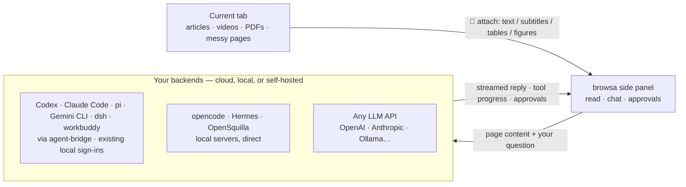

<p align="center"><a href="./README.en.md">English</a> · <a href="./README.md">简体中文</a> · <a href="./README.ja.md">日本語</a> · <a href="./README.ko.md">한국어</a> · <a href="./README.es.md">Español</a> · <a href="./README.pt-BR.md">Português</a> · <strong>Русский</strong></p>

<p align="center">
  <a href="https://chromewebstore.google.com/detail/browsa/kghjmmajnpbkljankbbjbmnhfdocaeho"></a>&nbsp;
  <a href="LICENSE"></a>&nbsp;
  <a href="#установка"></a>&nbsp;
  <a href="https://github.com/xiaohuzai/browsa/pulls"></a>
</p>

<p align="center">
  <a href="https://xiaohuzai.github.io/browsa/en/"><strong>Сайт</strong></a> · <a href="https://xiaohuzai.github.io/browsa/en/guide/quickstart.html"><strong>Быстрый старт</strong></a> · <a href="#установка"><strong>Установка</strong></a> · <a href="https://github.com/xiaohuzai/browsa/issues"><strong>Issues</strong></a>
</p>

---

# browsa

**Оставайтесь на странице. Спрашивайте рядом.**

browsa — расширение с боковой панелью для Chrome / Edge. Добавьте статью, видео или PDF в беседу с **вашим собственным ИИ** — без копирования текста и без ухода со страницы. Подключите **Codex / Claude Code / pi / Gemini CLI / dsh (DeepSeek Harness) / workbuddy** через Agent Bridge, используйте **opencode / Hermes / OpenSquilla** или настройте модельный API — OpenAI, Anthropic, Ollama и другие.

**Бесплатное расширение под лицензией MIT.** Модель или агент — ваши собственные. API-ключи хранятся локально и используются для аутентификации в настраиваемых вами сервисах.

<p align="center">
  
</p>
<p align="center">
  <a href="https://www.youtube.com/watch?v=kOq_3iK2XF0"><strong>▶ Полное видео · 68 секунд</strong></a> · <a href="https://xiaohuzai.github.io/browsa/ru/#demo"><strong>▶ Оставайтесь на странице. Спрашивайте рядом.</strong></a> · <a href="docs/assets/promo/browsa-promo-v7-ru.mp4">Скачать MP4</a> — Демонстрация реального интерфейса: откройте browsa, выберите или смените свою модель ИИ и агента, прикрепите статью, уточните смысл фразы и посмотрите формулы, схемы и графики. Проверьте содержание по временной шкале видео, управляйте несколькими сеансами и продолжайте работу у агента по ID сеанса. Ответы, результаты сохранения и иллюстрация продолжения в CLI используют демонстрационные данные; видео смонтировано. Сохранение файлов зависит от подключённого агента.</p>

## Ключевые возможности

### 1. Подключите агента, которым уже пользуетесь

Подключите своих текущих локальных агентов через Agent Bridge — с их настроенным входом и инструментами. browsa передаёт им веб-контент, транслирует прогресс инструментов и показывает приходящие от них запросы на подтверждение. Доступные инструменты и разрешения зависят от конфигурации агентов.

| Агент | Способ подключения | Вход |
|---|---|---|
| **Codex** (OpenAI) | локальный демон [agent-bridge](https://github.com/xiaohuzai/agent-bridge) | Существующая аутентификация CLI |
| **Claude Code** (Anthropic) | локальный демон agent-bridge | Существующая аутентификация CLI |
| **pi** (earendil-works) | локальный демон agent-bridge | Любая модель, настроенная в pi |
| **Gemini CLI** (Google) | локальный демон agent-bridge | Существующая аутентификация CLI |
| **dsh** (DeepSeek Harness) | локальный демон agent-bridge | API-ключ DeepSeek |
| **workbuddy** (настольное приложение WorkBuddy AI) | локальный демон agent-bridge | Вход в приложение WorkBuddy (приложение должно быть запущено) |
| opencode | официальный headless-сервер, напрямую | любая модель, настроенная в opencode |
| Hermes | собственный сервер, протокол `/v1/runs` | собственный сервер |
| OpenSquilla | собственный шлюз, WebSocket (`/ws`) | модели, на которые маршрутизирует шлюз |

Одна карточка browsa подключается сразу к нескольким агентам; переключение — выпадающим списком в боковой панели.

### 2. Читает весь веб — включая видео

- **Видео**: субтитры или автораспознавание речи (ASR) → заметки с **кликабельными метками времени `[mm:ss]`**; клик по метке возвращает прямо к нужному моменту. Видео без субтитров можно разбирать и визуально
- **PDF / научные статьи**: разбор целиком в браузере — восстанавливаются таблицы, многоколоночная вёрстка и заголовки; области с иллюстрациями вырезаются и отправляются в vision-модели
- **Офисные документы**: прямые ссылки на `.docx` / `.pptx` / `.xlsx` / `.epub` / `.odt` / `.rtf`… конвертируются в Markdown полностью на устройстве (docling, скомпилированный в WASM) — таблицы, заголовки и списки сохраняются
- **Статьи и захламлённые страницы**: чистый текст статьи; страницы-ленты читаются напрямую из собственных данных сайта (YouTube, Bilibili, 小红书…)

Полный список — ниже, в разделе «Что читает browsa».

## Архитектура



Обзор кодовой базы на уровне разработчика — поток сообщений, конвейер рендеринга, модель хранения, провайдеры и агенты, ASR и модель безопасности — живёт в [вики проекта](https://github.com/xiaohuzai/browsa/wiki) (7 языков).

## Установка

Выберите один способ установки:

**Chrome Web Store — рекомендуется, автоматические обновления.** [Добавьте browsa в Chrome](https://chromewebstore.google.com/detail/browsa/kghjmmajnpbkljankbbjbmnhfdocaeho). Проверка в магазине может отставать от релизов на GitHub.

**GitHub — ручная установка и обновление.**

1. Скачайте и распакуйте ZIP расширения со страницы [Releases](https://github.com/xiaohuzai/browsa/releases). Чтобы работать с кодом, вместо этого клонируйте или скачайте сам репозиторий.
2. Откройте `chrome://extensions` (или `edge://extensions`) и включите **Режим разработчика**.
3. Нажмите **Загрузить распакованное** → выберите распакованную папку, в которой лежит `manifest.json`, — не ZIP и не родительскую папку. Её имя зависит от того, как вы скачивали архив.

**Затем при любом способе:**

1. Откройте какую-нибудь статью и щёлкните значок расширения на панели инструментов браузера или нажмите `Ctrl+Shift+H` (`Command+Shift+H` на macOS).
2. Откройте **⚙ Настройки**, настройте LLM- или агент-провайдера и нажмите **Ping**, чтобы проверить соединение.
3. Выберите модель или агента в выпадающем списке боковой панели, нажмите **📎**, чтобы прикрепить страницу, и задайте первый вопрос.

Полный обзор — в [руководстве быстрого старта](https://xiaohuzai.github.io/browsa/en/guide/quickstart.html). Расширенные настройки можно не трогать, пока вы просто подключаетесь.

<details>
<summary><b>Сборка и упаковка</b></summary>

```bash
npm install          # first time only
npm test             # run the test suite
npm run package      # → browsa-v<version>.zip
```

`npm version patch|minor` автоматически повышает версию и в `package.json`, и в `manifest.json`.

На машинах с ограниченной памятью запускайте тесты последовательно: `node --test --test-concurrency=1 test/*.test.mjs`.

</details>

## Подключение провайдера

Откройте ⚙ Настройки, введите адрес и нажмите **Ping** — соединение проверяется, возможности определяются автоматически; первый проверённый провайдер становится активным. Два вида бэкендов:

- **Агент-провайдеры** — полноценные агентские бэкенды с выполнением инструментов на сервере (bash, файловые операции, веб-поиск…). Такой ИИ действительно может *действовать*.
- **LLM-провайдеры** — обычные чат-эндпоинты для бесед. Требуется ID модели.

Беседы с агентами живут на стороне агента: browsa автоматически называет сессию («browsa:» + ваше первое сообщение), чтобы её можно было продолжить в собственном интерфейсе агента. ID сессии показан — и его можно скопировать — вверху панели сессий. Сохранённые диалоги browsa сохраняют и восстанавливают ID сессий для каждого Agent и адреса подключения. Старые диалоги без записанного ID при первой отправке создают новую сессию Agent и передают в неё имеющуюся текстовую историю.

<details>
<summary><b>🔧 Agent Bridge</b> — мост к локальным агентам (<b>Codex</b>, <b>Claude Code</b>, <b>pi</b>, <b>Gemini CLI</b>, <b>dsh</b>, <b>workbuddy</b>…)</summary>

[agent-bridge](https://github.com/xiaohuzai/agent-bridge) — автономный локальный демон, который сводит локальных агентов (codex, claude, pi, gemini, dsh, workbuddy) к одному локальному HTTP-протоколу. Использует настроенную в агенте аутентификацию:

```bash
npm i -g @xiaohuzai/agent-bridge                  # published on npm (Node 18+)
cp "$(npm root -g)/@xiaohuzai/agent-bridge/agents.example.json" agents.json
agent-bridge serve                                # one bridge per entry; ports live in agents.json
```

Откройте ⚙ Настройки, выберите карточку **Agent Bridge**, нажмите **＋ Добавить агента** и впишите адреса мостов — по одному в строке: один агент на адрес, с необязательным псевдонимом (оставьте пустым — Ping сам определит имя агента) и собственным API-ключом этого моста (ключи могут различаться от моста к мосту). В выпадающем списке боковой панели они выглядят как «Agent Bridge · codex», у каждого — своя независимая ветка сессии и свой статус пинга (⟳ в строке пингует только этого агента). Карточки подтверждения опасных действий появляются прямо в панели; скриншоты, вставленные изображения и иллюстрации из PDF отправляются вместе с вашим сообщением (до 8 за ход). Контекст многоходового разговора хранится в самом агенте. workbuddy работает поверх настольного приложения WorkBuddy AI — просто сохраните в нём вход и держите его запущенным (мост сам обнаруживает локальный worker-шлюз приложения); беседы живут в памяти приложения, поэтому перезапуск приложения начинает новую сессию агента со следующего хода, а история на стороне browsa не затрагивается.


</details>

<details>
<summary><b>🔧 OpenCode Agent</b> — подключение CLI-агента <code>opencode</code></summary>

В [opencode](https://opencode.ai) есть собственный headless-сервер — browsa подключается к нему напрямую (сессии, потоковая передача, прогресс инструментов и запросы подтверждения опасных действий вроде команд shell). browsa может подключиться к **любому** адресу `opencode serve`, но голый `opencode serve` выбирает случайный порт, меняющийся при каждом перезапуске, поэтому надёжнее закрепить один:

```bash
opencode serve --port 4096
```

Откройте ⚙ Настройки, выберите провайдера **OpenCode Agent**, впишите Base URL `http://127.0.0.1:4096` (плейсхолдер именно его и подсказывает), нажмите **Ping** — готово. Контекст многоходового разговора живёт в сессии opencode; browsa лишь отправляет ваши ходы. Когда opencode попросит выполнить опасную команду, карточка подтверждения появится прямо в панели. Работает из любого каталога — запустите сервер в том проекте, с которым он должен работать.

</details>

<details>
<summary><b>🤖 Hermes Agent</b> — собственный агент со встроенными инструментами</summary>

Hermes — это размещаемый у себя ИИ-агент со встроенными инструментами (веб-поиск, терминал, файловые операции, память, навыки). browsa использует его API `/v1/runs` — более богатый, чем обычные chat completions (прогресс инструментов, запросы подтверждения/уточнения для опасных действий) — со стабильным `X-Hermes-Session-Id` на беседу, чтобы Hermes поддерживал непрерывность сессии на своей стороне. Если развёртывание Hermes не заявляет поддержку `/v1/runs`, происходит автоматический откат к обычному `/v1/chat/completions`.

**1. Установите Hermes**

```bash
pip install hermes-agent   # or follow the official install guide
```

**2. Включите API-сервер** — добавьте в `~/.hermes/.env`:

```bash
API_SERVER_ENABLED=true
API_SERVER_KEY=your-secret-key
```

**3. Запустите Hermes**

```bash
hermes gateway
# → [API Server] API server listening on http://127.0.0.1:8642
```

**4. Настройте browsa** — откройте ⚙ Настройки и выберите провайдера **Hermes Agent**. Нужны только Base URL и API-ключ — его собственный протокол `/v1/runs` используется автоматически (без выпадающего списка типа API).

| Поле | Значение |
|---|---|
| Base URL | `http://<server-ip>:8642` |
| API Key | значение `API_SERVER_KEY` |

**5. Ping** для проверки. Поддержка `/v1/runs` определяется и включается автоматически.

</details>

<details>
<summary><b>🦑 OpenSquilla Agent</b> — локальный агент через WebSocket шлюза (десктоп-приложение или CLI)</summary>

[OpenSquilla](https://github.com/opensquilla/opensquilla) — локальный агент (шлюз + веб-интерфейс + десктоп-приложение) с экономичной по токенам микроядерной архитектурой, маршрутизацией моделей и навыками. browsa общается с его **WebSocket шлюза** (`/ws`) — тем же каналом, что и собственный веб-интерфейс, — так что вы получаете полный агентский опыт: серверную память сессий, потоковые дельты, вывод размышлений и отмену на стороне сервера.

Запускайте шлюз **либо** как десктоп-приложение, **либо** из командной строки — browsa подключается к обоим одинаково. Разница между путями ровно одна: какой конфигурационный файл читает шлюз (шаг 2 в каждом пути). Правка не того файла — самая частая причина тихого отказа соединения.

**Способ A — десктоп-приложение (без терминала)**

1. **Установите и запустите** десктоп-приложение OpenSquilla, v0.5.5 или новее (в старых сборках идёт шлюз, чья origin-защита не принимает расширения). Приложение само запускает свой шлюз — откройте его настройки и запишите показанный **URL шлюза** (обычно `http://127.0.0.1:18791`; берётся первый свободный порт из диапазона 18791–18830).
2. **Дайте расширению доступ** — десктоп-приложение **не** читает `~/.opensquilla/config.toml`; оно читает конфиг в собственном каталоге данных приложения. Самый точный источник — само приложение: **Settings → Advanced → Config file** показывает точный путь (с кнопкой копирования). Частые значения по умолчанию: официальный пакет macOS — `~/Library/Application Support/OpenSquilla/opensquilla/config.toml`; самостоятельно собранный пакет — `~/Library/Application Support/@opensquilla/desktop-electron/opensquilla/config.toml` (каталоги данных полностью раздельны). Путь содержит пробелы — экранируйте их в терминале (заключите весь путь в кавычки или экранируйте каждый пробел обратным слэшем), иначе оболочка разрежет путь по пробелу, и вы отредактируете не тот файл:

```bash
open -e "<paste the path copied from Settings → Advanced → Config file>"   # opens in macOS TextEdit
```

Добавьте:

```toml
[cors]
# The value below covers the Chrome Web Store build. A sideloaded build
# (zip / repo folder) has a DIFFERENT extension ID — see the fine print below.
allowed_origins = ["chrome-extension://kghjmmajnpbkljankbbjbmnhfdocaeho"]
```

3. **Полностью закройте и заново откройте приложение** (закрытия окна недостаточно) — шлюз читает этот конфиг один раз при запуске. Модели / API-ключи для десктоп-приложения настраиваются внутри самого приложения (в его окне первичной настройки), а не через переменные окружения оболочки. Для продвинутых: приложение может подключиться и к внешне запущенному CLI-шлюзу через `OPENSQUILLA_DESKTOP_GATEWAY_URL`.
4. Перейдите к пункту **Настройка browsa** ниже.

**Способ B — командная строка**

1. **Установите и запустите** шлюз (uv ставит Python 3.12):

```bash
uv tool install --python 3.12 "opensquilla[recommended] @ https://github.com/opensquilla/opensquilla/releases/download/v0.5.5/opensquilla-0.5.5-py3-none-any.whl"
opensquilla gateway start
# → running: http://127.0.0.1:18791
```

2. **Дайте расширению доступ** — CLI-шлюз читает `~/.opensquilla/config.toml`. Добавьте тот же блок `[cors]`, что и в способе A. Здесь же настраивается маршрутизация моделей шлюза (см. собственную документацию OpenSquilla; ключи LLM обычно берутся из окружения, в котором запущен шлюз).
3. **Перезапустите шлюз** (`Ctrl+C`, затем снова `opensquilla gateway start`) — конфиг читается один раз при запуске.
4. Перейдите к пункту **Настройка browsa** ниже.

**Настройка browsa (одинакова для обоих способов)** — откройте ⚙ Настройки и выберите вкладку **OpenSquilla**:

| Поле | Значение |
|---|---|
| Base URL | `ws://127.0.0.1:18791/ws` — берите URL, который реально показывает ваш шлюз (десктоп: в его настройках; CLI: строка `running:`) |
| API Key | только если ваш шлюз требует токен (опционально) |

**Ping** для проверки — выполняется настоящий WebSocket-handshake, поэтому зелёный пинг доказывает и связность, и попадание в origin-список.

Подробности origin-защиты (для обоих способов): список сравнивается как точная строка (`*` ничего не делает). Значение из сниппета покрывает **сборку из Chrome Web Store**; у **установленной вручную сборки ID другой** — при загрузке папки репозитория напрямую всегда показывается `chrome-extension://apoodheofdhglelbnmggeokbhampbmgn` (закреплён ключом в манифесте репозитория), а сборка, распакованная из release-zip, получает ID, производный от пути к папке на вашей машине. В любом случае прочитайте актуальное значение на `chrome://extensions` → browsa → **ID** и допишите этот origin в список (несколько записей допустимы). Начиная с v0.5.5 защита принимает точно перечисленные non-http(s) origin на loopback (схема `ws://` отображается на `http`; `wss` отклоняется — для локального шлюза используйте `ws://`).

Примечания: каждая беседа browsa соответствует одной сессии шлюза (ключ выдаёт шлюз; сбрасывается при очистке истории browsa). История чата живёт на стороне шлюза — browsa пересылает ваш текст плюс любую страницу, прикреплённую прямо перед вопросом (контекст 📎 едет со следующим сообщением, а затем живёт в собственном транскрипте шлюза); огромная страница (свыше 60 тыс. знаков) загружается как документ `page-context.md`, который агент читает своими инструментами. Иллюстрации со страницы едут как вложения-изображения (маршрутизирующая модель без зрения автоматически деградирует до текста). Вставленные скриншоты остаются в собственной истории browsa и пока не пересылаются. Предпочтение языка ответа дописывается в начало сообщения, поскольку у этого протокола нет поля системного промпта.

</details>

<details>
<summary><b>💬 LLM-провайдеры</b> — OpenAI · Anthropic · Ollama · Groq · LiteLLM · любой совместимый эндпоинт</summary>

Любой эндпоинт, говорящий на OpenAI **Chat Completions** (`/v1/chat/completions`), OpenAI **Responses** (`/v1/responses`) или **Anthropic Messages** (`/v1/messages`).

Откройте ⚙ Настройки → **LLM-провайдеры**. Пустой слот **LLM 1** зарезервирован для вас — заполните его и нажмите **Сохранить**. Провайдеры живут вкладками на одной карточке; добавляйте сколько нужно вкладкой **＋** в конце панели вкладок:

| Поле | Значение |
|---|---|
| Псевдоним | придуманное вами имя (например, «Мой OpenAI», «本地模型») — показывается в выпадающем списке боковой панели, чтобы провайдеры не перепутались |
| Base URL | например, `https://api.openai.com` |
| API Key | ваш API-ключ |
| Model ID | Обязательно. Введите ID модели и нажмите **Enter** или **＋**, чтобы добавить; **✕** удаляет модель. Ввод через запятую добавляет несколько сразу. Каждая показывается в выпадающем списке боковой панели как «Псевдоним · модель» |
| API | протокол этого эндпоинта: Chat Completions / Responses / Anthropic |

Добавляйте LLM-провайдеров сколько угодно; каждый выбирает свой протокол и носит свой псевдоним. Одна карточка может нести и несколько Model ID — одна карточка покрывает целый шлюз с десятками моделей. **✕** на карточке удаляет её (встроенные агентские карточки — Hermes, OpenSquilla, OpenCode, Agent Bridge — фиксированы и не удаляются).

</details>

## Что читает browsa

Нажмите 📎, чтобы прикрепить текущую вкладку — режим **Авто** (чистый текст статьи с откатом к дереву DOM, затем к полному тексту страницы) или режим **📷 Скриншот** (видимая часть вкладки, для мультимодальных моделей). Прикрепление PDF или офисного документа — или страницы, которая таковым оказывается, — происходит автоматически; выбирать режим не нужно.

| Что вы читаете | Что отправляет browsa |
|---|---|
| Статьи и документация | чистый текст статьи; инструкции `llms.txt` сайта вплетаются в контекст |
| PDF и научные статьи | полная вёрстка — таблицы, заголовки, колонки — разбирается в браузере; области иллюстраций вырезаются и отправляются картинками в vision-модели (после ответа в истории сжимаются до подписанных плейсхолдеров) |
| Офисные документы (`.docx` `.pptx` `.xlsx` `.epub` `.odt` `.rtf`…) | конвертируются в Markdown на устройстве через docling-wasm — заголовки, списки и таблицы сохраняют структуру |
| Видео | транскрипт с кликабельными метками `[mm:ss]`; видео без субтитров расшифровываются автоматически (ASR, опционально — ключ Volcengine Ark в настройках) или разбираются визуально вместе с речью |
| Страницы файлов GitHub | исходник с `raw.githubusercontent.com` — markdown и код сохраняют структуру |
| Документы Feishu / Lark | блочная структура редактора страницы разбирается напрямую — заголовки, списки и **строки и столбцы таблиц** сохраняются |
| Что угодно запутанное | собственные сетевые запросы страницы наблюдаются и читаются напрямую — субтитры, комментарии, исходник статьи (YouTube, Bilibili, 小红书 и другие) |

Выделите текст на странице — появится **плавающая панель**: **Объяснить** и **Перевести** отвечают на месте — стриминговая карточка прямо у выделения, панель не нужна, — а **Спросить** и **Обобщить** (и контекстное меню) уходят в панель. Нажимать 📎 не нужно.

## Возможности

Полный справочник здесь:

<details>
<summary><b>Чат</b> — стриминг, блоки размышлений, диаграммы, уточнения…</summary>

Переключение сессии посреди ответа никогда не убивает ответ: он продолжает идти в фоне и сохраняется в ту сессию, где начался (в панели сессий отмечается пульсирующей точкой, пока не завершится). Самостоятельная остановка ответа сохраняет всё, что уже успело прийти, с пометкой «прервано» — долгие размышления никогда не испаряются.

| Возможность | Что вы получаете |
|---|---|
| **Потоковые ответы** | токены появляются по мере поступления; нажмите **■** в поле ввода или клавишу `Esc`, чтобы остановить |
| **Блоки размышлений** | содержимое `<think>` / `<thinking>` в сворачиваемом блоке, после стриминга сворачивается автоматически |
| **Markdown и подсветка** | полный GFM (таблицы, блоки кода, списки); 40+ языков через highlight.js; в блоках `diff` `+` красится зелёным / `-` красным |
| **Ваш код тоже рендерится** | вставьте ограждённый блок ```` ``` ```` в поле ввода — и ваш собственный пузырь покажет его как подсвеченный блок кода с кнопкой копирования; ярлык языка не нужен (определяется автоматически). Всё остальное в сообщении остаётся байт-в-байт как набрано — никакого повторного толкования ваших слов как markdown |
| **LaTeX** | строчные `$...$` и выносные `$$...$$` через KaTeX — сообщения с обилием формул выгружаются в Web Worker, чтобы панель не подтормаживала |
| **Mermaid · ECharts · Markmap** | блоки кода ` ```mermaid ` / ` ```echarts ` / ` ```markmap ` рендерятся прямо в беседе, у каждого — панель зума / копирования / экспорта в PNG; просто попросите диаграмму или майндмэп — модель знает формат. Если блок Mermaid не парсится, один клик отправляет его обратно модели на исправление — починенная диаграмма проверяется локально, прежде чем заменить сломанную |
| **Молекулы · Белки · Графы** | ```smiles / ```pdb / ```dot блоки кода тоже рендерятся живьём — 2D-структуры и схемы реакций рисует RDKit со строкой свойств молекулы (MW, logP, TPSA, доноры/акцепторы водородных связей; химически невалидные SMILES отклоняются с сохранением исходника), интерактивный 3D белков по PDB ID или AlphaFold ID (просмотрщик Mol*: наведите курсор на любой остаток — увидите, что это; есть лента последовательности; модели AlphaFold раскрашены по достоверности pLDDT) и диаграммы Graphviz DOT (архитектуры нейросетей, потоки данных, графы зависимостей); у каждого — кнопки копирования / экспорта |
| **Уточнение («追问»)** | выделите любой текст внутри ответа — откроется отдельная боковая беседа именно об этом фрагменте, не затрагивающая главную историю; окно свободно масштабируется; в карточку можно вставлять изображения, как и в основное поле ввода; ↑/↓ в поле ввода подставляют только ранее заданные уточняющие вопросы; процитированные формулы рендерятся как математика |
| **Оглавление беседы** | начиная с 4-го обмена репликами, сбоку появляется незаметная шкала меток, следующая за беседой, — клик переносит к ходу, наведение показывает предпросмотр |
| **Правка и повторная отправка · Регенерация** | ✏ правит и заново отправляет любое сообщение пользователя; ⟳ перегенерирует любой ответ ассистента |
| **Очередь сообщений** | текст, набранный, пока ответ ещё стримится, встаёт в очередь; он отправится автоматически, когда поток завершится |
| **Карточки ошибок** | ошибки провайдеров переводятся на человеческий язык (аутентификация / лимит запросов / таймаут / сеть / 5xx); исходная ошибка разворачивается и копируется |
| **Копирование и время** | ⎘ копирует полный исходный Markdown; наведите курсор на любое сообщение, чтобы увидеть время отправки |
| **Метки источника ответа** | каждый ответ помечен провайдером / агентом, который его создал (тем же именем, что в выпадающем списке боковой панели); при переключении на агента спрашивается, перенести беседу его первым сообщением или начать новую сессию (отправка без выбора продолжит без контекста) |

</details>

<details>
<summary><b>История и сессии</b> — панели, поиск, экспорт…</summary>

| Возможность | Что вы получаете |
|---|---|
| **Сессии** | сохраните беседу как именованную сессию; просматривайте и восстанавливайте в панели 🕐; избранное закрепляется над списком |
| **Поиск везде** | `Ctrl+F` по всем сообщениям беседы; панель сессий фильтрует по названию **и** по содержимому сообщений (совпадения только по содержимому помечаются) |
| **Экспорт** | любая сессия — в файл Markdown |
| **Безопасное удаление** | двухшаговое удаление сессий с подтверждением; мультивыбор сообщений для пакетного удаления; очистка всех сообщений требует подтверждения |

</details>

<details>
<summary><b>Ввод</b> — изображения, черновики, быстрые действия…</summary>

| Возможность | Что вы получаете |
|---|---|
| **Вложения-изображения** | перетащите или вставьте изображения в поле ввода (для мультимодальных моделей) |
| **История ввода и черновики** | ↑/↓ подставляют ранее отправленные сообщения для редактирования; ↓ после самого нового восстанавливает исходный черновик; неотправленный черновик переживает закрытие панели |
| **Слэш-команды** | введите `/` — появится автодополнение; см. таблицу ниже |
| **Быстрые действия** | кнопки в один клик над полем ввода: Обобщить / Тезисы / Объяснить / → 中文 / Структура |
| **Панель выделения и контекстное меню** | выделите текст на любой странице: Спросить · Объяснить · → 中文 · Обобщить — Объяснить / Перевести отвечают на месте (стримингом, прямо у выделения); Спросить / Обобщить и меню правой кнопки уходят в панель |

</details>

<details>
<summary><b>Настройки</b> — системный промпт, языки, llms.txt, автосуммаризация…</summary>

Повседневные настройки показаны сразу: язык интерфейса, провайдеры, системный промпт / язык ответов и предпочтения чата. В **⚙ Дополнительно** собраны опции панели выделения, `llms.txt`, глубокого извлечения и ASR; если они не нужны, держите раздел свёрнутым. Группы LLM- и агент-провайдеров тоже сворачиваются независимо — при переключении на агентов свёрнутая группа LLM остаётся свёрнутой.

| Настройка | Что делает |
|---|---|
| **Системный промпт** | дописывается в начало каждой беседы как `role: system` — задайте здесь язык ответов, тон и правила форматирования |
| **Язык ответов** | принуждает отвечать на заданном языке независимо от языка страницы |
| **Язык интерфейса** | English, 中文, 日本語, 한국어, Español, Português, Русский или Auto (как в браузере) — применяется сразу, без перезагрузки |
| **Панель выделения и llms.txt** | включает плавающую панель при выделении текста; при 📎 LLM-инструкции сайта подгружаются один раз и вшиваются в контекст прикрепляемой страницы — вне системного промпта, чтобы префикс промпта оставался байт-в-байт стабильным между ходами (дружелюбно к prompt-кэшу) |
| **Уровень размышлений** | глубина рассуждений по модели (`auto` ничего не отправляет; далее собственная лестница модели — у GLM/Qwen-класса переключатель вкл/выкл, у GPT/Claude-класса low→max). Варианты следуют за введённым ID модели, а поля запроса автоматически подстраиваются под каждый API-диалект (`reasoning.effort` / `thinking`+`output_config` / `enable_thinking`…) |
| **Настройки чтения** | размер шрифта сообщений, клавиша отправки (Enter / Shift+Enter), автосворачивание блоков размышлений |
| **ASR** | провайдер распознавания речи для видео без субтитров (по умолчанию Volcengine Ark): API-ключ, язык, источник субтитров |
| **Автосуммаризация длинных вложений** | автоматически — страницы или транскрипты выше порога (по умолчанию 100 000 знаков) режутся на куски, суммаризируются параллельно и сливаются в фоне; метки `[mm:ss]` сохраняются, так что ссылки-переходы продолжают работать; любая ошибка откатывает к исходному тексту |
| **Глубокое извлечение** | включено по умолчанию — перед прикреплением browsa раскрывает свёрнутые разделы и пролистывает постраничный контент, так что до модели доходит гораздо больше страницы; всё это тихо происходит в фоновых вкладках, без прокрутки и кликов по странице, которую вы смотрите |

</details>

### Слэш-команды

Введите `/` в поле ввода, чтобы увидеть автодополнение. Все команды принимают дополнительные указания — `/summarize focus on the methodology`:

| Команда | Промпт, отправляемый модели |
|---|---|
| `/summarize` | краткое изложение в 3–5 пунктах |
| `/translate` | перевод на китайский |
| `/rewrite` | более сжатое переписывание с сохранением всех фактов |
| `/explain` | объяснение для новичка простым языком |
| `/outline` | вложенный план из одних только заголовков |
| `/keypoints` | 5 главных выводов |
| `/prompt` | показать текущий действующий системный промпт (не отправляется модели) |

## Горячие клавиши

| Сочетание | Действие |
|---|---|
| `Ctrl+Shift+H` | Открыть / закрыть боковую панель |
| `Enter` | Отправить сообщение (меняется в настройках) |
| `Shift+Enter` | Новая строка |
| `Ctrl+K` | Очистить сообщения (с подтверждением) |
| `Ctrl+/` | Переключение режима контекста по кругу (Авто ↔ Скриншот) |
| `Ctrl+F` | Открыть поиск по беседе |
| `Esc` | Отменить поток / закрыть поиск / закрыть панель |

## Как это устроено

<details>
<summary><b>Карта кода</b></summary>

- **`background.js`** — service worker MV3, единый маршрутизатор сообщений; стриминг через порты, выделяемые на каждый ход, автосуммаризация слишком больших вложений.
- **`sidepanel.js`** — оркестратор UI чата; рендеринг (Markdown/Mermaid/Markmap/KaTeX/ECharts), сессии, поиск и уточнения живут каждый в `lib/sidepanel/`.
- **`lib/`** — извлечение содержимого страниц (каскад Readability + перехват XHR), SSE-клиенты стриминга (`/v1/chat/completions`, Hermes `/v1/runs`, агентские клиенты opencode / agent-bridge), обёртка над `chrome.storage.local`, контент-скрипты.

[Вики](https://github.com/xiaohuzai/browsa/wiki) разворачивает каждый из этих пунктов в отдельную главу — Architecture, Rendering Pipeline, Storage Model, Providers and Agents, ASR, Security Model, Design Decisions, Contributing.

</details>

## Совместимость с браузерами

Chrome / Edge 116+ (основная платформа); Brave 1.56+ должен работать (тот же слой Chromium). Firefox не поддерживается (нет API `side_panel`).

## Безопасность

- API-ключи хранятся локально в `chrome.storage.local` и используются для аутентификации в настроенных вами сервисах. Локальное хранение не означает, что ключи никогда не передаются.
- Содержимое прикреплённой страницы, вопросы и контекст беседы отправляются выбранной вами модели или агенту. Опциональная расшифровка / аудиовизуальный анализ тоже отправляет медиа в настроенный сервис анализа.
- Перед отправкой контекста страницы browsa маскирует распознанные учётные данные в URL (такие как token, password, signature и параметры сессии). Это не универсальный чистильщик чувствительного текста страницы. URL, которые browsa запрашивает сама (медиа, изображения), не затрагиваются.
- PDF разбираются локально (WASM + pdf.js); извлечённый текст и изображения-иллюстрации могут отправляться настроенному провайдеру. Локальный разбор не означает, что всё извлечённое остаётся на устройстве.
- Ответы LLM санилизируются DOMPurify перед рендерингом (блокируются источники `data:image/svg+xml`; SVG-вывод Mermaid очищается от `<script>` / атрибутов-обработчиков событий).
- Контент-скрипты только наблюдают за сетевыми запросами; они никогда их не изменяют и не блокируют.

## Лицензия

[MIT](LICENSE) — можно свободно использовать, изменять и распространять.

---

<p align="center">
  <sub><b>browsa</b> — читайте где угодно, спрашивайте где угодно.</sub>
</p>
