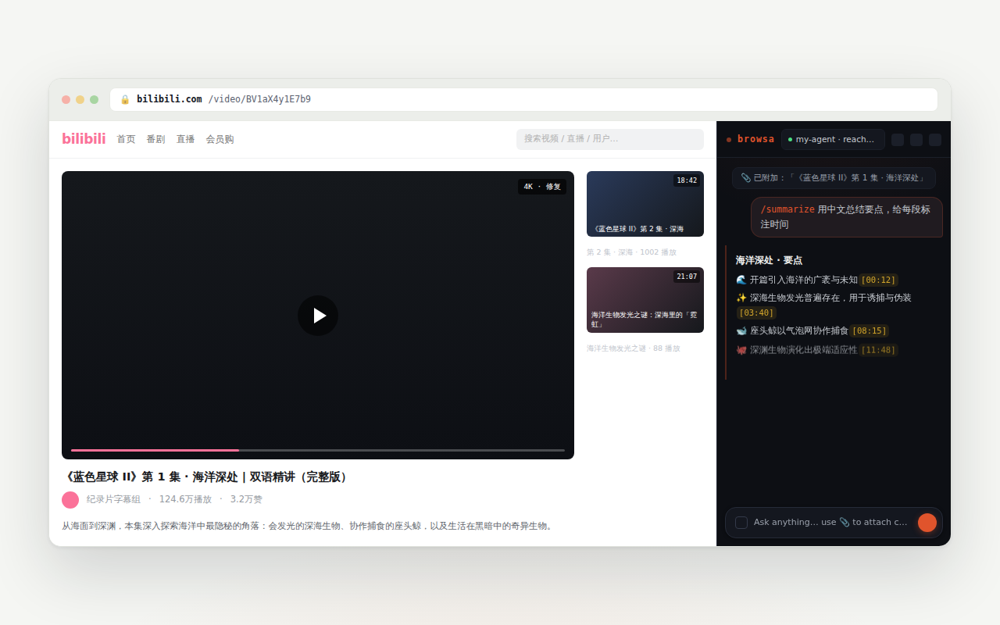
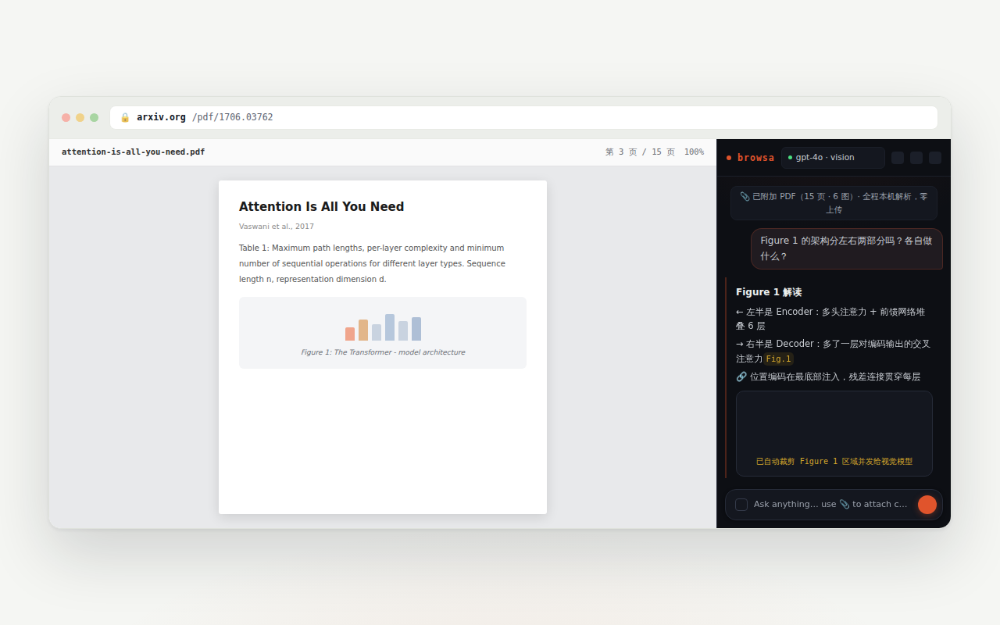
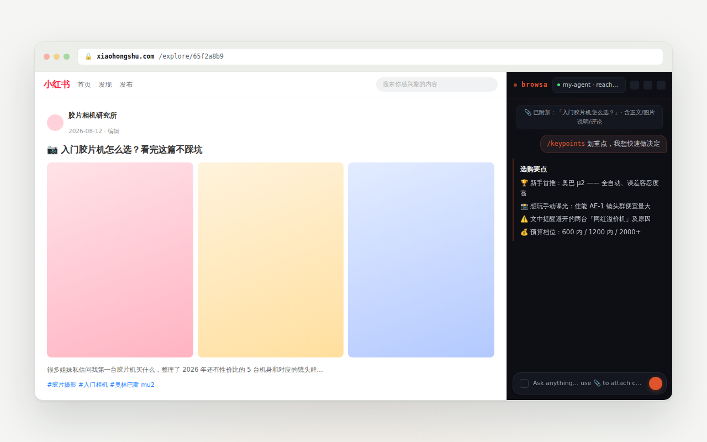
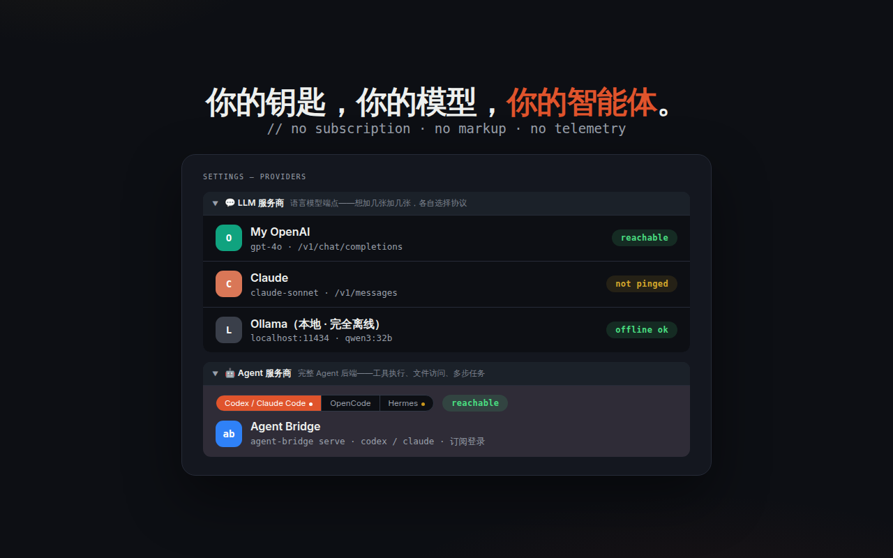

<p align="center">
  <a href="./README.md">English</a> · <strong>简体中文</strong>
</p>

<p align="center">
  
</p>

<p align="center">
  <a href="LICENSE"></a>&nbsp;
  <a href="#安装开发者模式"></a>&nbsp;
  <a href="https://github.com/xiaohuzai/browsa/pulls"></a>
</p>

<p align="center">
  <a href="https://xiaohuzai.github.io/browsa/"><strong>官网</strong></a> · <a href="#实际效果"><strong>截图</strong></a> · <a href="#安装开发者模式"><strong>安装</strong></a> · <a href="https://github.com/xiaohuzai/browsa/issues"><strong>提 Issue</strong></a>
</p>

---

**browsa**（**brow**ser **s**ide p**a**nel **A**I，浏览器侧边栏 AI）是一个 Chrome / Edge 扩展：在你当前标签页旁打开聊天面板，附加页面——文章、视频、PDF——并用**你自己的**模型或智能体流式生成回复：任意 OpenAI、Anthropic、Ollama 兼容端点，或带工具、记忆与审批的完整智能体后端（Hermes）。无订阅、无加价——key 只存在你自己的机器上。

## 实际效果

**视频页**——让它总结，要点就带可点击的 `[mm:ss]` 时间戳，点一下跳回原时刻。没有字幕？browsa 自动转写音频（ASR）或直接读画面。



**论文与 PDF**——全程本机解析，不上传任何内容：重建表格、标题与多栏版式，裁出真正的插图区域作为图片发送，让视觉模型真的「看见」Figure 1。



**信息流与乱页面**——普通阅读器放弃的地方，browsa 直接读页面自己的数据：字幕、评论、笔记正文。无需重新登录。



## 安装（开发者模式）

1. 克隆或下载本仓库。
2. 打开 `chrome://extensions`（或 `edge://extensions`），开启**开发者模式**。
3. 点击**加载已解压的扩展程序** → 选择 `browsa/` 目录。
4. 按 `Ctrl+Shift+H`（或点击工具栏图标）——侧边栏在任意页面旁打开。
5. 点击 **⚙ 设置**，连接下方任意 provider。

<details>
<summary><b>构建与打包</b></summary>

```bash
npm install          # 仅首次需要
npm test             # 运行 1,000+ 个单元测试
npm run package      # → browsa-v<version>.zip
```

`npm version patch|minor` 会自动把版本号同步到 `package.json` 和 `manifest.json`。

</details>

## 连接 Provider

browsa 支持两类后端：

- **Agent Provider（智能体）**——完整的智能体后端，在服务端执行工具（bash、文件操作、联网搜索……）。AI 真的能*做事*。
- **LLM Provider（纯语言模型）**——仅用于对话的聊天端点。需填写模型 ID。

打开 ⚙ 设置，填入 Base URL + API key，点 **Ping**——验证连通性并自动检测能力；第一个验证通过的 provider 自动设为激活。



<details>
<summary><b>🤖 Hermes Agent</b>——自托管、内置工具的智能体</summary>

Hermes 是一个自托管的 AI 智能体，内置工具（联网搜索、终端、文件操作、记忆、技能）。browsa 使用它的 `/v1/runs` API——比普通 chat completions 更丰富（工具进度、危险操作的审批/澄清提示），并且每个会话使用稳定的 `X-Hermes-Session-Id`，让 Hermes 能在服务端维持会话连续性。如果某个 Hermes 部署不支持 `/v1/runs`，会自动回退到普通的 `/v1/chat/completions`。

**1. 安装 Hermes**

```bash
pip install hermes-agent   # 或按官方安装指南
```

**2. 启用 API 服务**——在 `~/.hermes/.env` 中添加：

```bash
API_SERVER_ENABLED=true
API_SERVER_KEY=your-secret-key
```

**3. 启动 Hermes**

```bash
hermes gateway
# → [API Server] API server listening on http://127.0.0.1:8642
```

**4. 配置 browsa**——打开 ⚙ 设置，选择 **Hermes Agent** provider。只需 Base URL 和 API key——它自己的 `/v1/runs` 协议会自动启用（无需选择 API 类型）。

| 字段 | 值 |
|---|---|
| Base URL | `http://<server-ip>:8642` |
| API Key | `API_SERVER_KEY` 的值 |

**5. 点击 Ping 验证**。会自动检测并启用 `/v1/runs` 支持。

</details>

<details>
<summary><b>💬 LLM Providers</b>——OpenAI · Anthropic · Ollama · Groq · LiteLLM · 任意兼容端点</summary>

任何支持 OpenAI **Chat Completions**（`/v1/chat/completions`）、OpenAI **Responses**（`/v1/responses`）或 **Anthropic Messages**（`/v1/messages`）的端点。

打开 ⚙ 设置 → **LLM Providers**。系统会为你预留一个空的 **LLM 1** 槽位——填入信息后点 **Save**，或随时用 **＋ Add Provider** 添加更多：

| 字段 | 值 |
|---|---|
| Alias | 你起的名字（例如「My OpenAI」「本地模型」）——显示在侧边栏下拉框中，方便区分多个 provider |
| Base URL | 例如 `https://api.openai.com` |
| API Key | 你的 API key |
| Model ID | **必填**——例如 `gpt-4o`、`claude-sonnet-4-6`；可填多个（逗号分隔），侧边栏下拉按「Alias · 模型」逐个选择 |
| API | 端点使用的协议：Chat Completions / Responses / Anthropic |

想加多少 LLM provider 都行；每个可各自选择协议并带上自己的 Alias。一张卡也可填多个模型 ID——托管几十个模型的聚合网关一张卡就够。用卡片上的 **✕** 删除（内置 Hermes 智能体卡片固定不可删）。

</details>

## browsa 读什么

点击 📎 附加当前标签页——**自动**模式（先读出干净正文，失败后回退 DOM 树、再回退全文）或 **📷 截图**模式（当前可见画面，给多模态模型）。附加 PDF——或一个其实是 PDF 的页面——是自动的，无需单独选模式。

| 你在读 | browsa 发送 |
|---|---|
| 文章与文档 | 干净的正文；站点 `llms.txt` 指令一并烘入上下文 |
| PDF 与论文 | 完整版式——表格、标题、多栏——本机解析；插图区域裁出作为图片发给视觉模型（回答后在历史中压缩为带标签的占位符） |
| 视频 | 带可点击 `[mm:ss]` 时间戳的字幕/转写；无字幕视频自动转写（ASR，可选——设置中填火山方舟 Key）或画面与语音一起精读 |
| GitHub 文件页 | 直接抓 `raw.githubusercontent.com` 原始源码——markdown 与代码保持结构 |
| 飞书 / Lark 文档 | 直接解析页面编辑器的块结构——标题、列表与**表格行列**完整保留 |
| 乱糟糟的页面 | 观察并直接读页面自身的网络请求——字幕、评论、文章源码（YouTube、Bilibili、小红书等） |

划选网页文字会出现**浮动工具栏**：**解释**和**翻译**就地作答——流式卡片展开在选区旁，不用打开侧栏；**提问**和**总结**（以及右键菜单）把选区送进侧栏。不用点 📎。

## 功能

上面的截图就是它的样子——完整清单收在这里：

<details>
<summary><b>聊天</b>——流式回复、思考块、图表、细聊……</summary>

| 功能 | 说明 |
|---|---|
| **流式回复** | token 逐字出现；点击 ✕ 或按 `Esc` 停止 |
| **思考块** | ` thinking` / `<thinking>` 内容显示为可折叠块，流式结束后自动收起 |
| **Markdown 渲染与高亮** | 完整 GFM（表格、代码块、列表）；40+ 种语言（highlight.js）；`diff` 代码块 `+` 标绿 / `-` 标红 |
| **LaTeX** | 行内 `$...$` 和块级 `$$...$$`（KaTeX）——公式多的消息卸载到 Web Worker 渲染，面板不卡顿 |
| **Mermaid · ECharts · Markmap** | ` ```mermaid ` / ` ```echarts ` / ` ```markmap ` 代码块内联渲染，各带缩放/复制/导出 SVG 工具栏；直接说要一张图表或思维导图——模型懂这个格式。Mermaid 解析失败时，一键让 AI 修复重绘——修复后的图先经本地解析校验再替换 |
| **细聊（Detail thread）** | 选中回复中的任意文本，打开仅针对这段摘录的独立侧边对话，不碰主历史；大小可调 |
| **大纲导航** | 对话满 4 轮后出现刻度导航条——点击跳转、悬停预览 |
| **编辑并重发 · 重新生成** | ✏ 编辑并重发任意用户消息；⟳ 重新运行任意回复 |
| **排队追问** | 流式回答期间继续输入会自动排队，回答结束后依次发出 |
| **错误说明卡** | provider 报错归类成大白话标题（鉴权 / 限流 / 超时 / 网络 / 5xx），原始错误可展开、可复制 |
| **复制与时间戳** | ⎘ 复制完整原始 Markdown；悬停任意消息查看发送时间 |

</details>

<details>
<summary><b>历史与会话</b>——抽屉、搜索、导出……</summary>

| 功能 | 说明 |
|---|---|
| **会话** | 把当前对话保存为命名会话；从 🕐 抽屉浏览和恢复；置顶的会话悬浮在列表上方 |
| **处处搜索** | `Ctrl+F` 在对话内跨全部消息搜索；抽屉按标题**与**消息内容过滤会话（仅内容命中会有标记） |
| **导出** | 任意会话导出为 Markdown 文件 |
| **安全删除** | 会话两步确认删除；消息多选批量删除；清空历史 5 秒内可撤销 |

</details>

<details>
<summary><b>输入</b>——图片、草稿、快捷操作……</summary>

| 功能 | 说明 |
|---|---|
| **图片附件** | 直接把图片拖入或粘贴到输入框（用于多模态模型） |
| **输入历史与草稿** | ↑/↓ 召回之前发送过的消息；未发送的草稿在面板关闭后仍在 |
| **斜杠命令** | 输入 `/` 查看补全——见下表 |
| **快捷操作** | 输入框上方的「总结 / 要点 / 解释 / → 中文 / 大纲」一键按钮 |
| **浮动工具栏与右键菜单** | 在任意页面划选文字：提问 · 解释 · → 中文 · 总结——解释 / 翻译就地流式作答；提问 / 总结与右键菜单送侧栏 |

</details>

<details>
<summary><b>设置</b>——系统提示词、语言、llms.txt、长附件自动总结……</summary>

| 设置 | 说明 |
|---|---|
| **系统提示词** | 每轮对话以 `role: system` 注入——回复语言、语气与格式规则在这里定 |
| **回复语言** | 无论页面语言，强制用指定语言回复 |
| **界面语言** | English / 中文 / Auto（跟随浏览器语言）——即时生效，无需重载 |
| **划词工具栏与 llms.txt** | 开关划选文字时的浮动工具栏；附加页面（📎）时抓取一次 `<origin>/llms.txt`，把站点 LLM 指令烘入页面上下文——放在系统提示词之外，保证提示词前缀跨轮次字节稳定（对 prompt 缓存友好） |
| **阅读偏好** | 消息字号、发送快捷键（Enter / Ctrl+Enter）、自动滚动开关 |
| **ASR 字幕识别** | 无字幕视频的语音转写服务商（默认火山方舟）：API Key、语言、字幕来源 |
| **长附件自动总结** | 自动进行——超过阈值（默认 100,000 字符）的页面或字幕会分块、并行总结、后台合并；`[mm:ss]` 标记显式保留，跳转链接继续可用；任何错误都安全失败、静默保留原文 |

</details>

### 斜杠命令

在输入框输入 `/` 查看自动补全。所有命令都可以跟额外指令——`/summarize focus on the methodology`：

| 命令 | 发送给模型的提示词 |
|---|---|
| `/summarize` | 3–5 条要点总结 |
| `/translate` | 翻译成中文 |
| `/rewrite` | 更简洁的改写，保留全部事实 |
| `/explain` | 用简单语言向新手解释 |
| `/outline` | 仅标题的嵌套大纲 |
| `/keypoints` | 前 5 条要点 |
| `/prompt` | 显示当前生效的系统提示词（不发送给模型） |

## 键盘快捷键

| 快捷键 | 动作 |
|---|---|
| `Ctrl+Shift+H` | 打开 / 关闭侧边栏 |
| `Enter` | 发送消息（可在设置中配置） |
| `Shift+Enter` | 换行 |
| `Ctrl+K` | 清空历史（可撤销） |
| `Ctrl+/` | 循环切换上下文模式（自动 ↔ 截图） |
| `Ctrl+F` | 打开对话内搜索 |
| `Esc` | 取消流式 / 关闭搜索 / 关闭抽屉 |

## 工作原理

```
[Web 页面]  →  [browsa 侧边栏]  →  [你的模型 / 智能体]  →  流式回复
```

<details>
<summary><b>代码地图</b></summary>

- **`background.js`**——MV3 服务工作线程，单一消息路由器；通过每轮端口流式传输，超大附件自动总结。
- **`sidepanel.js`**——聊天 UI 编排器；渲染（Markdown/Mermaid/Markmap/KaTeX/ECharts）、会话、搜索、细聊各在 `lib/sidepanel/` 下。
- **`lib/`**——页面提取（Readability 级联 + XHR 拦截）、SSE 流式客户端（`/v1/chat/completions` + Hermes `/v1/runs`）、`chrome.storage.local` 封装、内容脚本。

</details>

## 浏览器兼容性

Chrome / Edge 114+（主要目标）；Brave 1.56+ 应可运行（相同的 Chromium 内核）。Firefox 不支持（没有 `side_panel` API）。

## 安全

- API key 只存在你自己的机器上的 `chrome.storage.local` 里——除了你配置的 `baseUrl` 之外，绝不会发送到任何地方。
- 页面内容发给 provider 前，其中所有 URL 会先在本地脱敏：藏在查询参数、userinfo、hash 里的凭据（令牌、密码、签名、会话 ID）不会离开你的机器；browsa 自己要拉取的 URL（媒体、图片）不受影响。
- PDF 完全在客户端解析（WASM + pdf.js）——文件字节绝不离开你的设备，只有提取出的文本会发送给你配置的 provider。
- LLM 回复在渲染前用 DOMPurify 净化（拦截 `data:image/svg+xml` 来源；Mermaid 的 SVG 输出会移除 `<script>` / 事件处理器属性）。
- 内容脚本只观察网络请求，从不修改或阻断它们。

## 许可证

[MIT](LICENSE) —— 免费使用、修改与分发。

---

<p align="center">
  <sub><b>browsa</b> —— 读到哪里，问到哪里。</sub>
</p>
