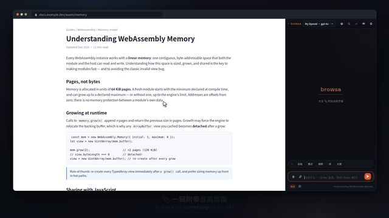
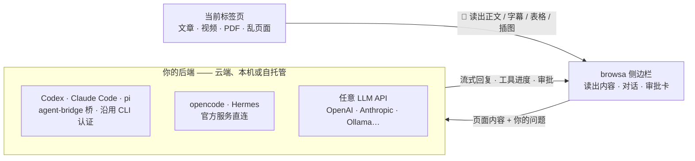

<p align="center">
  <a href="./README.md">English</a> · <strong>简体中文</strong>
</p>

<p align="center">
  <a href="https://chromewebstore.google.com/detail/browsa/kghjmmajnpbkljankbbjbmnhfdocaeho"></a>&nbsp;
  <a href="LICENSE"></a>&nbsp;
  <a href="#安装"></a>&nbsp;
  <a href="https://github.com/xiaohuzai/browsa/pulls"></a>
</p>

<p align="center">
  <a href="https://xiaohuzai.github.io/browsa/"><strong>官网</strong></a> · <a href="https://xiaohuzai.github.io/browsa/guide/quickstart.html"><strong>快速开始</strong></a> · <a href="#安装"><strong>安装</strong></a> · <a href="https://github.com/xiaohuzai/browsa/issues"><strong>提 Issue</strong></a>
</p>

---

# browsa

**读到哪里，问到哪里。**

browsa 是一个 Chrome / Edge 侧边栏扩展：把正在看的文章、视频、PDF 带进对话，让**你自己的 AI** 在旁边帮你读懂。不用复制粘贴，也不用离开页面。通过 Agent Bridge 接入 **Codex / Claude Code / pi**，连接 **opencode / Hermes**，或配置 OpenAI、Anthropic、Ollama 等模型接口。

**扩展免费，MIT 开源。** 自备模型或 Agent。API Key 保存在本地，用于向你配置的服务进行身份验证。

<p align="center">
  
</p>
<p align="center">
  <a href="https://xiaohuzai.github.io/browsa/#demo"><strong>▶ 观看 60 秒完整演示</strong></a> — 附页问答 · 追问线程 · 划词工具条 · 视频时间线 · 图表与 3D · Agent 审批
</p>

## 亮点

### 一、接你正在用的 Agent

通过 Agent Bridge 连接已有的 CLI 智能体，沿用它配置好的登录方式和工具。browsa 把网页内容交给 agent，实时展示工具进度，并在面板里呈现它发出的审批请求。具体工具能力与权限取决于 agent 的配置。

| Agent | 接入方式 | 登录 |
|---|---|---|
| **Codex**（OpenAI） | [agent-bridge](https://github.com/xiaohuzai/agent-bridge) 本地桥 | 沿用 CLI 已配置的认证 |
| **Claude Code**（Anthropic） | agent-bridge 本地桥 | 沿用 CLI 已配置的认证 |
| **pi**（earendil-works） | agent-bridge 本地桥 | 你在 pi 里配置的模型 |
| opencode | 官方无头服务器直连 | 你给它配置的模型 |
| Hermes | 自托管部署，`/v1/runs` 协议 | 自托管 |

一张 browsa 卡可以同时连多个 agent，侧边栏下拉逐个切换。

### 二、读得动整个网页——视频也行

- **视频**：字幕或自动转写（ASR）→ 带可点击 `[mm:ss]` 时间戳的笔记，点一下跳回原时刻；无字幕的视频还能直接「看」画面
- **PDF / 论文**：全程本机解析——表格、多栏、标题原样重建，插图区域裁出来发给视觉模型
- **文章与乱页面**：读出干净正文；信息流页面直接读页面自己的数据（YouTube、Bilibili、小红书…）

完整清单见下方「browsa 读什么」。

## 架构



## 安装

选择一种安装方式即可：

**Chrome 应用商店 —— 推荐，自动更新。** [点这里添加 browsa](https://chromewebstore.google.com/detail/browsa/kghjmmajnpbkljankbbjbmnhfdocaeho)。商店审核可能晚于 GitHub 发布。

**GitHub —— 手动安装与更新。**

1. 从 [Releases](https://github.com/xiaohuzai/browsa/releases) 下载扩展 ZIP 并解压。如果需要修改代码，也可以克隆或下载本仓库。
2. 打开 `chrome://extensions`（或 `edge://extensions`），开启**开发者模式**。
3. 点击**加载已解压的扩展程序** → 选择解压后包含 `manifest.json` 的目录，而不是 ZIP 文件或外层目录。文件夹名称取决于下载方式。

**接下来两种方式都一样：**

1. 打开一篇文章，点击扩展工具栏图标，或按 `Ctrl+Shift+H`（macOS 为 `Command+Shift+H`）打开侧边栏。
2. 进入 **⚙ 设置**，配置一个 LLM 或 Agent 服务商，点 **Ping** 验证连接。
3. 在侧边栏下拉框选择模型或 agent，点 **📎** 附加当前页面，再问第一个问题。

完整步骤见[快速开始指南](https://xiaohuzai.github.io/browsa/guide/quickstart.html)。首次使用先连通服务即可，高级设置可以保留默认值。

<details>
<summary><b>构建与打包</b></summary>

```bash
npm install          # 仅首次需要
npm test             # 运行测试套件
npm run package      # → browsa-v<version>.zip
```

`npm version patch|minor` 会自动把版本号同步到 `package.json` 和 `manifest.json`。

内存较小的机器建议串行运行测试：`node --test --test-concurrency=1 test/*.test.mjs`。

</details>

## 连接 Provider

打开 ⚙ 设置，填好地址、点 **Ping**——验证连通性并自动检测能力；第一个验证通过的 provider 自动设为激活。两类后端：

- **Agent Provider（智能体）**——完整的智能体后端，在服务端执行工具（bash、文件操作、联网搜索……）。AI 真的能*做事*。
- **LLM Provider（纯语言模型）**——仅用于对话的聊天端点。需填写模型 ID。

<details>
<summary><b>🔧 Agent Bridge</b>——桥接本地 CLI 智能体（<b>Codex</b>、<b>Claude Code</b>、<b>pi</b>…）</summary>

[agent-bridge](https://github.com/xiaohuzai/agent-bridge) 是一个独立的本地守护进程，把 codex、claude、pi 等 CLI 智能体适配成统一的本地 HTTP 协议。它沿用 CLI 配置的认证方式：

```bash
npm i -g @xiaohuzai/agent-bridge                  # 已发布到 npm（Node 18+）
cp "$(npm root -g)/@xiaohuzai/agent-bridge/agents.example.json" agents.json
agent-bridge serve                                # 每个 entry 一座桥，端口写在 agents.json 里
```

打开 ⚙ 设置，选择 **Agent Bridge** 卡，点 **＋ 添加 Agent** 逐行填桥地址——一行一个 agent，可顺手填别名（留空则 Ping 后自动识别 agent 名字）和该桥自己的 API Key（每桥可不同）。侧边栏下拉按「Agent Bridge · codex」逐个选择，每个 agent 有自己独立的会话线程。危险操作的审批卡片直接出现在面板里；截图、粘贴图片与 PDF 图表也会随消息发送（单条 ≤8 张）。多轮上下文由 agent 自己维护。

不想手动执行上面三步？设置页 Agent Bridge 卡上点「**复制配置提示词**」，把整段粘给你的 CLI agent，让它替你完成安装、配置和启动（完整文案见[接入指南](https://xiaohuzai.github.io/browsa/guide/providers.html#agent-bridge)）。

</details>

<details>
<summary><b>🔧 OpenCode Agent</b>——连接 <code>opencode</code> 命令行智能体</summary>

[opencode](https://opencode.ai) 自带官方无头服务器——browsa 直连即可（会话、流式回复、工具进度，以及危险操作——比如执行 shell 命令——的审批卡片）。browsa 能连**任意** `opencode serve` 地址——但裸 `opencode serve` 会随机选端口且每次重启都变，所以省心的做法是固定一个：

```bash
opencode serve --port 4096
```

打开 ⚙ 设置，选择 **OpenCode Agent** provider，Base URL 填 `http://127.0.0.1:4096`（占位符即此建议值），**Ping** 通即用。多轮上下文由 opencode 会话自己维护，browsa 只发送你的每一句话。当 opencode 请求执行危险命令时，审批卡片直接出现在面板里。服务器在哪个目录启动，agent 就在哪个项目上干活。

</details>

<details>
<summary><b>🤖 Hermes Agent</b>——自托管、内置工具的智能体</summary>

Hermes 是一个自托管的 AI 智能体，内置工具（联网搜索、终端、文件操作、记忆、技能）。browsa 使用它的 `/v1/runs` API——比普通 chat completions 更丰富（工具进度、危险操作的审批/澄清提示），并且每个会话使用稳定的 `X-Hermes-Session-Id`，让 Hermes 能在服务端维持会话连续性。如果某个 Hermes 部署不支持 `/v1/runs`，会自动回退到普通的 `/v1/chat/completions`。

**1. 安装 Hermes**

```bash
pip install hermes-agent   # 或按官方安装指南
```

**2. 启用 API 服务**——在 `~/.hermes/.env` 中添加：

```bash
API_SERVER_ENABLED=true
API_SERVER_KEY=your-secret-key
```

**3. 启动 Hermes**

```bash
hermes gateway
# → [API Server] API server listening on http://127.0.0.1:8642
```

**4. 配置 browsa**——打开 ⚙ 设置，选择 **Hermes Agent** provider。只需 Base URL 和 API key——它自己的 `/v1/runs` 协议会自动启用（无需选择 API 类型）。

| 字段 | 值 |
|---|---|
| Base URL | `http://<server-ip>:8642` |
| API Key | `API_SERVER_KEY` 的值 |

**5. 点击 Ping 验证**。会自动检测并启用 `/v1/runs` 支持。

</details>

<details>
<summary><b>💬 LLM Providers</b>——OpenAI · Anthropic · Ollama · Groq · LiteLLM · 任意兼容端点</summary>

任何支持 OpenAI **Chat Completions**（`/v1/chat/completions`）、OpenAI **Responses**（`/v1/responses`）或 **Anthropic Messages**（`/v1/messages`）的端点。

打开 ⚙ 设置 → **LLM Providers**。系统会为你预留一个空的 **LLM 1** 槽位——填入信息后点 **Save**，或随时用 **＋ Add Provider** 添加更多：

| 字段 | 值 |
|---|---|
| Alias | 你起的名字（例如「My OpenAI」「本地模型」）——显示在侧边栏下拉框中，方便区分多个 provider |
| Base URL | 例如 `https://api.openai.com` |
| API Key | 你的 API key |
| Model ID | **必填**——输入模型 ID 后按 **Enter** 或点 **＋** 添加，点 **✕** 移除；也支持一次输入多个逗号分隔的 ID。侧边栏下拉按「Alias · 模型」逐个选择 |
| API | 端点使用的协议：Chat Completions / Responses / Anthropic |

想加多少 LLM provider 都行；每个可各自选择协议并带上自己的 Alias。一张卡也可填多个模型 ID——托管几十个模型的聚合网关一张卡就够。用卡片上的 **✕** 删除（内置的 Hermes / OpenCode / Agent Bridge 智能体卡片固定不可删）。

</details>

## browsa 读什么

点击 📎 附加当前标签页——**自动**模式（先读出干净正文，失败后回退 DOM 树、再回退全文）或 **📷 截图**模式（当前可见画面，给多模态模型）。附加 PDF——或一个其实是 PDF 的页面——是自动的，无需单独选模式。

| 你在读 | browsa 发送 |
|---|---|
| 文章与文档 | 干净的正文；站点 `llms.txt` 指令一并烘入上下文 |
| PDF 与论文 | 完整版式——表格、标题、多栏——本机解析；插图区域裁出作为图片发给视觉模型（回答后在历史中压缩为带标签的占位符） |
| 视频 | 带可点击 `[mm:ss]` 时间戳的字幕/转写；无字幕视频自动转写（ASR，可选——设置中填火山方舟 Key）或画面与语音一起精读 |
| GitHub 文件页 | 直接抓 `raw.githubusercontent.com` 原始源码——markdown 与代码保持结构 |
| 飞书 / Lark 文档 | 直接解析页面编辑器的块结构——标题、列表与**表格行列**完整保留 |
| 乱糟糟的页面 | 观察并直接读页面自身的网络请求——字幕、评论、文章源码（YouTube、Bilibili、小红书等） |

划选网页文字会出现**浮动工具栏**：**解释**和**翻译**就地作答——流式卡片展开在选区旁，不用打开侧栏；**提问**和**总结**（以及右键菜单）把选区送进侧栏。不用点 📎。

## 功能

完整清单收在这里：

<details>
<summary><b>聊天</b>——流式回复、思考块、图表、追问……</summary>

| 功能 | 说明 |
|---|---|
| **流式回复** | token 逐字出现；点击输入框中的 **■** 或按 `Esc` 停止 |
| **思考块** | ` thinking` / `<thinking>` 内容显示为可折叠块，流式结束后自动收起 |
| **Markdown 渲染与高亮** | 完整 GFM（表格、代码块、列表）；40+ 种语言（highlight.js）；`diff` 代码块 `+` 标绿 / `-` 标红 |
| **LaTeX** | 行内 `$...$` 和块级 `$$...$$`（KaTeX）——公式多的消息卸载到 Web Worker 渲染，面板不卡顿 |
| **Mermaid · ECharts · Markmap** | ` ```mermaid ` / ` ```echarts ` / ` ```markmap ` 代码块内联渲染，各带缩放/复制/导出 SVG 工具栏；直接说要一张图表或思维导图——模型懂这个格式。Mermaid 解析失败时，一键让 AI 修复重绘——修复后的图先经本地解析校验再替换 |
| **分子式 · 蛋白质 · 神经网络** | ` ```smiles ` / ` ```pdb ` / ` ```nn ` 代码块同样内联实时渲染——2D 结构式与化学反应式、按 PDB ID 交互查看蛋白质 3D 结构、出版级网络架构图；各带复制/导出工具栏 |
| **追问（Follow-up）** | 选中回复中的任意文本，打开仅针对这段摘录的独立侧边对话，不碰主历史；大小可调 |
| **大纲导航** | 对话满 4 轮后出现刻度导航条——点击跳转、悬停预览 |
| **编辑并重发 · 重新生成** | ✏ 编辑并重发任意用户消息；⟳ 重新运行任意回复 |
| **排队追问** | 流式回答期间继续输入会自动排队，回答结束后依次发出 |
| **错误说明卡** | provider 报错归类成大白话标题（鉴权 / 限流 / 超时 / 网络 / 5xx），原始错误可展开、可复制 |
| **复制与时间戳** | ⎘ 复制完整原始 Markdown；悬停任意消息查看发送时间 |
| **回复来源标注** | 每条回复标注生成它的 provider / agent（与侧栏下拉同名）；切换到智能体时会询问：把当前对话作为第一条消息带给它，或新建会话从零开始（直接发送则不带上下文） |

</details>

<details>
<summary><b>历史与会话</b>——抽屉、搜索、导出……</summary>

| 功能 | 说明 |
|---|---|
| **会话** | 把当前对话保存为命名会话；从 🕐 抽屉浏览和恢复；置顶的会话悬浮在列表上方 |
| **处处搜索** | `Ctrl+F` 在对话内跨全部消息搜索；抽屉按标题**与**消息内容过滤会话（仅内容命中会有标记） |
| **导出** | 任意会话导出为 Markdown 文件 |
| **安全删除** | 会话两步确认删除；消息多选批量删除；清空历史 5 秒内可撤销 |

</details>

<details>
<summary><b>输入</b>——图片、草稿、快捷操作……</summary>

| 功能 | 说明 |
|---|---|
| **图片附件** | 直接把图片拖入或粘贴到输入框（用于多模态模型） |
| **输入历史与草稿** | ↑/↓ 召回之前发送过的消息；未发送的草稿在面板关闭后仍在 |
| **斜杠命令** | 输入 `/` 查看补全——见下表 |
| **快捷操作** | 输入框上方的「总结 / 要点 / 解释 / → 中文 / 大纲」一键按钮 |
| **浮动工具栏与右键菜单** | 在任意页面划选文字：提问 · 解释 · → 中文 · 总结——解释 / 翻译就地流式作答；提问 / 总结与右键菜单送侧栏 |

</details>

<details>
<summary><b>设置</b>——系统提示词、语言、llms.txt、长附件自动总结……</summary>

常用设置直接展示：界面语言、服务商、系统提示词／回复语言和聊天偏好。**高级设置**里放划词工具栏、`llms.txt`、深读和 ASR 等选项；不使用这些功能时无需展开。LLM 与 Agent 服务商也可分别折叠，切换 agent 不会展开已折叠的 LLM 分组。

| 设置 | 说明 |
|---|---|
| **系统提示词** | 每轮对话以 `role: system` 注入——回复语言、语气与格式规则在这里定 |
| **回复语言** | 无论页面语言，强制用指定语言回复 |
| **界面语言** | English / 中文 / Auto（跟随浏览器语言）——即时生效，无需重载 |
| **划词工具栏与 llms.txt** | 开关划选文字时的浮动工具栏；附加页面（📎）时抓取一次 `<origin>/llms.txt`，把站点 LLM 指令烘入页面上下文——放在系统提示词之外，保证提示词前缀跨轮次字节稳定（对 prompt 缓存友好） |
| **阅读偏好** | 消息字号、发送快捷键（Enter / Shift+Enter）、思考块自动折叠 |
| **ASR 字幕识别** | 无字幕视频的语音转写服务商（默认火山方舟）：API Key、语言、字幕来源 |
| **长附件自动总结** | 自动进行——超过阈值（默认 100,000 字符）的页面或字幕会分块、并行总结、后台合并；`[mm:ss]` 标记显式保留，跳转链接继续可用；任何错误都安全失败、静默保留原文 |
| **深读（Deep extract）** | 默认开启——附加前自动展开折叠区块、翻页抓取后续内容，让更多页面内容进入模型；全程在后台标签页静默进行，不滚动、不点击你正在看的页面 |

</details>

### 斜杠命令

在输入框输入 `/` 查看自动补全。所有命令都可以跟额外指令——`/summarize focus on the methodology`：

| 命令 | 发送给模型的提示词 |
|---|---|
| `/summarize` | 3–5 条要点总结 |
| `/translate` | 翻译成中文 |
| `/rewrite` | 更简洁的改写，保留全部事实 |
| `/explain` | 用简单语言向新手解释 |
| `/outline` | 仅标题的嵌套大纲 |
| `/keypoints` | 前 5 条要点 |
| `/prompt` | 显示当前生效的系统提示词（不发送给模型） |

## 键盘快捷键

| 快捷键 | 动作 |
|---|---|
| `Ctrl+Shift+H` | 打开 / 关闭侧边栏 |
| `Enter` | 发送消息（可在设置中配置） |
| `Shift+Enter` | 换行 |
| `Ctrl+K` | 清空历史（可撤销） |
| `Ctrl+/` | 循环切换上下文模式（自动 ↔ 截图） |
| `Ctrl+F` | 打开对话内搜索 |
| `Esc` | 取消流式 / 关闭搜索 / 关闭抽屉 |

## 工作原理

<details>
<summary><b>代码地图</b></summary>

- **`background.js`**——MV3 服务工作线程，单一消息路由器；通过每轮端口流式传输，超大附件自动总结。
- **`sidepanel.js`**——聊天 UI 编排器；渲染（Markdown/Mermaid/Markmap/KaTeX/ECharts）、会话、搜索、追问各在 `lib/sidepanel/` 下。
- **`lib/`**——页面提取（Readability 级联 + XHR 拦截）、SSE 流式客户端（`/v1/chat/completions`、Hermes `/v1/runs`、opencode / agent-bridge agent 客户端）、`chrome.storage.local` 封装、内容脚本。

</details>

## 浏览器兼容性

Chrome / Edge 116+（主要目标）；Brave 1.56+ 应可运行（相同的 Chromium 内核）。Firefox 不支持（没有 `side_panel` API）。

## 安全

- API Key 保存在本地 `chrome.storage.local`，用于向你配置的服务进行身份验证；本地保存不代表密钥不会通过网络发送。
- 附加的页面内容、问题和对话上下文会发送给你选择的模型或 agent。可选的语音转写／视听分析也会把媒体发送给配置的分析服务。
- 页面上下文发送前，browsa 会在本地隐去 URL 中可识别的凭据（如令牌、密码、签名、会话参数）；这不等于对页面正文中的敏感信息进行全面脱敏。browsa 自己要拉取的 URL（媒体、图片）不受影响。
- PDF 在本地解析（WASM + pdf.js），提取出的文字和图片可以发送给配置的 provider；本地解析不代表所有提取内容都留在设备上。
- LLM 回复在渲染前用 DOMPurify 净化（拦截 `data:image/svg+xml` 来源；Mermaid 的 SVG 输出会移除 `<script>` / 事件处理器属性）。
- 内容脚本只观察网络请求，从不修改或阻断它们。

## 许可证

[MIT](LICENSE) —— 免费使用、修改与分发。

---

<p align="center">
  <sub><b>browsa</b> —— 读到哪里，问到哪里。</sub>
</p>
